# 🔧 Abhinav's Task Breakdown and Delivery Plan

## 📋 Overview
This document outlines the detailed breakdown of tasks, responsibilities, and deliverables for Abhinav in the Phoenix Platform team. As the Senior Engineer for Infrastructure & DevOps, my role encompasses managing deployment configurations, infrastructure components, CI/CD pipelines, automation scripts, and development tools.

## 🎯 Primary Areas of Ownership

```
├── /deployments/                   # All deployment configurations
│   ├── kubernetes/                 # K8s manifests
│   ├── helm/                       # Helm charts
│   └── terraform/                  # Infrastructure as code
├── /infrastructure/                # Infrastructure components
├── /.github/workflows/             # CI/CD pipelines
├── /scripts/                       # Automation scripts
├── /tools/                         # Development tools
│   ├── analyzers/                  # Code analyzers
│   └── dev-env/                    # Development environment
└── docker-compose*.yml             # Docker configurations
```

## 🔄 Core Responsibilities 
- CI/CD pipeline management
- Kubernetes deployments
- Infrastructure automation
- Security and monitoring setup
- Production deployments

## 📊 Task Breakdown by Domain

### 1. Kubernetes & Container Orchestration (13 SP)

#### Deliverables
- **K8s Manifest Standardization** (5 SP)
  - Consolidate and standardize all Kubernetes manifests across projects
  - End Goal: Unified deployment patterns across all services with clear resource requirements
  
- **K8s Migration Completion** (5 SP)
  - Complete migration of remaining services to Kubernetes
  - End Goal: All Phoenix platform services running in Kubernetes with proper configuration
  
- **Helm Chart Optimization** (3 SP)
  - Optimize Helm charts for production readiness
  - End Goal: Simplified deployment process with value overrides for different environments

### 2. CI/CD Pipeline Management (8 SP)

#### Deliverables
- **Workflow Templates Standardization** (3 SP)
  - Create and maintain standardized workflow templates for different project types
  - End Goal: Consistent CI/CD patterns across all services with minimal duplication

- **Pipeline Performance Optimization** (2 SP)
  - Improve build and test execution times
  - End Goal: Reduce average CI pipeline execution time by 30%

- **CI/CD Metric Collection** (3 SP)
  - Implement metrics collection for build performance, success rates, and deployment frequency
  - End Goal: Dashboard for CI/CD performance metrics and trend analysis

### 3. Infrastructure as Code (8 SP)

#### Deliverables
- **Terraform Module Development** (5 SP)
  - Develop reusable Terraform modules for core infrastructure components
  - End Goal: Library of infrastructure modules for quick provisioning of new environments

- **Infrastructure Documentation** (3 SP)
  - Document infrastructure architecture and deployment procedures
  - End Goal: Comprehensive runbooks for all infrastructure components

### 4. Security & Compliance (8 SP)

#### Deliverables
- **Security Scanning Integration** (3 SP)
  - Integrate security scanning tools into CI/CD pipelines
  - End Goal: Automated vulnerability detection with severity-based alerts

- **Secret Management** (3 SP)
  - Implement secure secret management solution across environments
  - End Goal: Zero plaintext secrets in code repositories and secure rotation mechanism

- **Compliance Automation** (2 SP)
  - Automate compliance checks in the deployment pipeline
  - End Goal: Regular compliance reports with violation detection

### 5. Development Tools & Automation (8 SP)

#### Deliverables
- **Developer Environment Standardization** (3 SP)
  - Enhance and maintain development environment setup scripts
  - End Goal: One-command developer environment setup for new team members

- **Code Quality Analyzers** (2 SP)
  - Implement and maintain static code analyzers
  - End Goal: Automated code quality checks integrated with PR process

- **Build & Test Automation** (3 SP)
  - Create scripts for local build and test automation
  - End Goal: Consistent build/test experience between local and CI environments

### 6. Monitoring & Observability (5 SP)

#### Deliverables
- **Monitoring Infrastructure** (3 SP)
  - Set up and maintain monitoring infrastructure (Prometheus, Grafana)
  - End Goal: Comprehensive monitoring dashboard with alerts for key metrics

- **Log Management** (2 SP)
  - Implement centralized logging solution
  - End Goal: Searchable logs with structured data and alert capabilities

## 📅 Sprint Planning

### Sprint 1 (Current Focus)
- K8s Migration (5 SP)
- CI/CD updates (5 SP)
- Security scanning integration (3 SP)

### Sprint 2 (Next Up)
- Helm chart optimization (3 SP)
- Terraform module development (5 SP)
- Developer environment standardization (3 SP)

### Sprint 3 (Coming Soon)
- Monitoring infrastructure (3 SP)
- CI/CD metric collection (3 SP) 
- K8s manifest standardization (5 SP)

### Sprint 4 (Future)
- Secret management (3 SP)
- Infrastructure documentation (3 SP)
- Compliance automation (2 SP)
- Pipeline performance optimization (2 SP)

## 🌐 Cross-Team Dependencies

- Architecture decisions (Palash)
- Core service requirements (Srikanth)
- Monitoring configuration needs (Anitha)
- OpenTelemetry integration (Ramana)
- Kubernetes operators requirements (Anitha)

## 🛠️ Technology Stack

- **Container Orchestration**: Kubernetes, Docker
- **CI/CD**: GitHub Actions, Jenkins
- **Infrastructure as Code**: Terraform, Helm
- **Monitoring**: Prometheus, Grafana, OpenTelemetry
- **Security**: SonarQube, Trivy, GitGuardian
- **Automation**: Bash, Python, Go

## 📝 Key Performance Indicators

- **Deployment Success Rate**: > 95%
- **Mean Time to Recovery**: < 30 minutes
- **Infrastructure as Code Coverage**: 100%
- **CI/CD Pipeline Runtime**: < 15 minutes average
- **Security Vulnerabilities SLA**: Critical (24h), High (72h), Medium (7d)

## 📊 Task Flow Diagram

```mermaid
graph TD
    subgraph "Infrastructure Delivery Pipeline"
        A[Code Changes] --> B[CI Validation]
        B --> C{Tests Pass?}
        C -->|Yes| D[Build Artifacts]
        C -->|No| A
        D --> E[Deploy to Dev]
        E --> F[Integration Tests]
        F --> G{Tests Pass?}
        G -->|Yes| H[Deploy to Staging]
        G -->|No| A
        H --> I[Acceptance Tests]
        I --> J{Tests Pass?}
        J -->|Yes| K[Deploy to Production]
        J -->|No| A
        K --> L[Post-deploy Monitoring]
    end

    subgraph "Infrastructure as Code Management"
        M[Terraform Modules] --> N[Module Testing]
        N --> O[Module Registry]
        O --> P[Environment Provisioning]
        P --> Q[Configuration Management]
        Q --> R[State Management]
        R --> S[Compliance Checking]
    end

    subgraph "Development & Operations Support"
        T[Dev Environment Setup] --> U[Local Testing]
        U --> V[CI/CD Pipeline]
        V --> W[Monitoring & Alerts]
        W --> X[Incident Response]
        X --> Y[Postmortem]
        Y --> Z[Process Improvement]
        Z --> T
    end

    subgraph "Security Operations"
        AA[Code Scanning] --> AB[Dependency Analysis]
        AB --> AC[Secret Detection]
        AC --> AD[Image Scanning]
        AD --> AE[Runtime Security]
        AE --> AF[Compliance Reporting]
    end
```



## 🔁 Continuous Improvement Plan

1. **Weekly Reviews**
   - Deployment success metrics
   - Infrastructure cost optimization
   - CI/CD performance metrics

2. **Monthly Activities**
   - Security posture assessment
   - Infrastructure scaling evaluation
   - Automation coverage review

3. **Quarterly Goals**
   - New tool/technology evaluation
   - Major infrastructure upgrades
   - Cross-team knowledge sharing sessions

## 📚 Documentation Responsibilities

- Maintain up-to-date deployment procedures
- Document infrastructure architecture
- Develop and update runbooks for incident response
- Create developer onboarding guides for infrastructure tools
- Generate automated documentation from infrastructure code

---

*Last Updated: May 26, 2025*  
*Owner: Abhinav*  
*Department: Platform Engineering*
