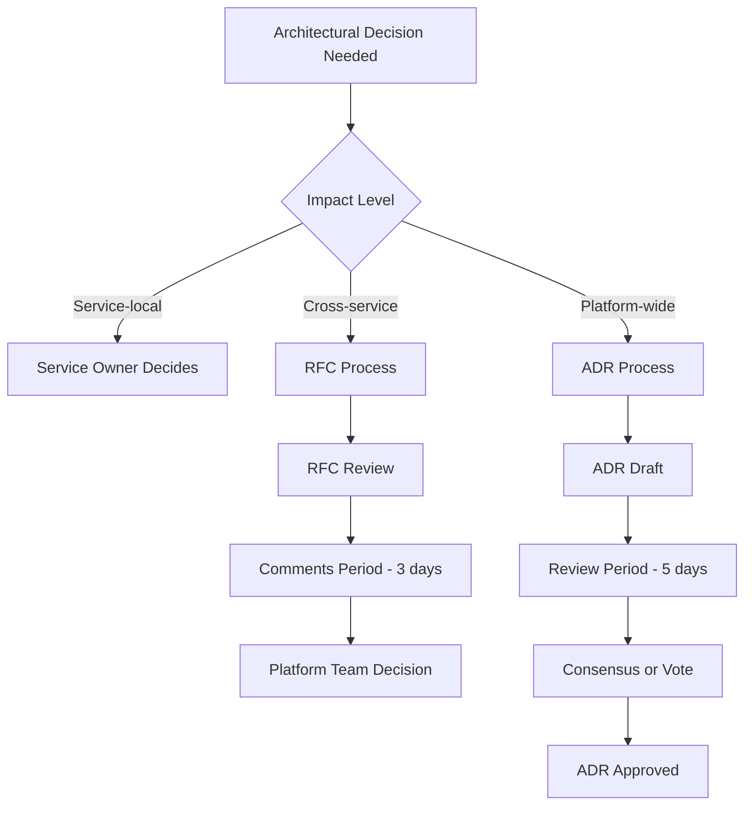

# Phoenix Platform Mono-Repository Governance

## Overview

This document establishes the governance model, development workflows, and architectural decision-making processes for the Phoenix platform mono-repository. It ensures consistent development practices, maintains architectural integrity, and facilitates efficient collaboration across all services and components.

## Repository Governance Structure

### 1. Ownership Model

```yaml
ownership:
  platform_owners:
    - role: "Platform Lead"
      responsibilities:
        - Overall architecture decisions
        - Cross-service standards
        - Breaking change approvals
        - Dependency management strategy
      
  service_owners:
    api_service:
      owner: "@api-team"
      backup: "@platform-team"
      
    dashboard:
      owner: "@frontend-team"
      backup: "@api-team"
      
    experiment_controller:
      owner: "@backend-team"
      backup: "@platform-team"
      
    pipeline_operator:
      owner: "@infrastructure-team"
      backup: "@backend-team"
      
    process_simulator:
      owner: "@testing-team"
      backup: "@backend-team"
      
  shared_components:
    pkg/:
      owner: "@platform-team"
      approval_required: 2
      
    api/:
      owner: "@api-team"
      approval_required: 2
      
    configs/:
      owner: "@devops-team"
      approval_required: 1
```

### 2. Code Review Requirements

```yaml
review_requirements:
  standard_changes:
    approvals_required: 1
    must_include:
      - Service owner OR backup
      
  breaking_changes:
    approvals_required: 2
    must_include:
      - Service owner
      - Platform lead
      - Affected service owners
      
  shared_packages:
    approvals_required: 2
    must_include:
      - Package owner
      - Consumer representative
      
  security_sensitive:
    approvals_required: 2
    must_include:
      - Security team member
      - Service owner
```

### 3. Decision Making Process



## Development Workflows

### 1. Branch Strategy

```yaml
branching:
  main:
    description: "Production-ready code"
    protection:
      - Require PR with approvals
      - Pass all CI checks
      - No direct pushes
      
  develop:
    description: "Integration branch"
    merges_to: main
    frequency: "Weekly or as needed"
    
  feature/*:
    description: "Feature development"
    naming: "feature/{ticket-id}-{description}"
    merges_to: develop
    lifetime: "< 2 weeks"
    
  fix/*:
    description: "Bug fixes"
    naming: "fix/{ticket-id}-{description}"
    merges_to: develop
    lifetime: "< 3 days"
    
  release/*:
    description: "Release preparation"
    naming: "release/{version}"
    merges_to: main
    lifetime: "< 1 week"
```

### 2. Commit Standards

```yaml
commit_standards:
  format: |
    <type>(<scope>): <subject>
    
    <body>
    
    <footer>
    
  types:
    - feat: "New feature"
    - fix: "Bug fix"
    - docs: "Documentation changes"
    - style: "Code style changes"
    - refactor: "Code refactoring"
    - perf: "Performance improvements"
    - test: "Test additions or corrections"
    - chore: "Build process or auxiliary tool changes"
    
  scopes:
    - api
    - dashboard
    - controller
    - operator
    - simulator
    - pkg
    - deps
    
  rules:
    - Subject line max 72 characters
    - Use imperative mood
    - Reference issues in footer
    - Breaking changes marked with "BREAKING CHANGE:"
    
  examples:
    - "feat(api): add experiment validation endpoint"
    - "fix(controller): resolve race condition in state machine"
    - "docs(operator): update deployment instructions"
```

### 3. Pull Request Process

```markdown
## PR Template

### Description
Brief description of changes

### Type of Change
- [ ] Bug fix (non-breaking change)
- [ ] New feature (non-breaking change)
- [ ] Breaking change
- [ ] Documentation update

### Testing
- [ ] Unit tests pass
- [ ] Integration tests pass
- [ ] Manual testing completed

### Checklist
- [ ] Code follows style guidelines
- [ ] Self-review completed
- [ ] Comments added for complex code
- [ ] Documentation updated
- [ ] No new warnings
- [ ] Breaking changes documented

### Related Issues
Fixes #(issue)

### Screenshots (if applicable)
```

## Service Boundaries

### 1. Service Interaction Rules

```yaml
service_interactions:
  allowed_patterns:
    - pattern: "Service A -> API Gateway -> Service B"
      via: "REST/gRPC"
      
    - pattern: "Service -> Message Queue -> Service"
      via: "Events"
      
    - pattern: "Service -> Shared Database"
      via: "Repository pattern"
      
  forbidden_patterns:
    - pattern: "Direct service-to-service DB access"
      reason: "Violates service boundaries"
      
    - pattern: "Synchronous circular dependencies"
      reason: "Creates tight coupling"
      
    - pattern: "Shared mutable state"
      reason: "Race conditions and complexity"
```

### 2. Data Ownership

```yaml
data_ownership:
  api_service:
    owns:
      - experiments
      - users
      - pipelines
    exposes:
      - "GET /api/v1/experiments"
      - "gRPC ExperimentService"
      
  controller_service:
    owns:
      - experiment_states
      - pipeline_deployments
    exposes:
      - "gRPC ControllerService"
      - "Metrics endpoints"
      
  operator:
    owns:
      - pipeline_status
      - collector_instances
    exposes:
      - "Kubernetes CRD status"
      - "Metrics endpoints"
```

### 3. API Contracts

```yaml
api_contracts:
  versioning:
    strategy: "URL path versioning"
    format: "/api/v{major}/"
    deprecation_notice: "6 months"
    
  compatibility:
    backward_compatible:
      - Adding optional fields
      - Adding new endpoints
      - Adding new methods
      
    breaking_changes:
      - Removing fields
      - Changing field types
      - Changing behavior
      - Removing endpoints
      
  documentation:
    required:
      - OpenAPI 3.0 spec
      - gRPC proto files
      - Migration guides
```

## Dependency Management

### 1. Dependency Policies

```yaml
dependency_policies:
  approval_required:
    - New production dependencies
    - Major version updates
    - Security-critical libraries
    
  automated_updates:
    - Minor version updates
    - Patch updates
    - Development dependencies
    
  review_cycle:
    frequency: "Monthly"
    actions:
      - Security audit
      - License compliance
      - Unused dependency removal
      - Version consolidation
```

### 2. Shared Package Guidelines

```go
// pkg/README.md
# Shared Package Guidelines

## Creating New Packages

1. Single responsibility principle
2. Minimal external dependencies
3. Comprehensive documentation
4. >90% test coverage
5. Stable API (minimize breaking changes)

## Package Structure

```
pkg/
├── auth/           # Authentication utilities
├── errors/         # Common error types
├── httpclient/     # HTTP client wrapper
├── logging/        # Structured logging
├── metrics/        # Metrics collection
├── middleware/     # HTTP/gRPC middleware
├── testing/        # Test helpers
└── validation/     # Input validation
```

## Usage Rules

1. Import only from `pkg/`, never from `internal/`
2. Don't create circular dependencies
3. Version breaking changes properly
4. Maintain backward compatibility
```

### 3. Version Management

```yaml
version_management:
  strategy: "Semantic Versioning"
  
  components:
    platform:
      current: "1.0.0"
      format: "MAJOR.MINOR.PATCH"
      
    services:
      api: "1.2.3"
      dashboard: "1.1.0"
      controller: "1.2.1"
      operator: "1.0.2"
      simulator: "1.0.0"
      
  release_process:
    - Create release branch
    - Update version files
    - Generate changelog
    - Create git tag
    - Build artifacts
    - Deploy to staging
    - Run acceptance tests
    - Deploy to production
    - Create GitHub release
```

## Testing Standards

### 1. Test Requirements

```yaml
testing_requirements:
  unit_tests:
    coverage:
      minimum: 80%
      target: 90%
    location: "*_test.go"
    framework: "testing + testify"
    
  integration_tests:
    location: "tests/integration/"
    requirements:
      - Test service interactions
      - Use test containers
      - Clean up resources
      
  e2e_tests:
    location: "tests/e2e/"
    requirements:
      - Test full user workflows
      - Run in CI pipeline
      - Generate reports
      
  performance_tests:
    location: "tests/performance/"
    requirements:
      - Establish baselines
      - Detect regressions
      - Run nightly
```

### 2. Test Data Management

```yaml
test_data:
  fixtures:
    location: "testdata/"
    format: "JSON or YAML"
    
  generators:
    location: "pkg/testing/generators/"
    requirements:
      - Deterministic output
      - Configurable complexity
      
  cleanup:
    policy: "Always clean up"
    methods:
      - Defer statements
      - Test containers auto-removal
      - Transaction rollbacks
```

## CI/CD Pipeline

### 1. Pipeline Stages

```yaml
pipeline:
  stages:
    - name: "Validate"
      parallel: true
      jobs:
        - lint
        - security-scan
        - license-check
        
    - name: "Test"
      parallel: true
      jobs:
        - unit-tests
        - integration-tests
        
    - name: "Build"
      parallel: true
      jobs:
        - build-services
        - build-dashboard
        - build-operators
        
    - name: "Package"
      jobs:
        - docker-images
        - helm-charts
        
    - name: "Deploy"
      jobs:
        - deploy-staging
        - run-e2e-tests
        - deploy-production
```

### 2. Quality Gates

```yaml
quality_gates:
  pre_merge:
    - "All CI checks pass"
    - "Code coverage >= 80%"
    - "No security vulnerabilities"
    - "No linting errors"
    - "Approved by code owner"
    
  pre_release:
    - "All integration tests pass"
    - "Performance benchmarks pass"
    - "Documentation updated"
    - "CHANGELOG updated"
    - "Version bumped"
    
  pre_production:
    - "Staging tests pass"
    - "Load tests pass"
    - "Security scan clean"
    - "Rollback plan documented"
```

## Documentation Standards

### 1. Documentation Requirements

```yaml
documentation:
  required:
    code:
      - Package documentation (doc.go)
      - Public API godoc comments
      - Complex algorithm explanations
      - Example usage
      
    service:
      - README.md
      - TECHNICAL_SPEC.md
      - API documentation
      - Deployment guide
      
    project:
      - Architecture decisions (ADRs)
      - Runbook
      - Troubleshooting guide
      - Contributing guide
```

### 2. Architecture Decision Records (ADRs)

```markdown
# ADR Template

## Title
ADR-XXX: [Decision Title]

## Status
[Proposed | Accepted | Deprecated | Superseded]

## Context
What is the issue that we're seeing that is motivating this decision?

## Decision
What is the change that we're proposing and/or doing?

## Consequences
What becomes easier or more difficult to do because of this change?

### Positive
- Pro 1
- Pro 2

### Negative
- Con 1
- Con 2

## Alternatives Considered
- Alternative 1: Description
- Alternative 2: Description
```

## Monitoring and Metrics

### 1. Service Metrics

```yaml
required_metrics:
  service_health:
    - uptime
    - request_rate
    - error_rate
    - response_time
    
  business_metrics:
    - experiments_created
    - pipelines_deployed
    - optimization_percentage
    
  technical_metrics:
    - cpu_usage
    - memory_usage
    - disk_usage
    - network_traffic
```

### 2. Repository Metrics

```yaml
repo_metrics:
  code_quality:
    - test_coverage
    - technical_debt
    - code_duplication
    - cyclomatic_complexity
    
  development_velocity:
    - pr_merge_time
    - deployment_frequency
    - lead_time
    - mttr
    
  collaboration:
    - pr_review_time
    - contributor_count
    - issue_resolution_time
```

## Security Governance

### 1. Security Requirements

```yaml
security_requirements:
  code_scanning:
    tools:
      - gosec
      - gitleaks
      - dependency-check
    frequency: "Every commit"
    
  access_control:
    principle: "Least privilege"
    review_frequency: "Quarterly"
    
  secrets_management:
    storage: "Kubernetes secrets"
    rotation: "90 days"
    audit: "Monthly"
```

### 2. Incident Response

```yaml
incident_response:
  security_vulnerabilities:
    p0_critical:
      response_time: "1 hour"
      fix_time: "24 hours"
      
    p1_high:
      response_time: "4 hours"
      fix_time: "48 hours"
      
    p2_medium:
      response_time: "24 hours"
      fix_time: "1 week"
      
  process:
    1. "Assess impact"
    2. "Notify stakeholders"
    3. "Implement fix"
    4. "Deploy patch"
    5. "Post-mortem"
```

## Change Management

### 1. Breaking Changes

```yaml
breaking_changes:
  process:
    1. "Document in BREAKING_CHANGES.md"
    2. "Provide migration guide"
    3. "Deprecation notice (min 3 months)"
    4. "Support both versions temporarily"
    5. "Communicate to users"
    6. "Remove deprecated code"
    
  approval:
    required_approvers:
      - Platform lead
      - Affected service owners
      - Customer representative
```

### 2. Feature Flags

```yaml
feature_flags:
  implementation:
    library: "OpenFeature"
    backend: "Redis"
    
  lifecycle:
    stages:
      - development: "Team only"
      - beta: "Selected users"
      - ga: "All users"
      - cleanup: "Remove flag"
      
  requirements:
    - Default to disabled
    - Document behavior
    - Add metrics
    - Plan removal
```

## Compliance and Auditing

### 1. Compliance Checks

```yaml
compliance:
  automated_checks:
    - License compliance
    - Security policy adherence
    - Coding standards
    - Documentation completeness
    
  manual_reviews:
    - Architecture alignment
    - Security review
    - Performance impact
    - User experience
```

### 2. Audit Trail

```yaml
audit_requirements:
  tracked_events:
    - Code changes (git)
    - Deployments
    - Configuration changes
    - Access logs
    - Security events
    
  retention:
    development: "90 days"
    production: "1 year"
    security: "3 years"
```

## Continuous Improvement

### 1. Retrospectives

```yaml
retrospectives:
  frequency: "Bi-weekly"
  participants:
    - Development team
    - Product owner
    - Platform team representative
    
  topics:
    - What went well
    - What could improve
    - Action items
    - Process improvements
```

### 2. Metrics Review

```yaml
metrics_review:
  frequency: "Monthly"
  metrics:
    - Code quality trends
    - Velocity metrics
    - Incident metrics
    - User satisfaction
    
  actions:
    - Identify bottlenecks
    - Plan improvements
    - Update processes
    - Celebrate successes
```

## Enforcement

This governance model is enforced through:

1. **Automated checks** in CI/CD pipelines
2. **Code review requirements** in GitHub
3. **Regular audits** by platform team
4. **Metrics tracking** and reporting
5. **Team education** and onboarding

Non-compliance results in:
- PR blocks
- Build failures
- Team notifications
- Escalation to platform lead

Success is measured by:
- Reduced incident rate
- Faster deployment velocity
- Higher code quality metrics
- Team satisfaction scores