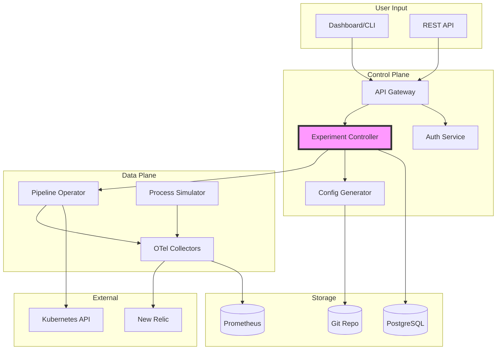
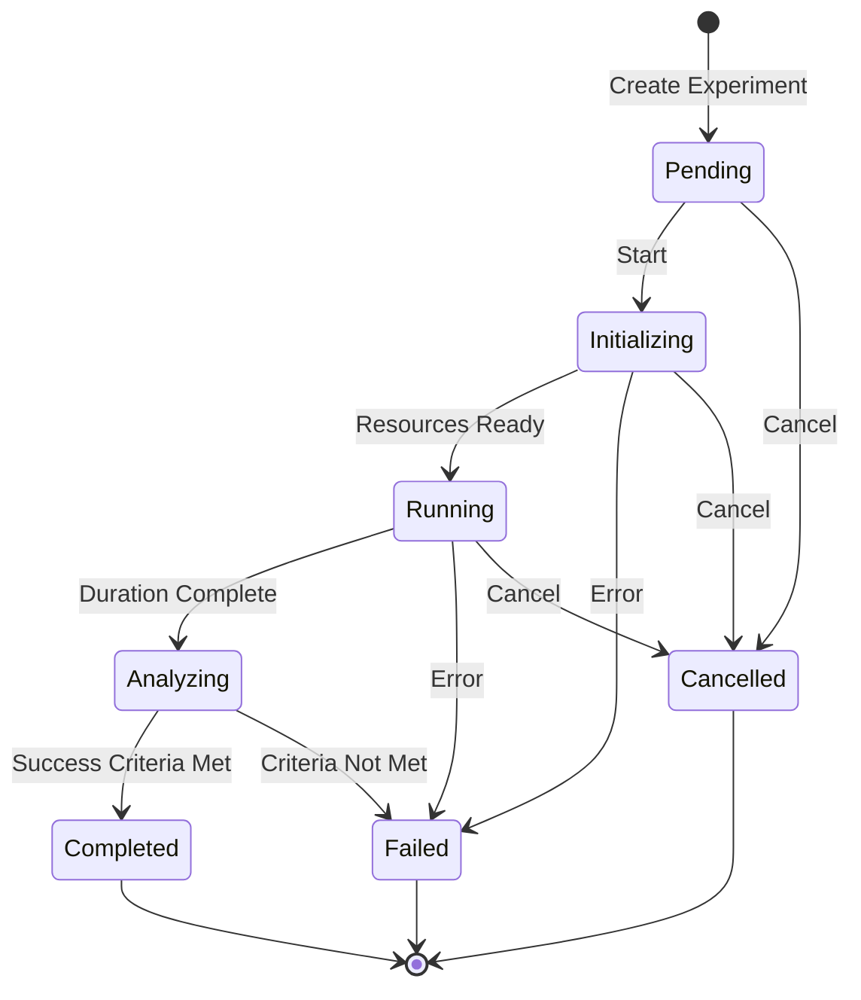
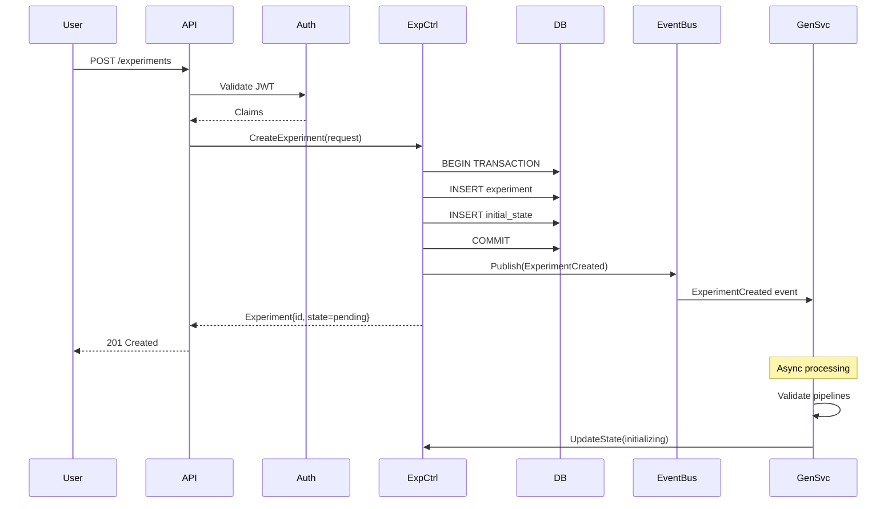
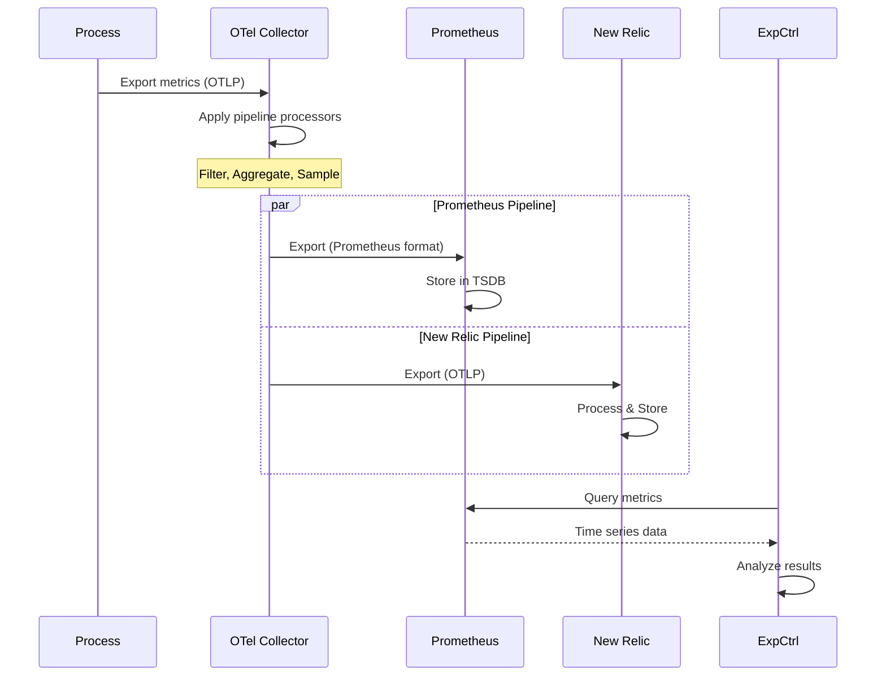
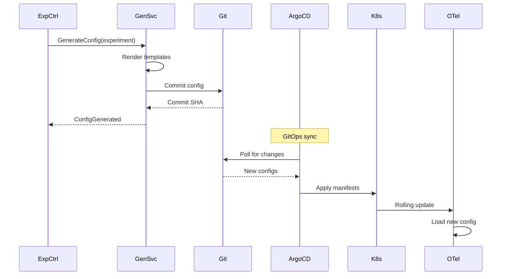

# Phoenix Platform Data Flow and State Management

**Version**: 1.0  
**Last Updated**: January 25, 2025

## Overview

This document provides a comprehensive view of data flow through the Phoenix Platform and how state is managed across different components.

## 1. High-Level Data Flow



## 2. Experiment State Machine

### 2.1 State Transitions



### 2.2 State Persistence

```sql
-- Experiment state tracking
CREATE TABLE experiment_states (
    id BIGSERIAL PRIMARY KEY,
    experiment_id UUID NOT NULL REFERENCES experiments(id),
    state VARCHAR(50) NOT NULL,
    previous_state VARCHAR(50),
    transition_reason TEXT,
    metadata JSONB,
    created_at TIMESTAMPTZ NOT NULL DEFAULT NOW(),
    created_by UUID REFERENCES users(id),
    
    INDEX idx_experiment_states_experiment (experiment_id, created_at DESC)
);

-- State transition audit
CREATE TABLE state_transitions (
    id BIGSERIAL PRIMARY KEY,
    experiment_id UUID NOT NULL,
    from_state VARCHAR(50),
    to_state VARCHAR(50) NOT NULL,
    duration_ms INTEGER,
    success BOOLEAN NOT NULL,
    error_message TEXT,
    metadata JSONB,
    created_at TIMESTAMPTZ NOT NULL DEFAULT NOW()
) PARTITION BY RANGE (created_at);
```

### 2.3 State Management Code

```go
// pkg/state/manager.go
package state

import (
    "context"
    "fmt"
    "sync"
    "time"
)

type StateManager struct {
    mu          sync.RWMutex
    states      map[string]*ExperimentState
    store       StateStore
    eventBus    EventBus
    transitions map[State][]State
}

type ExperimentState struct {
    ExperimentID   string
    CurrentState   State
    PreviousState  State
    StateData      map[string]interface{}
    LastTransition time.Time
    Version        int64 // For optimistic locking
}

func (sm *StateManager) Transition(ctx context.Context, experimentID string, targetState State, reason string) error {
    sm.mu.Lock()
    defer sm.mu.Unlock()
    
    // Get current state
    current, err := sm.getState(ctx, experimentID)
    if err != nil {
        return fmt.Errorf("failed to get current state: %w", err)
    }
    
    // Validate transition
    if !sm.isValidTransition(current.CurrentState, targetState) {
        return &InvalidTransitionError{
            From: current.CurrentState,
            To:   targetState,
        }
    }
    
    // Begin transaction
    tx, err := sm.store.BeginTx(ctx)
    if err != nil {
        return err
    }
    defer tx.Rollback()
    
    // Update state with optimistic locking
    newState := &ExperimentState{
        ExperimentID:   experimentID,
        CurrentState:   targetState,
        PreviousState:  current.CurrentState,
        LastTransition: time.Now(),
        Version:        current.Version + 1,
    }
    
    err = tx.UpdateState(ctx, newState, current.Version)
    if err == ErrVersionConflict {
        return &ConcurrentModificationError{ExperimentID: experimentID}
    }
    
    // Record transition
    transition := &StateTransition{
        ExperimentID: experimentID,
        FromState:    current.CurrentState,
        ToState:      targetState,
        Reason:       reason,
        Duration:     time.Since(current.LastTransition),
    }
    
    if err := tx.RecordTransition(ctx, transition); err != nil {
        return err
    }
    
    // Commit transaction
    if err := tx.Commit(); err != nil {
        return err
    }
    
    // Update in-memory cache
    sm.states[experimentID] = newState
    
    // Publish event
    sm.eventBus.Publish(ctx, &StateChangedEvent{
        ExperimentID: experimentID,
        OldState:     current.CurrentState,
        NewState:     targetState,
        Timestamp:    time.Now(),
    })
    
    return nil
}
```

## 3. Data Flow Scenarios

### 3.1 Experiment Creation Flow



### 3.2 Metrics Collection Flow



### 3.3 Configuration Update Flow



## 4. State Storage Patterns

### 4.1 Event Sourcing for Audit Trail

```go
// pkg/eventsource/store.go
package eventsource

type EventStore interface {
    Append(ctx context.Context, streamID string, events []Event) error
    Load(ctx context.Context, streamID string, fromVersion int) ([]Event, error)
    Subscribe(ctx context.Context, streamID string) (<-chan Event, error)
}

type Event struct {
    ID         string
    StreamID   string
    Version    int
    Type       string
    Data       json.RawMessage
    Metadata   map[string]string
    Timestamp  time.Time
}

// Aggregate reconstruction
func (s *ExperimentAggregate) Replay(events []Event) error {
    for _, event := range events {
        if err := s.Apply(event); err != nil {
            return err
        }
    }
    return nil
}
```

### 4.2 Snapshot Strategy

```go
// pkg/snapshot/manager.go
package snapshot

type SnapshotManager struct {
    store        SnapshotStore
    eventStore   EventStore
    snapshotFreq int // Events between snapshots
}

func (m *SnapshotManager) LoadAggregate(ctx context.Context, id string) (*Aggregate, error) {
    // Try to load latest snapshot
    snapshot, err := m.store.GetLatest(ctx, id)
    if err != nil && err != ErrNotFound {
        return nil, err
    }
    
    // Load events since snapshot
    fromVersion := 0
    if snapshot != nil {
        fromVersion = snapshot.Version
    }
    
    events, err := m.eventStore.Load(ctx, id, fromVersion)
    if err != nil {
        return nil, err
    }
    
    // Reconstruct aggregate
    agg := &Aggregate{}
    if snapshot != nil {
        agg = snapshot.ToAggregate()
    }
    
    for _, event := range events {
        agg.Apply(event)
    }
    
    // Create new snapshot if needed
    if len(events) > m.snapshotFreq {
        m.createSnapshot(ctx, agg)
    }
    
    return agg, nil
}
```

## 5. Concurrent State Management

### 5.1 Optimistic Locking

```sql
-- Version-based optimistic locking
UPDATE experiments 
SET 
    state = $1,
    updated_at = NOW(),
    version = version + 1
WHERE 
    id = $2 AND 
    version = $3
RETURNING version;
```

### 5.2 Distributed Locking

```go
// pkg/locks/distributed.go
package locks

import (
    "github.com/go-redis/redis/v8"
    "github.com/bsm/redislock"
)

type DistributedLock struct {
    client *redislock.Client
}

func (d *DistributedLock) AcquireExperimentLock(ctx context.Context, experimentID string) (*redislock.Lock, error) {
    key := fmt.Sprintf("experiment:lock:%s", experimentID)
    
    lock, err := d.client.Obtain(ctx, key, 30*time.Second, &redislock.Options{
        RetryStrategy: redislock.ExponentialBackoff(100*time.Millisecond, 5*time.Second),
        Metadata:      map[string]string{"holder": getHostname()},
    })
    
    if err == redislock.ErrNotObtained {
        return nil, &LockContentionError{Resource: experimentID}
    }
    
    return lock, err
}

// Usage in state transition
func (sm *StateManager) TransitionWithLock(ctx context.Context, experimentID string, targetState State) error {
    lock, err := sm.locks.AcquireExperimentLock(ctx, experimentID)
    if err != nil {
        return err
    }
    defer lock.Release(ctx)
    
    return sm.Transition(ctx, experimentID, targetState)
}
```

## 6. Data Consistency Patterns

### 6.1 Saga Pattern for Distributed Transactions

```go
// pkg/saga/experiment_creation.go
package saga

type ExperimentCreationSaga struct {
    steps []SagaStep
}

func NewExperimentCreationSaga() *ExperimentCreationSaga {
    return &ExperimentCreationSaga{
        steps: []SagaStep{
            &CreateExperimentStep{},
            &ValidatePipelinesStep{},
            &GenerateConfigsStep{},
            &DeployPipelinesStep{},
            &StartMonitoringStep{},
        },
    }
}

func (s *ExperimentCreationSaga) Execute(ctx context.Context, data *ExperimentData) error {
    completedSteps := []SagaStep{}
    
    for _, step := range s.steps {
        if err := step.Execute(ctx, data); err != nil {
            // Compensate in reverse order
            for i := len(completedSteps) - 1; i >= 0; i-- {
                if compErr := completedSteps[i].Compensate(ctx, data); compErr != nil {
                    // Log compensation failure
                    log.Error("compensation failed", 
                        zap.String("step", completedSteps[i].Name()),
                        zap.Error(compErr),
                    )
                }
            }
            return err
        }
        completedSteps = append(completedSteps, step)
    }
    
    return nil
}
```

### 6.2 Eventual Consistency

```go
// pkg/consistency/reconciler.go
package consistency

type Reconciler struct {
    store    Store
    k8s      kubernetes.Interface
    interval time.Duration
}

func (r *Reconciler) ReconcileExperiments(ctx context.Context) error {
    // Get expected state from database
    experiments, err := r.store.ListActiveExperiments(ctx)
    if err != nil {
        return err
    }
    
    // Get actual state from Kubernetes
    deployments, err := r.k8s.AppsV1().Deployments("").List(ctx, metav1.ListOptions{
        LabelSelector: "app=otel-collector",
    })
    
    // Reconcile differences
    for _, exp := range experiments {
        actual := findDeployment(deployments.Items, exp.ID)
        expected := exp.GetExpectedDeployments()
        
        if !reflect.DeepEqual(actual, expected) {
            // Update Kubernetes to match expected state
            if err := r.applyDeployments(ctx, expected); err != nil {
                log.Error("failed to reconcile deployment",
                    zap.String("experiment_id", exp.ID),
                    zap.Error(err),
                )
                continue
            }
        }
    }
    
    return nil
}
```

## 7. Performance Optimizations

### 7.1 State Caching

```go
// pkg/cache/state_cache.go
package cache

import (
    "github.com/dgraph-io/ristretto"
)

type StateCache struct {
    cache *ristretto.Cache
    ttl   time.Duration
}

func NewStateCache() (*StateCache, error) {
    cache, err := ristretto.NewCache(&ristretto.Config{
        NumCounters: 1e7,     // 10 million
        MaxCost:     1 << 30, // 1GB
        BufferItems: 64,
    })
    
    return &StateCache{
        cache: cache,
        ttl:   5 * time.Minute,
    }, err
}

func (c *StateCache) Get(experimentID string) (*ExperimentState, bool) {
    value, found := c.cache.Get(experimentID)
    if !found {
        return nil, false
    }
    
    state := value.(*ExperimentState)
    return state, true
}

func (c *StateCache) Set(experimentID string, state *ExperimentState) {
    c.cache.SetWithTTL(
        experimentID,
        state,
        int64(unsafe.Sizeof(*state)),
        c.ttl,
    )
}

// Invalidation on state change
func (c *StateCache) Invalidate(experimentID string) {
    c.cache.Del(experimentID)
}
```

### 7.2 Batch Processing

```go
// pkg/batch/processor.go
package batch

type BatchProcessor struct {
    batchSize    int
    flushInterval time.Duration
    processor    func([]StateUpdate) error
    updates      chan StateUpdate
}

func (b *BatchProcessor) Start(ctx context.Context) {
    batch := make([]StateUpdate, 0, b.batchSize)
    ticker := time.NewTicker(b.flushInterval)
    
    for {
        select {
        case update := <-b.updates:
            batch = append(batch, update)
            if len(batch) >= b.batchSize {
                b.flush(batch)
                batch = batch[:0]
            }
            
        case <-ticker.C:
            if len(batch) > 0 {
                b.flush(batch)
                batch = batch[:0]
            }
            
        case <-ctx.Done():
            b.flush(batch)
            return
        }
    }
}

func (b *BatchProcessor) flush(batch []StateUpdate) {
    if err := b.processor(batch); err != nil {
        log.Error("batch processing failed", zap.Error(err))
    }
}
```

## 8. Monitoring State Management

### 8.1 State Metrics

```go
var (
    StateTransitionDuration = prometheus.NewHistogramVec(
        prometheus.HistogramOpts{
            Name: "phoenix_state_transition_duration_seconds",
            Help: "Duration of state transitions",
        },
        []string{"from_state", "to_state", "success"},
    )
    
    StateDistribution = prometheus.NewGaugeVec(
        prometheus.GaugeOpts{
            Name: "phoenix_experiments_by_state",
            Help: "Current distribution of experiments by state",
        },
        []string{"state"},
    )
    
    StateLockContention = prometheus.NewCounterVec(
        prometheus.CounterOpts{
            Name: "phoenix_state_lock_contention_total",
            Help: "Number of state lock contentions",
        },
        []string{"resource_type"},
    )
)
```

### 8.2 State Transition Tracing

```go
func (sm *StateManager) TransitionWithTracing(ctx context.Context, experimentID string, targetState State) error {
    ctx, span := tracer.Start(ctx, "state.transition",
        trace.WithAttributes(
            attribute.String("experiment.id", experimentID),
            attribute.String("state.target", string(targetState)),
        ),
    )
    defer span.End()
    
    start := time.Now()
    err := sm.Transition(ctx, experimentID, targetState)
    duration := time.Since(start)
    
    StateTransitionDuration.WithLabelValues(
        string(current.State),
        string(targetState),
        strconv.FormatBool(err == nil),
    ).Observe(duration.Seconds())
    
    if err != nil {
        span.RecordError(err)
        span.SetStatus(codes.Error, err.Error())
    }
    
    return err
}
```

## 9. Recovery and Resilience

### 9.1 State Recovery

```go
// pkg/recovery/state_recovery.go
package recovery

func (r *StateRecovery) RecoverIncompleteTransitions(ctx context.Context) error {
    // Find experiments stuck in transitional states
    stuck, err := r.store.FindStuckExperiments(ctx, 10*time.Minute)
    if err != nil {
        return err
    }
    
    for _, exp := range stuck {
        switch exp.State {
        case StateInitializing:
            // Check if resources were created
            if r.resourcesExist(ctx, exp.ID) {
                r.transitionTo(ctx, exp.ID, StateRunning)
            } else {
                r.transitionTo(ctx, exp.ID, StateFailed)
            }
            
        case StateAnalyzing:
            // Check if we have enough data
            if r.hasMinimumData(ctx, exp.ID) {
                r.completeAnalysis(ctx, exp.ID)
            } else {
                r.extendRuntime(ctx, exp.ID, 5*time.Minute)
            }
        }
    }
    
    return nil
}
```

## 10. Best Practices

### 10.1 State Management Guidelines

1. **Idempotency**: All state transitions must be idempotent
2. **Atomicity**: Use transactions for multi-step operations
3. **Audit Trail**: Log all state changes with context
4. **Validation**: Validate state transitions before execution
5. **Recovery**: Implement automatic recovery for stuck states

### 10.2 Data Flow Guidelines

1. **Async Processing**: Use events for non-critical paths
2. **Batching**: Batch operations where possible
3. **Caching**: Cache read-heavy data with proper invalidation
4. **Monitoring**: Track all data flow paths
5. **Error Handling**: Implement circuit breakers for external calls