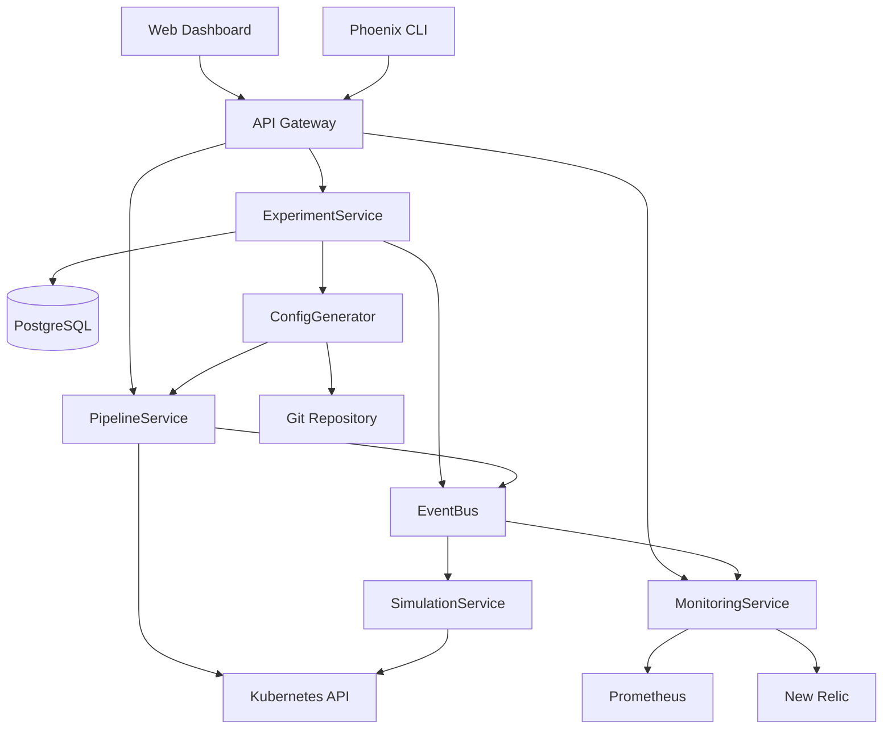

# Phoenix Platform Interface Architecture

## Overview

The Phoenix Platform follows an interface-driven architecture where all inter-module communication is defined through explicit contracts. This document describes the interface architecture, patterns, and guidelines for module integration.

## Architecture Principles

### 1. Interface Segregation
- Small, focused interfaces (5-10 methods max)
- Single responsibility per interface
- Domain-specific contracts

### 2. Dependency Inversion
- High-level modules depend on interfaces
- Low-level modules implement interfaces
- No direct dependencies between modules

### 3. Contract-First Design
- Define interfaces before implementation
- Explicit request/response types
- Comprehensive error handling

## Interface Categories

### Domain Interfaces

Located in `pkg/interfaces/`:

#### 1. Experiment Management (`experiment.go`)
```go
type ExperimentService interface {
    CreateExperiment(ctx context.Context, req *CreateExperimentRequest) (*Experiment, error)
    GetExperiment(ctx context.Context, id string) (*Experiment, error)
    StartExperiment(ctx context.Context, id string) error
    // ... other methods
}
```
- **Purpose**: Core experiment lifecycle management
- **Implemented by**: Experiment Controller
- **Consumed by**: API Service, Dashboard

#### 2. Pipeline Management (`pipeline.go`)
```go
type PipelineService interface {
    CreatePipeline(ctx context.Context, req *CreatePipelineRequest) (*Pipeline, error)
    ValidatePipeline(ctx context.Context, config *PipelineConfig) (*ValidationResult, error)
    DeployPipeline(ctx context.Context, id string, targets []string) (*DeploymentStatus, error)
    // ... other methods
}
```
- **Purpose**: Pipeline configuration and deployment
- **Implemented by**: Pipeline Manager, Config Generator
- **Consumed by**: API Service, Experiment Controller

#### 3. Monitoring (`monitoring.go`)
```go
type MonitoringService interface {
    QueryMetrics(ctx context.Context, query *MetricsQuery) (*MetricsResult, error)
    CompareMetrics(ctx context.Context, req *CompareMetricsRequest) (*MetricsComparison, error)
    GenerateReport(ctx context.Context, experimentID string) (*AnalysisReport, error)
    // ... other methods
}
```
- **Purpose**: Metrics collection and analysis
- **Implemented by**: Monitoring Service
- **Consumed by**: Dashboard, API Service

#### 4. Load Simulation (`simulation.go`)
```go
type SimulationService interface {
    CreateSimulation(ctx context.Context, req *CreateSimulationRequest) (*Simulation, error)
    StartSimulation(ctx context.Context, id string) error
    GetSimulationMetrics(ctx context.Context, id string) (*SimulationMetrics, error)
    // ... other methods
}
```
- **Purpose**: Load generation and testing
- **Implemented by**: Process Simulator
- **Consumed by**: Experiment Controller

### Infrastructure Interfaces

#### 5. Event Bus (`events.go`)
```go
type EventBus interface {
    Publish(ctx context.Context, event Event) error
    Subscribe(ctx context.Context, filter EventFilter) (<-chan Event, error)
    // ... other methods
}
```
- **Purpose**: Asynchronous event-driven communication
- **Implementation Options**: Redis Pub/Sub, NATS, Kafka
- **Used by**: All services for decoupled communication

#### 6. Service Discovery (`service.go`)
```go
type ServiceRegistry interface {
    Register(ctx context.Context, service *ServiceInstance) error
    Discover(ctx context.Context, serviceName string) ([]*ServiceInstance, error)
    // ... other methods
}
```
- **Purpose**: Dynamic service discovery and health checking
- **Implementation Options**: Consul, etcd, Kubernetes
- **Used by**: All services for inter-service communication

## Communication Patterns

### 1. Request-Response (Synchronous)
```
Client → ServiceInterface → Implementation
         ↓                    ↓
    Request Type         Response Type
```

### 2. Event-Driven (Asynchronous)
```
Producer → Event → EventBus → Event → Consumer
                      ↓
                 Event Types
```

### 3. Streaming
```
Client ← Stream ← ServiceInterface → Implementation
          ↓
    Continuous Updates
```

## Service Integration Map



## Implementation Guidelines

### 1. Interface Implementation

```go
// Good: Explicit interface implementation
type experimentService struct {
    store    interfaces.ExperimentStore
    eventBus interfaces.EventBus
    logger   *zap.Logger
}

// Ensure interface is implemented
var _ interfaces.ExperimentService = (*experimentService)(nil)

func NewExperimentService(deps Dependencies) interfaces.ExperimentService {
    return &experimentService{
        store:    deps.Store,
        eventBus: deps.EventBus,
        logger:   deps.Logger,
    }
}
```

### 2. Error Handling

```go
// Define domain-specific errors
type ExperimentError struct {
    Code    string
    Message string
    Details map[string]interface{}
}

func (e *ExperimentError) Error() string {
    return fmt.Sprintf("%s: %s", e.Code, e.Message)
}

// Use in interface methods
func (s *experimentService) CreateExperiment(ctx context.Context, req *CreateExperimentRequest) (*Experiment, error) {
    if err := s.validate(req); err != nil {
        return nil, &ExperimentError{
            Code:    "INVALID_REQUEST",
            Message: "Invalid experiment configuration",
            Details: map[string]interface{}{"validation_errors": err},
        }
    }
    // ... implementation
}
```

### 3. Context Usage

All interface methods must:
- Accept `context.Context` as first parameter
- Respect context cancellation
- Pass context through the call chain

```go
func (s *service) Method(ctx context.Context, ...) error {
    // Check context
    select {
    case <-ctx.Done():
        return ctx.Err()
    default:
    }
    
    // Implementation
}
```

### 4. Testing with Interfaces

```go
// Mock implementation
type mockExperimentService struct {
    mock.Mock
}

func (m *mockExperimentService) CreateExperiment(ctx context.Context, req *CreateExperimentRequest) (*Experiment, error) {
    args := m.Called(ctx, req)
    if args.Get(0) == nil {
        return nil, args.Error(1)
    }
    return args.Get(0).(*Experiment), args.Error(1)
}

// Test
func TestHandler_CreateExperiment(t *testing.T) {
    mockSvc := new(mockExperimentService)
    handler := NewHandler(mockSvc)
    
    mockSvc.On("CreateExperiment", mock.Anything, mock.Anything).
        Return(&Experiment{ID: "123"}, nil)
    
    // Test implementation
}
```

## Interface Evolution

### Versioning Strategy

1. **Non-breaking changes**: Add methods to existing interfaces
2. **Breaking changes**: Create new interface version (e.g., `ExperimentServiceV2`)
3. **Deprecation**: Mark old methods/interfaces as deprecated
4. **Migration**: Provide adapters between versions

### Adding New Interfaces

1. Define interface in appropriate domain file
2. Add comprehensive documentation
3. Define all types (requests, responses, events)
4. Create mock implementation
5. Update this documentation
6. Implement in relevant service

## Best Practices

### DO:
- ✅ Keep interfaces small and focused
- ✅ Use meaningful method names
- ✅ Return errors for all fallible operations
- ✅ Use context.Context consistently
- ✅ Define explicit types for requests/responses
- ✅ Document all methods and types
- ✅ Validate inputs at interface boundaries

### DON'T:
- ❌ Create "god" interfaces with many methods
- ❌ Use interface{} for parameters/returns
- ❌ Panic in interface implementations
- ❌ Ignore context cancellation
- ❌ Mix concerns in single interface
- ❌ Break interface contracts without versioning

## Monitoring Interfaces

Each service should expose metrics about interface usage:

```go
var (
    interfaceCallsTotal = prometheus.NewCounterVec(
        prometheus.CounterOpts{
            Name: "phoenix_interface_calls_total",
            Help: "Total number of interface method calls",
        },
        []string{"interface", "method", "status"},
    )
    
    interfaceLatency = prometheus.NewHistogramVec(
        prometheus.HistogramOpts{
            Name: "phoenix_interface_latency_seconds",
            Help: "Interface method call latency",
        },
        []string{"interface", "method"},
    )
)
```

## Future Enhancements

1. **Code Generation**: Generate interface implementations from OpenAPI specs
2. **Contract Testing**: Automated interface compliance tests
3. **Service Mesh**: Integration with Istio/Linkerd for advanced routing
4. **Distributed Tracing**: OpenTelemetry integration for request tracing
5. **API Gateway**: Auto-generate gateway from interfaces