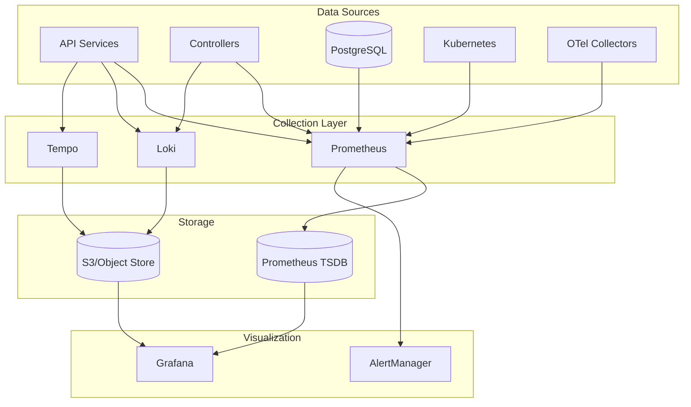

# Phoenix Platform Monitoring and Alerting Strategy

**Version**: 1.0  
**Last Updated**: January 25, 2025

## Overview

This document defines the comprehensive monitoring and alerting strategy for the Phoenix Platform, ensuring system reliability, performance visibility, and rapid incident response.

## 1. Monitoring Architecture

### 1.1 Metrics Collection Stack



### 1.2 Metrics Export Configuration

```yaml
# configs/monitoring/prometheus/prometheus.yaml
global:
  scrape_interval: 15s
  evaluation_interval: 15s
  external_labels:
    cluster: 'phoenix-prod'
    region: 'us-east-1'

scrape_configs:
  # Phoenix Services
  - job_name: 'phoenix-api'
    kubernetes_sd_configs:
      - role: pod
        namespaces:
          names: ['phoenix-system']
    relabel_configs:
      - source_labels: [__meta_kubernetes_pod_label_app]
        regex: phoenix-api
        action: keep
      - source_labels: [__meta_kubernetes_pod_annotation_prometheus_io_port]
        target_label: __address__
        regex: (.+)
        replacement: $1:${1}

  # OTel Collectors
  - job_name: 'otel-collectors'
    kubernetes_sd_configs:
      - role: pod
        namespaces:
          names: ['phoenix-experiments']
    relabel_configs:
      - source_labels: [__meta_kubernetes_pod_label_app]
        regex: otel-collector
        action: keep

  # PostgreSQL Exporter
  - job_name: 'postgres'
    static_configs:
      - targets: ['postgres-exporter:9187']

# Remote write to New Relic
remote_write:
  - url: https://metric-api.newrelic.com/prometheus/v1/write
    bearer_token_file: /var/run/secrets/newrelic/api-key
    write_relabel_configs:
      - source_labels: [__name__]
        regex: 'phoenix_.*'
        action: keep
```

## 2. Key Metrics and SLIs

### 2.1 Service Level Indicators (SLIs)

| Service | SLI | Target | Measurement |
|---------|-----|--------|-------------|
| API Gateway | Request Success Rate | 99.9% | `(1 - rate(http_requests_total{status=~"5.."}[5m])) * 100` |
| API Gateway | Latency P99 | <100ms | `histogram_quantile(0.99, http_request_duration_seconds)` |
| Experiment Controller | State Transition Success | 99.5% | `rate(experiment_transitions_success[5m]) / rate(experiment_transitions_total[5m])` |
| OTel Collectors | CPU Usage | <10% | `rate(container_cpu_usage_seconds_total[5m]) * 100` |
| Database | Connection Pool Utilization | <80% | `pg_stat_database_numbackends / pg_settings_max_connections` |

### 2.2 Phoenix-Specific Metrics

```go
// pkg/metrics/metrics.go
package metrics

import (
    "github.com/prometheus/client_golang/prometheus"
    "github.com/prometheus/client_golang/prometheus/promauto"
)

var (
    // Experiment metrics
    ExperimentTotal = promauto.NewCounterVec(
        prometheus.CounterOpts{
            Name: "phoenix_experiment_total",
            Help: "Total number of experiments by state",
        },
        []string{"state", "tenant_id"},
    )
    
    ExperimentDuration = promauto.NewHistogramVec(
        prometheus.HistogramOpts{
            Name:    "phoenix_experiment_duration_seconds",
            Help:    "Duration of experiments in seconds",
            Buckets: prometheus.ExponentialBuckets(60, 2, 10), // 1min to ~17hrs
        },
        []string{"state", "pipeline_type"},
    )
    
    // Pipeline metrics
    PipelineCardinalityReduction = promauto.NewGaugeVec(
        prometheus.GaugeOpts{
            Name: "phoenix_pipeline_cardinality_reduction_ratio",
            Help: "Cardinality reduction ratio achieved by pipeline",
        },
        []string{"experiment_id", "pipeline", "variant"},
    )
    
    CollectorResourceUsage = promauto.NewGaugeVec(
        prometheus.GaugeOpts{
            Name: "phoenix_collector_resource_usage",
            Help: "Resource usage of OTel collectors",
        },
        []string{"experiment_id", "variant", "resource", "node"},
    )
    
    // Cost metrics
    EstimatedMonthlySavings = promauto.NewGaugeVec(
        prometheus.GaugeOpts{
            Name: "phoenix_estimated_monthly_savings_usd",
            Help: "Estimated monthly cost savings in USD",
        },
        []string{"tenant_id", "provider"},
    )
    
    // API metrics
    APIRequestDuration = promauto.NewHistogramVec(
        prometheus.HistogramOpts{
            Name:    "phoenix_api_request_duration_seconds",
            Help:    "API request duration in seconds",
            Buckets: prometheus.DefBuckets,
        },
        []string{"method", "endpoint", "status"},
    )
    
    WebSocketConnections = promauto.NewGauge(
        prometheus.GaugeOpts{
            Name: "phoenix_websocket_connections_active",
            Help: "Number of active WebSocket connections",
        },
    )
)
```

## 3. Alerting Rules

### 3.1 Critical Alerts (P0)

```yaml
# configs/monitoring/prometheus/rules/critical.yaml
groups:
  - name: phoenix_critical
    interval: 30s
    rules:
      # Service availability
      - alert: PhoenixAPIDown
        expr: up{job="phoenix-api"} == 0
        for: 2m
        labels:
          severity: critical
          team: platform
        annotations:
          summary: "Phoenix API is down"
          description: "Phoenix API service has been down for more than 2 minutes"
          runbook_url: "https://wiki.phoenix.io/runbooks/api-down"
      
      # Database issues
      - alert: DatabaseConnectionPoolExhausted
        expr: |
          (pg_stat_database_numbackends{datname="phoenix"} / 
           pg_settings_max_connections) > 0.9
        for: 5m
        labels:
          severity: critical
          team: platform
        annotations:
          summary: "Database connection pool nearly exhausted"
          description: "PostgreSQL connection pool is at {{ $value | humanizePercentage }} capacity"
      
      # Experiment failures
      - alert: HighExperimentFailureRate
        expr: |
          rate(phoenix_experiment_total{state="failed"}[15m]) /
          rate(phoenix_experiment_total[15m]) > 0.1
        for: 10m
        labels:
          severity: critical
          team: platform
        annotations:
          summary: "High experiment failure rate"
          description: "{{ $value | humanizePercentage }} of experiments are failing"
```

### 3.2 Warning Alerts (P1)

```yaml
  - name: phoenix_warnings
    interval: 1m
    rules:
      # Performance degradation
      - alert: APIHighLatency
        expr: |
          histogram_quantile(0.99, 
            rate(phoenix_api_request_duration_seconds_bucket[5m])
          ) > 0.5
        for: 10m
        labels:
          severity: warning
          team: platform
        annotations:
          summary: "API latency is high"
          description: "API p99 latency is {{ $value }}s"
      
      # Resource usage
      - alert: CollectorHighMemoryUsage
        expr: |
          container_memory_usage_bytes{pod=~"otel-collector-.*"} / 
          container_spec_memory_limit_bytes > 0.8
        for: 15m
        labels:
          severity: warning
          team: platform
        annotations:
          summary: "OTel collector high memory usage"
          description: "Collector {{ $labels.pod }} memory at {{ $value | humanizePercentage }}"
      
      # Business metrics
      - alert: LowCardinalityReduction
        expr: |
          avg_over_time(phoenix_pipeline_cardinality_reduction_ratio[30m]) < 0.2
        for: 30m
        labels:
          severity: warning
          team: product
        annotations:
          summary: "Low cardinality reduction achieved"
          description: "Pipeline {{ $labels.pipeline }} achieving only {{ $value | humanizePercentage }} reduction"
```

### 3.3 Informational Alerts (P2)

```yaml
  - name: phoenix_info
    interval: 5m
    rules:
      # Scaling events
      - alert: PodAutoScaled
        expr: |
          changes(kube_deployment_spec_replicas{deployment=~"phoenix-.*"}[10m]) > 0
        labels:
          severity: info
          team: platform
        annotations:
          summary: "Deployment scaled"
          description: "{{ $labels.deployment }} scaled to {{ $value }} replicas"
      
      # Certificate expiry
      - alert: CertificateExpiringSoon
        expr: |
          (probe_ssl_earliest_cert_expiry - time()) / 86400 < 30
        for: 1h
        labels:
          severity: info
          team: platform
        annotations:
          summary: "SSL certificate expiring soon"
          description: "Certificate for {{ $labels.instance }} expires in {{ $value }} days"
```

## 4. Dashboards

### 4.1 Executive Dashboard

```json
{
  "dashboard": {
    "title": "Phoenix Platform - Executive Overview",
    "panels": [
      {
        "title": "Active Experiments",
        "targets": [{
          "expr": "sum(phoenix_experiment_total{state=\"running\"})"
        }]
      },
      {
        "title": "Monthly Cost Savings",
        "targets": [{
          "expr": "sum(phoenix_estimated_monthly_savings_usd)"
        }]
      },
      {
        "title": "Average Cardinality Reduction",
        "targets": [{
          "expr": "avg(phoenix_pipeline_cardinality_reduction_ratio)"
        }]
      },
      {
        "title": "System Health Score",
        "targets": [{
          "expr": "(1 - rate(phoenix_api_request_duration_seconds{status=~\"5..\"}[5m])) * 100"
        }]
      }
    ]
  }
}
```

### 4.2 Operations Dashboard

Key panels:
- Service health matrix
- Request rate and latency
- Error rate by service
- Resource utilization
- Database performance
- Queue depths

### 4.3 Experiment Dashboard

Key panels:
- Experiment lifecycle funnel
- State transition success rates
- Cardinality reduction by pipeline
- Resource usage comparison
- Cost savings projections

## 5. Logging Strategy

### 5.1 Structured Logging

```go
// pkg/logging/logger.go
package logging

import (
    "go.uber.org/zap"
    "go.uber.org/zap/zapcore"
)

func NewLogger(service string) *zap.Logger {
    config := zap.NewProductionConfig()
    config.EncoderConfig.TimeKey = "@timestamp"
    config.EncoderConfig.EncodeTime = zapcore.ISO8601TimeEncoder
    
    config.InitialFields = map[string]interface{}{
        "service": service,
        "version": Version,
        "cluster": os.Getenv("CLUSTER_NAME"),
    }
    
    logger, _ := config.Build()
    return logger
}

// Usage
logger.Info("experiment state transition",
    zap.String("experiment_id", expID),
    zap.String("from_state", fromState),
    zap.String("to_state", toState),
    zap.Duration("transition_time", duration),
)
```

### 5.2 Log Aggregation

```yaml
# configs/logging/fluent-bit.yaml
config:
  inputs: |
    [INPUT]
        Name tail
        Path /var/log/containers/*phoenix*.log
        Parser docker
        Tag kube.*
        
  filters: |
    [FILTER]
        Name kubernetes
        Match kube.*
        Merge_Log On
        Keep_Log Off
        
    [FILTER]
        Name nest
        Match kube.*
        Operation lift
        Nested_under kubernetes
        
  outputs: |
    [OUTPUT]
        Name loki
        Match kube.*
        Host loki.monitoring.svc.cluster.local
        Port 3100
        Labels job=phoenix
```

## 6. Distributed Tracing

### 6.1 OpenTelemetry Integration

```go
// pkg/tracing/tracer.go
package tracing

import (
    "go.opentelemetry.io/otel"
    "go.opentelemetry.io/otel/exporters/otlp/otlptrace/otlptracegrpc"
    "go.opentelemetry.io/otel/sdk/trace"
)

func InitTracer(serviceName string) func() {
    exporter, _ := otlptracegrpc.New(
        context.Background(),
        otlptracegrpc.WithEndpoint("tempo:4317"),
        otlptracegrpc.WithInsecure(),
    )
    
    tp := trace.NewTracerProvider(
        trace.WithBatcher(exporter),
        trace.WithResource(resource.NewWithAttributes(
            semconv.SchemaURL,
            semconv.ServiceNameKey.String(serviceName),
        )),
    )
    
    otel.SetTracerProvider(tp)
    
    return func() {
        tp.Shutdown(context.Background())
    }
}
```

### 6.2 Trace Sampling Strategy

```yaml
# Adaptive sampling based on traffic
sampling_rules:
  - service: "phoenix-api"
    endpoint: "/api/v1/experiments"
    method: "POST"
    sample_rate: 1.0  # 100% for experiment creation
    
  - service: "phoenix-api"
    endpoint: "/health"
    sample_rate: 0.001  # 0.1% for health checks
    
  - service: "*"
    error: true
    sample_rate: 1.0  # 100% for errors
    
  default_sample_rate: 0.1  # 10% default
```

## 7. Incident Response

### 7.1 On-Call Rotation

```yaml
on_call_schedule:
  primary:
    schedule: "weekly"
    teams:
      - platform
      - backend
  secondary:
    schedule: "weekly"
    teams:
      - sre
  escalation:
    15_minutes: "secondary"
    30_minutes: "engineering_manager"
    60_minutes: "director"
```

### 7.2 Runbook Template

```markdown
# Runbook: [Alert Name]

## Overview
Brief description of what this alert means

## Impact
- Customer impact
- Business impact
- Technical impact

## Diagnosis
1. Check dashboard: [link]
2. Query logs: `{service="phoenix-api"} |= "error"`
3. Check dependencies

## Mitigation
1. Immediate actions
2. Temporary fixes
3. Long-term solutions

## Prevention
- Root cause
- Action items
- Timeline
```

## 8. Performance Monitoring

### 8.1 SLO Dashboard

```yaml
slos:
  - name: "API Availability"
    sli: "phoenix_api_availability"
    target: 99.9
    window: "30d"
    
  - name: "Experiment Success Rate"
    sli: "phoenix_experiment_success_rate"
    target: 99.0
    window: "7d"
    
  - name: "Pipeline Deployment Time"
    sli: "phoenix_pipeline_deployment_duration"
    target: 300  # seconds
    window: "30d"
```

### 8.2 Capacity Planning

Monthly review metrics:
- Request rate growth
- Storage usage trends
- Compute resource utilization
- Database connection usage
- Cost per experiment

## 9. Security Monitoring

### 9.1 Security Events

```yaml
security_alerts:
  - alert: UnauthorizedAPIAccess
    expr: |
      rate(phoenix_api_request_total{status="403"}[5m]) > 10
    
  - alert: SuspiciousQueryPattern
    expr: |
      rate(pg_stat_statements_calls{query=~".*';.*"}[5m]) > 0
    
  - alert: SecretAccessAnomaly
    expr: |
      rate(vault_secret_access_total[5m]) > 
      avg_over_time(vault_secret_access_total[1h:5m]) * 3
```

## 10. Implementation Timeline

### Phase 1 (Week 1)
- Deploy Prometheus and Grafana
- Configure service discovery
- Import basic dashboards

### Phase 2 (Week 2)
- Configure AlertManager
- Set up critical alerts
- Create on-call schedule

### Phase 3 (Week 3)
- Deploy Loki for logging
- Configure log aggregation
- Create log-based alerts

### Phase 4 (Week 4)
- Deploy Tempo for tracing
- Instrument services
- Create trace-based dashboards

## Success Metrics

- Mean Time to Detect (MTTD) < 5 minutes
- Mean Time to Resolve (MTTR) < 30 minutes
- Alert accuracy > 95% (low false positives)
- Dashboard load time < 3 seconds
- Log query performance < 5 seconds