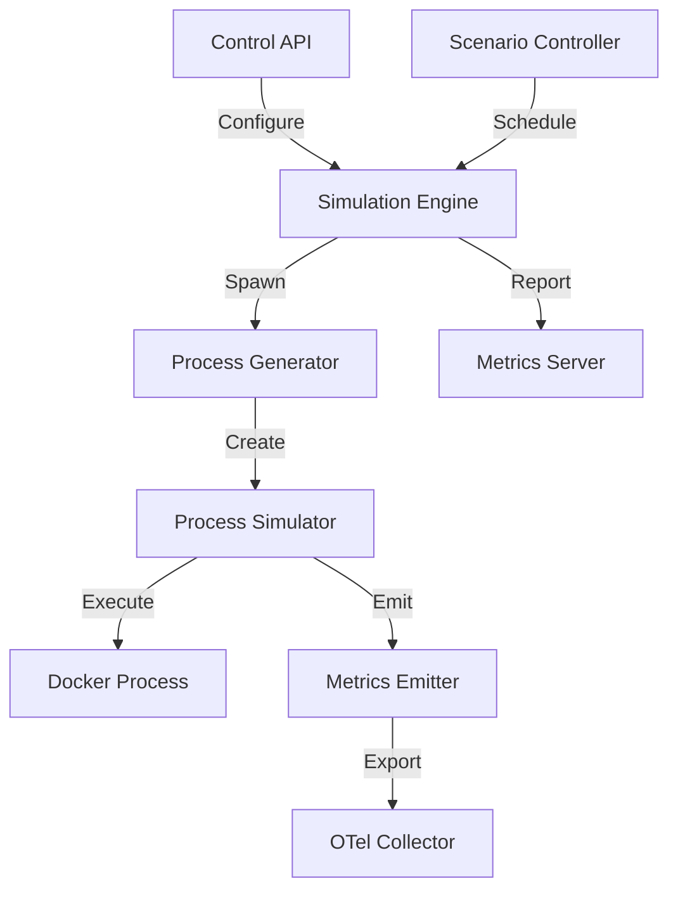

# Phoenix Process Simulator Technical Specification

## Overview

The Phoenix Process Simulator is a Go-based tool that generates realistic process loads for testing OpenTelemetry pipeline configurations. It simulates various process patterns including high cardinality, churn, and resource consumption to validate optimization strategies.

## Service Identity

- **Service Name**: phoenix-process-simulator
- **Type**: Testing/Simulation Tool
- **Repository Path**: `/cmd/simulator/`
- **Port**: 8095 (Metrics), 8096 (Control API)
- **Technology Stack**: Go 1.21, Docker API

## Architecture

### Service Architecture

```
cmd/simulator/
├── main.go                    # Entry point
├── internal/
│   ├── simulator/
│   │   ├── engine.go         # Core simulation engine
│   │   ├── process.go        # Process lifecycle management
│   │   ├── patterns.go       # Load patterns
│   │   └── metrics.go        # Metrics emission
│   ├── generator/
│   │   ├── names.go          # Process name generation
│   │   ├── memory.go         # Memory pattern simulation
│   │   ├── cpu.go            # CPU pattern simulation
│   │   └── lifecycle.go      # Process lifecycle patterns
│   ├── control/
│   │   ├── api.go            # Control API handlers
│   │   ├── scenarios.go      # Pre-defined scenarios
│   │   └── scheduler.go      # Scenario scheduling
│   └── docker/
│       ├── client.go         # Docker API integration
│       └── container.go      # Container management
├── pkg/simulator/
│   ├── types/                # Public types
│   └── client/               # Client library
└── configs/
    └── scenarios/            # Scenario definitions
```

### Component Interaction



## Core Components

### 1. Simulation Engine

```go
// SimulationEngine orchestrates process simulation
type SimulationEngine struct {
    config          *Config
    processManager  *ProcessManager
    metricsEmitter  *MetricsEmitter
    dockerClient    *docker.Client
    activeProcesses sync.Map
    mu              sync.RWMutex
}

// SimulationConfig defines simulation parameters
type SimulationConfig struct {
    // Process generation
    ProcessCount      int                    `json:"processCount"`
    ProcessNamespace  string                 `json:"processNamespace"`
    ChurnRate         float64                `json:"churnRate"` // processes/sec
    CardinalityTarget int                    `json:"cardinalityTarget"`
    
    // Resource patterns
    MemoryPattern     MemoryPattern          `json:"memoryPattern"`
    CPUPattern        CPUPattern             `json:"cpuPattern"`
    
    // Lifecycle
    MinLifetime       time.Duration          `json:"minLifetime"`
    MaxLifetime       time.Duration          `json:"maxLifetime"`
    
    // Chaos
    ChaosEnabled      bool                   `json:"chaosEnabled"`
    ChaosConfig       ChaosConfig            `json:"chaosConfig"`
}

// Start begins the simulation
func (se *SimulationEngine) Start(ctx context.Context) error {
    log.Info("Starting simulation engine", 
        "targetProcesses", se.config.ProcessCount,
        "churnRate", se.config.ChurnRate)
    
    // Start metrics emission
    go se.metricsEmitter.Start(ctx)
    
    // Start process lifecycle manager
    go se.manageProcessLifecycle(ctx)
    
    // Start initial processes
    for i := 0; i < se.config.ProcessCount; i++ {
        if err := se.spawnProcess(ctx); err != nil {
            log.Error("Failed to spawn process", "error", err)
        }
    }
    
    // Monitor and maintain target count
    ticker := time.NewTicker(time.Second)
    defer ticker.Stop()
    
    for {
        select {
        case <-ctx.Done():
            return se.cleanup()
        case <-ticker.C:
            se.maintainProcessCount(ctx)
        }
    }
}

// spawnProcess creates a new simulated process
func (se *SimulationEngine) spawnProcess(ctx context.Context) error {
    process := &SimulatedProcess{
        ID:        generateProcessID(),
        Name:      se.generateProcessName(),
        StartTime: time.Now(),
        Lifetime:  se.generateLifetime(),
        Memory:    se.config.MemoryPattern.Initial(),
        CPU:       se.config.CPUPattern.Initial(),
    }
    
    // Create actual process or container
    if se.config.UseDocker {
        container, err := se.createDockerProcess(process)
        if err != nil {
            return fmt.Errorf("creating docker process: %w", err)
        }
        process.ContainerID = container.ID
    } else {
        cmd, err := se.createLocalProcess(process)
        if err != nil {
            return fmt.Errorf("creating local process: %w", err)
        }
        process.Cmd = cmd
    }
    
    // Register process
    se.activeProcesses.Store(process.ID, process)
    
    // Start resource simulation
    go se.simulateProcessBehavior(ctx, process)
    
    return nil
}
```

### 2. Process Pattern Generator

```go
// ProcessNameGenerator creates realistic process names
type ProcessNameGenerator struct {
    patterns     []NamePattern
    cardinality  int
    uniqueNames  *sync.Map
    nameCounts   map[string]int
    mu           sync.Mutex
}

type NamePattern struct {
    Template string
    Weight   float64
    Args     []string
}

var defaultPatterns = []NamePattern{
    {Template: "java", Weight: 0.15, Args: []string{"-jar", "app.jar"}},
    {Template: "python", Weight: 0.12, Args: []string{"script.py"}},
    {Template: "node", Weight: 0.10, Args: []string{"index.js"}},
    {Template: "nginx", Weight: 0.08, Args: []string{"-g", "daemon off;"}},
    {Template: "postgres", Weight: 0.05, Args: []string{"-D", "/data"}},
    {Template: "redis-server", Weight: 0.05, Args: []string{}},
    {Template: "worker-%d", Weight: 0.20, Args: []string{}},
    {Template: "sidecar-%s", Weight: 0.10, Args: []string{}},
    {Template: "cron-%s", Weight: 0.05, Args: []string{}},
    {Template: "batch-job-%d", Weight: 0.10, Args: []string{}},
}

func (g *ProcessNameGenerator) Generate() ProcessInfo {
    g.mu.Lock()
    defer g.mu.Unlock()
    
    // Select pattern based on weights
    pattern := g.selectPattern()
    
    // Generate name maintaining cardinality
    name := g.generateFromPattern(pattern)
    
    // Track for cardinality metrics
    g.nameCounts[name]++
    currentCardinality := len(g.nameCounts)
    
    // Adjust if exceeding target cardinality
    if currentCardinality > g.cardinality {
        // Reuse existing name
        name = g.selectExistingName()
    }
    
    return ProcessInfo{
        Name: name,
        Args: pattern.Args,
        Cmd:  fmt.Sprintf("%s %s", name, strings.Join(pattern.Args, " ")),
    }
}

// MemoryPattern defines memory usage patterns
type MemoryPattern interface {
    Initial() int64
    Next(current int64, elapsed time.Duration) int64
    ShouldLeak() bool
}

// GradualGrowthPattern simulates gradual memory growth
type GradualGrowthPattern struct {
    BaseMemory   int64
    GrowthRate   float64 // MB per minute
    MaxMemory    int64
    LeakChance   float64
}

func (p *GradualGrowthPattern) Next(current int64, elapsed time.Duration) int64 {
    growth := int64(p.GrowthRate * elapsed.Minutes())
    next := current + growth
    
    // Add some randomness
    jitter := int64(float64(growth) * 0.1 * (rand.Float64() - 0.5))
    next += jitter
    
    // Cap at max
    if next > p.MaxMemory {
        next = p.MaxMemory
    }
    
    return next
}

// SpikePattern simulates memory spikes
type SpikePattern struct {
    BaseMemory    int64
    SpikeSize     int64
    SpikeInterval time.Duration
    SpikeDuration time.Duration
    lastSpike     time.Time
}

func (p *SpikePattern) Next(current int64, elapsed time.Duration) int64 {
    now := time.Now()
    
    // Check if we should spike
    if now.Sub(p.lastSpike) > p.SpikeInterval {
        p.lastSpike = now
        return p.BaseMemory + p.SpikeSize
    }
    
    // Check if spike should end
    if now.Sub(p.lastSpike) < p.SpikeDuration {
        return p.BaseMemory + p.SpikeSize
    }
    
    return p.BaseMemory
}
```

### 3. Resource Simulation

```go
// ResourceSimulator manages process resource patterns
type ResourceSimulator struct {
    process *SimulatedProcess
    memory  MemoryPattern
    cpu     CPUPattern
    ticker  *time.Ticker
}

func (rs *ResourceSimulator) Start(ctx context.Context) {
    rs.ticker = time.NewTicker(time.Second)
    defer rs.ticker.Stop()
    
    startTime := time.Now()
    
    for {
        select {
        case <-ctx.Done():
            return
        case <-rs.ticker.C:
            elapsed := time.Since(startTime)
            
            // Update memory
            rs.process.Memory = rs.memory.Next(rs.process.Memory, elapsed)
            
            // Update CPU
            rs.process.CPU = rs.cpu.Next(rs.process.CPU, elapsed)
            
            // Apply resource changes
            if rs.process.ContainerID != "" {
                rs.updateContainerResources()
            } else {
                rs.updateProcessResources()
            }
            
            // Emit metrics
            rs.emitResourceMetrics()
        }
    }
}

// updateContainerResources updates Docker container resources
func (rs *ResourceSimulator) updateContainerResources() error {
    ctx := context.Background()
    
    // Update container memory limit
    _, err := rs.dockerClient.ContainerUpdate(ctx, rs.process.ContainerID, container.UpdateConfig{
        Resources: container.Resources{
            Memory:   rs.process.Memory,
            NanoCPUs: int64(rs.process.CPU * 1e9),
        },
    })
    
    return err
}

// CPUPattern defines CPU usage patterns
type CPUPattern interface {
    Initial() float64
    Next(current float64, elapsed time.Duration) float64
}

// BurstyPattern simulates bursty CPU usage
type BurstyPattern struct {
    IdleCPU       float64
    BusyCPU       float64
    BurstDuration time.Duration
    IdleDuration  time.Duration
    lastTransition time.Time
    isBusy        bool
}

func (p *BurstyPattern) Next(current float64, elapsed time.Duration) float64 {
    now := time.Now()
    
    if p.isBusy && now.Sub(p.lastTransition) > p.BurstDuration {
        p.isBusy = false
        p.lastTransition = now
        return p.IdleCPU
    }
    
    if !p.isBusy && now.Sub(p.lastTransition) > p.IdleDuration {
        p.isBusy = true
        p.lastTransition = now
        return p.BusyCPU
    }
    
    if p.isBusy {
        return p.BusyCPU + (rand.Float64()-0.5)*0.1
    }
    
    return p.IdleCPU + (rand.Float64()-0.5)*0.05
}
```

### 4. Scenario Controller

```go
// ScenarioController manages pre-defined test scenarios
type ScenarioController struct {
    engine    *SimulationEngine
    scenarios map[string]*Scenario
    active    *ActiveScenario
    mu        sync.Mutex
}

type Scenario struct {
    Name        string              `json:"name"`
    Description string              `json:"description"`
    Duration    time.Duration       `json:"duration"`
    Phases      []ScenarioPhase     `json:"phases"`
}

type ScenarioPhase struct {
    Name            string              `json:"name"`
    Duration        time.Duration       `json:"duration"`
    ProcessCount    int                 `json:"processCount"`
    ChurnRate       float64             `json:"churnRate"`
    MemoryPattern   string              `json:"memoryPattern"`
    CPUPattern      string              `json:"cpuPattern"`
    ChaosEnabled    bool                `json:"chaosEnabled"`
}

// Built-in scenarios
var builtInScenarios = map[string]*Scenario{
    "steady-state": {
        Name:        "steady-state",
        Description: "Stable process count with minimal churn",
        Duration:    30 * time.Minute,
        Phases: []ScenarioPhase{
            {
                Name:         "stable",
                Duration:     30 * time.Minute,
                ProcessCount: 100,
                ChurnRate:    0.1,
                MemoryPattern: "stable",
                CPUPattern:    "normal",
            },
        },
    },
    "high-churn": {
        Name:        "high-churn",
        Description: "High process creation/termination rate",
        Duration:    20 * time.Minute,
        Phases: []ScenarioPhase{
            {
                Name:         "warmup",
                Duration:     5 * time.Minute,
                ProcessCount: 50,
                ChurnRate:    1.0,
            },
            {
                Name:         "peak-churn",
                Duration:     10 * time.Minute,
                ProcessCount: 200,
                ChurnRate:    5.0,
            },
            {
                Name:         "cooldown",
                Duration:     5 * time.Minute,
                ProcessCount: 50,
                ChurnRate:    0.5,
            },
        },
    },
    "memory-pressure": {
        Name:        "memory-pressure",
        Description: "Increasing memory usage with leaks",
        Duration:    15 * time.Minute,
        Phases: []ScenarioPhase{
            {
                Name:          "normal",
                Duration:      5 * time.Minute,
                ProcessCount:  75,
                MemoryPattern: "stable",
            },
            {
                Name:          "growing",
                Duration:      5 * time.Minute,
                ProcessCount:  75,
                MemoryPattern: "gradual-growth",
            },
            {
                Name:          "leaking",
                Duration:      5 * time.Minute,
                ProcessCount:  75,
                MemoryPattern: "memory-leak",
            },
        },
    },
    "cardinality-explosion": {
        Name:        "cardinality-explosion",
        Description: "Rapidly increasing process name cardinality",
        Duration:    10 * time.Minute,
        Phases: []ScenarioPhase{
            {
                Name:              "low-cardinality",
                Duration:          3 * time.Minute,
                ProcessCount:      100,
                CardinalityTarget: 10,
            },
            {
                Name:              "increasing",
                Duration:          4 * time.Minute,
                ProcessCount:      150,
                CardinalityTarget: 100,
            },
            {
                Name:              "explosion",
                Duration:          3 * time.Minute,
                ProcessCount:      200,
                CardinalityTarget: 1000,
            },
        },
    },
}

// ExecuteScenario runs a pre-defined scenario
func (sc *ScenarioController) ExecuteScenario(ctx context.Context, name string) error {
    scenario, ok := sc.scenarios[name]
    if !ok {
        return fmt.Errorf("scenario %s not found", name)
    }
    
    sc.mu.Lock()
    sc.active = &ActiveScenario{
        Scenario:  scenario,
        StartTime: time.Now(),
        Phase:     0,
    }
    sc.mu.Unlock()
    
    log.Info("Starting scenario", "name", name, "duration", scenario.Duration)
    
    for i, phase := range scenario.Phases {
        if err := ctx.Err(); err != nil {
            return err
        }
        
        log.Info("Starting phase", "phase", phase.Name, "duration", phase.Duration)
        
        // Apply phase configuration
        if err := sc.applyPhase(phase); err != nil {
            return fmt.Errorf("applying phase %s: %w", phase.Name, err)
        }
        
        // Wait for phase duration
        select {
        case <-ctx.Done():
            return ctx.Err()
        case <-time.After(phase.Duration):
            log.Info("Phase completed", "phase", phase.Name)
        }
        
        sc.mu.Lock()
        sc.active.Phase = i + 1
        sc.mu.Unlock()
    }
    
    return nil
}
```

### 5. Chaos Engineering

```go
// ChaosController introduces controlled failures
type ChaosController struct {
    config  ChaosConfig
    engine  *SimulationEngine
    active  bool
    mu      sync.Mutex
}

type ChaosConfig struct {
    ProcessCrashRate    float64        `json:"processCrashRate"`    // crashes per minute
    MemorySpikChance    float64        `json:"memorySpikChance"`    // 0-1
    CPUSpikChance       float64        `json:"cpuSpikChance"`       // 0-1
    HangChance          float64        `json:"hangChance"`          // 0-1
    HangDuration        time.Duration  `json:"hangDuration"`
    ZombieChance        float64        `json:"zombieChance"`        // 0-1
}

func (cc *ChaosController) Start(ctx context.Context) {
    ticker := time.NewTicker(10 * time.Second)
    defer ticker.Stop()
    
    for {
        select {
        case <-ctx.Done():
            return
        case <-ticker.C:
            if cc.active {
                cc.injectChaos()
            }
        }
    }
}

func (cc *ChaosController) injectChaos() {
    // Random process crashes
    if rand.Float64() < cc.config.ProcessCrashRate/6 { // per 10 seconds
        cc.crashRandomProcess()
    }
    
    // Memory spikes
    if rand.Float64() < cc.config.MemorySpikChance {
        cc.injectMemorySpike()
    }
    
    // CPU spikes
    if rand.Float64() < cc.config.CPUSpikChance {
        cc.injectCPUSpike()  
    }
    
    // Process hangs
    if rand.Float64() < cc.config.HangChance {
        cc.hangRandomProcess()
    }
    
    // Zombie processes
    if rand.Float64() < cc.config.ZombieChance {
        cc.createZombieProcess()
    }
}

func (cc *ChaosController) crashRandomProcess() {
    processes := cc.engine.GetActiveProcesses()
    if len(processes) == 0 {
        return
    }
    
    victim := processes[rand.Intn(len(processes))]
    log.Info("Chaos: crashing process", "pid", victim.ID, "name", victim.Name)
    
    if victim.ContainerID != "" {
        cc.engine.dockerClient.ContainerKill(context.Background(), victim.ContainerID, "SIGKILL")
    } else if victim.Cmd != nil {
        victim.Cmd.Process.Kill()
    }
}
```

## API Specification

### Control API

```yaml
openapi: 3.0.0
info:
  title: Phoenix Process Simulator API
  version: 1.0.0

paths:
  /v1/simulator/status:
    get:
      summary: Get simulator status
      responses:
        '200':
          description: Current simulator status
          content:
            application/json:
              schema:
                $ref: '#/components/schemas/SimulatorStatus'
                
  /v1/simulator/start:
    post:
      summary: Start simulation
      requestBody:
        required: true
        content:
          application/json:
            schema:
              $ref: '#/components/schemas/SimulationConfig'
      responses:
        '200':
          description: Simulation started
          
  /v1/simulator/stop:
    post:
      summary: Stop simulation
      responses:
        '200':
          description: Simulation stopped
          
  /v1/simulator/scenarios:
    get:
      summary: List available scenarios
      responses:
        '200':
          description: List of scenarios
          content:
            application/json:
              schema:
                type: array
                items:
                  $ref: '#/components/schemas/Scenario'
                  
  /v1/simulator/scenarios/{name}/execute:
    post:
      summary: Execute a scenario
      parameters:
        - name: name
          in: path
          required: true
          schema:
            type: string
      responses:
        '200':
          description: Scenario started
          
  /v1/simulator/chaos:
    post:
      summary: Configure chaos engineering
      requestBody:
        required: true
        content:
          application/json:
            schema:
              $ref: '#/components/schemas/ChaosConfig'
      responses:
        '200':
          description: Chaos configured

components:
  schemas:
    SimulatorStatus:
      type: object
      properties:
        running:
          type: boolean
        activeProcesses:
          type: integer
        currentScenario:
          type: string
        metrics:
          $ref: '#/components/schemas/SimulatorMetrics'
          
    SimulatorMetrics:
      type: object
      properties:
        processChurnRate:
          type: number
        averageMemoryMB:
          type: number
        averageCPU:
          type: number
        processCardinality:
          type: integer
        totalProcessesCreated:
          type: integer
        totalProcessesKilled:
          type: integer
```

## Metrics Export

### Prometheus Metrics

```go
var (
    // Process metrics
    simulatedProcesses = promauto.NewGaugeVec(
        prometheus.GaugeOpts{
            Name: "phoenix_simulator_processes_active",
            Help: "Number of active simulated processes",
        },
        []string{"scenario", "phase"},
    )
    
    processChurn = promauto.NewCounterVec(
        prometheus.CounterOpts{
            Name: "phoenix_simulator_process_churn_total",
            Help: "Total process creation and termination events",
        },
        []string{"event", "scenario"},
    )
    
    processCardinality = promauto.NewGauge(
        prometheus.GaugeOpts{
            Name: "phoenix_simulator_process_cardinality",
            Help: "Number of unique process names",
        },
    )
    
    // Resource metrics
    simulatedMemoryBytes = promauto.NewGaugeVec(
        prometheus.GaugeOpts{
            Name: "phoenix_simulator_memory_bytes",
            Help: "Simulated memory usage per process",
        },
        []string{"process_name", "process_id"},
    )
    
    simulatedCPUPercent = promauto.NewGaugeVec(
        prometheus.GaugeOpts{
            Name: "phoenix_simulator_cpu_percent",
            Help: "Simulated CPU usage percentage",
        },
        []string{"process_name", "process_id"},
    )
    
    // Chaos metrics
    chaosEvents = promauto.NewCounterVec(
        prometheus.CounterOpts{
            Name: "phoenix_simulator_chaos_events_total",
            Help: "Total chaos events injected",
        },
        []string{"type"},
    )
)

// MetricsEmitter exports process metrics
type MetricsEmitter struct {
    engine   *SimulationEngine
    interval time.Duration
}

func (me *MetricsEmitter) Start(ctx context.Context) {
    ticker := time.NewTicker(me.interval)
    defer ticker.Stop()
    
    for {
        select {
        case <-ctx.Done():
            return
        case <-ticker.C:
            me.emitMetrics()
        }
    }
}

func (me *MetricsEmitter) emitMetrics() {
    processes := me.engine.GetActiveProcesses()
    
    // Update process count
    simulatedProcesses.WithLabelValues(
        me.engine.currentScenario,
        me.engine.currentPhase,
    ).Set(float64(len(processes)))
    
    // Update cardinality
    uniqueNames := make(map[string]bool)
    for _, p := range processes {
        uniqueNames[p.Name] = true
        
        // Per-process metrics
        simulatedMemoryBytes.WithLabelValues(p.Name, p.ID).Set(float64(p.Memory))
        simulatedCPUPercent.WithLabelValues(p.Name, p.ID).Set(p.CPU)
    }
    processCardinality.Set(float64(len(uniqueNames)))
}
```

## Configuration

### Simulator Configuration

```yaml
# simulator-config.yaml
simulator:
  # Process generation
  default_process_count: 100
  max_process_count: 1000
  default_churn_rate: 0.5
  
  # Resource limits
  max_memory_per_process: 1073741824  # 1GB
  max_cpu_per_process: 2.0
  
  # Docker settings
  use_docker: true
  docker_image: "phoenix/process-simulator:latest"
  docker_network: "phoenix-test"
  
  # Metrics
  metrics_port: 8095
  metrics_interval: 10s
  
  # Control API
  api_port: 8096
  api_auth_token: ${SIMULATOR_AUTH_TOKEN}
  
# Pre-defined patterns
patterns:
  memory:
    stable:
      type: "constant"
      value: 104857600  # 100MB
      
    gradual_growth:
      type: "linear"
      initial: 52428800  # 50MB
      growth_rate: 1048576  # 1MB/min
      max: 524288000  # 500MB
      
    memory_leak:
      type: "exponential"
      initial: 52428800
      growth_factor: 1.01
      max: 1073741824
      
    spike:
      type: "spike"
      base: 104857600
      spike_size: 209715200  # 200MB
      spike_interval: 5m
      spike_duration: 30s
      
  cpu:
    idle:
      type: "constant"
      value: 0.05
      
    normal:
      type: "random"
      min: 0.1
      max: 0.3
      
    busy:
      type: "random"
      min: 0.5
      max: 0.8
      
    bursty:
      type: "burst"
      idle: 0.1
      busy: 0.7
      burst_duration: 30s
      idle_duration: 2m
```

## Docker Integration

### Process Container Template

```dockerfile
# Dockerfile for simulated processes
FROM alpine:3.18

# Install stress-ng for resource simulation
RUN apk add --no-cache stress-ng

# Add simulation script
COPY simulate.sh /usr/local/bin/simulate
RUN chmod +x /usr/local/bin/simulate

# Set up non-root user
RUN adduser -D -s /bin/sh simulator
USER simulator

ENTRYPOINT ["/usr/local/bin/simulate"]
```

### Container Management

```go
// DockerProcessManager manages containerized processes
type DockerProcessManager struct {
    client      *docker.Client
    network     string
    image       string
    maxRetries  int
}

func (dpm *DockerProcessManager) CreateProcess(spec *ProcessSpec) (*Container, error) {
    ctx := context.Background()
    
    // Container configuration
    config := &container.Config{
        Image: dpm.image,
        Cmd:   spec.Command,
        Env: []string{
            fmt.Sprintf("PROCESS_NAME=%s", spec.Name),
            fmt.Sprintf("MEMORY_LIMIT=%d", spec.MemoryLimit),
            fmt.Sprintf("CPU_LIMIT=%f", spec.CPULimit),
        },
        Labels: map[string]string{
            "phoenix.simulator": "true",
            "process.name":      spec.Name,
            "process.id":        spec.ID,
            "scenario":          spec.Scenario,
        },
    }
    
    // Host configuration
    hostConfig := &container.HostConfig{
        Resources: container.Resources{
            Memory:   spec.MemoryLimit,
            NanoCPUs: int64(spec.CPULimit * 1e9),
        },
        NetworkMode: container.NetworkMode(dpm.network),
        AutoRemove:  true,
    }
    
    // Create container
    resp, err := dpm.client.ContainerCreate(ctx, config, hostConfig, nil, nil, "")
    if err != nil {
        return nil, fmt.Errorf("creating container: %w", err)
    }
    
    // Start container
    if err := dpm.client.ContainerStart(ctx, resp.ID, types.ContainerStartOptions{}); err != nil {
        return nil, fmt.Errorf("starting container: %w", err)
    }
    
    return &Container{
        ID:   resp.ID,
        Name: spec.Name,
        Spec: spec,
    }, nil
}
```

## Testing

### Unit Tests

```go
func TestProcessNameGenerator(t *testing.T) {
    gen := NewProcessNameGenerator(WithCardinality(50))
    
    names := make(map[string]int)
    
    // Generate many names
    for i := 0; i < 1000; i++ {
        info := gen.Generate()
        names[info.Name]++
    }
    
    // Check cardinality
    assert.LessOrEqual(t, len(names), 50, "Cardinality exceeded target")
    
    // Check distribution
    var total int
    for _, count := range names {
        total += count
    }
    assert.Equal(t, 1000, total)
}

func TestMemoryPatterns(t *testing.T) {
    tests := []struct {
        name    string
        pattern MemoryPattern
        checks  []struct {
            elapsed  time.Duration
            expected int64
            delta    int64
        }
    }{
        {
            name: "gradual growth",
            pattern: &GradualGrowthPattern{
                BaseMemory: 100 * MB,
                GrowthRate: 10, // 10MB/min
                MaxMemory:  500 * MB,
            },
            checks: []struct {
                elapsed  time.Duration
                expected int64
                delta    int64
            }{
                {0, 100 * MB, 0},
                {1 * time.Minute, 110 * MB, 5 * MB},
                {10 * time.Minute, 200 * MB, 10 * MB},
            },
        },
    }
    
    for _, tt := range tests {
        t.Run(tt.name, func(t *testing.T) {
            current := tt.pattern.Initial()
            
            for _, check := range tt.checks {
                result := tt.pattern.Next(current, check.elapsed)
                assert.InDelta(t, check.expected, result, float64(check.delta))
                current = result
            }
        })
    }
}
```

### Integration Tests

```go
func TestSimulationEngine(t *testing.T) {
    config := &SimulationConfig{
        ProcessCount:      10,
        ChurnRate:         1.0,
        CardinalityTarget: 5,
        MemoryPattern:     NewStablePattern(100 * MB),
        CPUPattern:        NewNormalPattern(0.1, 0.3),
        MinLifetime:       10 * time.Second,
        MaxLifetime:       30 * time.Second,
    }
    
    engine := NewSimulationEngine(config)
    
    ctx, cancel := context.WithTimeout(context.Background(), 1 * time.Minute)
    defer cancel()
    
    // Start engine
    go engine.Start(ctx)
    
    // Wait for stabilization
    time.Sleep(5 * time.Second)
    
    // Check process count
    processes := engine.GetActiveProcesses()
    assert.Len(t, processes, 10, "Process count mismatch")
    
    // Check cardinality
    uniqueNames := make(map[string]bool)
    for _, p := range processes {
        uniqueNames[p.Name] = true
    }
    assert.LessOrEqual(t, len(uniqueNames), 5, "Cardinality exceeded")
    
    // Wait for churn
    time.Sleep(10 * time.Second)
    
    // Verify churn occurred
    stats := engine.GetStats()
    assert.Greater(t, stats.TotalProcessesCreated, 10)
    assert.Greater(t, stats.TotalProcessesKilled, 0)
}
```

## Performance Requirements

- **Process Creation Rate**: Up to 100 processes/second
- **Maximum Concurrent Processes**: 1000
- **Memory Overhead**: < 10MB per simulated process
- **Metric Emission Rate**: 10,000 metrics/second
- **API Response Time**: < 100ms

## Deployment

### Kubernetes Deployment

```yaml
apiVersion: apps/v1
kind: Deployment
metadata:
  name: phoenix-process-simulator
  namespace: phoenix-test
spec:
  replicas: 1
  selector:
    matchLabels:
      app: phoenix-process-simulator
  template:
    metadata:
      labels:
        app: phoenix-process-simulator
    spec:
      serviceAccountName: phoenix-simulator
      containers:
      - name: simulator
        image: phoenix/process-simulator:1.0.0
        ports:
        - containerPort: 8095
          name: metrics
        - containerPort: 8096
          name: api
        env:
        - name: USE_DOCKER
          value: "true"
        - name: DOCKER_HOST
          value: "unix:///var/run/docker.sock"
        volumeMounts:
        - name: docker-sock
          mountPath: /var/run/docker.sock
        resources:
          requests:
            memory: "512Mi"
            cpu: "500m"
          limits:
            memory: "2Gi"
            cpu: "2000m"
        securityContext:
          privileged: true  # Required for Docker access
      volumes:
      - name: docker-sock
        hostPath:
          path: /var/run/docker.sock
          type: Socket
```

### Service Configuration

```yaml
apiVersion: v1
kind: Service
metadata:
  name: phoenix-process-simulator
  namespace: phoenix-test
spec:
  selector:
    app: phoenix-process-simulator
  ports:
  - name: metrics
    port: 8095
    targetPort: 8095
  - name: api
    port: 8096
    targetPort: 8096
```

## Compliance with Static Analysis Rules

### Folder Structure Validation

```yaml
simulator_structure:
  pattern: "cmd/simulator/*"
  requires:
    - internal/simulator/
    - internal/generator/
    - internal/control/
    - internal/docker/
    - pkg/simulator/types/
    - configs/scenarios/
  enforced_by:
    - Go module structure
    - Makefile validation
    - CI/CD checks
```

### Code Quality Rules

```makefile
# Makefile targets
.PHONY: validate-simulator
validate-simulator:
	@echo "Validating simulator structure..."
	@test -d internal/simulator || exit 1
	@test -d internal/generator || exit 1
	@test -d configs/scenarios || exit 1
	@go mod verify

.PHONY: test-simulator
test-simulator:
	go test -v ./cmd/simulator/...
	go test -v ./internal/simulator/...
	go test -v ./internal/generator/...
```