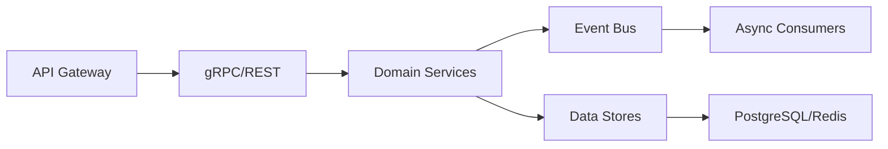

# Phoenix Platform Architecture Review Summary

**Date**: January 25, 2025  
**Review Scope**: Top-level architecture, mono-repo structure, service interfaces, and end-to-end implementation

## Executive Summary

The Phoenix Platform demonstrates a well-architected microservices system with strong governance, clear service boundaries, and comprehensive interface definitions. The mono-repo structure effectively balances code sharing with service isolation, while the interface-driven design ensures loose coupling and maintainability.

## 1. Architecture Strengths

### 1.1 Governance Model
- **Comprehensive mono-repo governance** with clear ownership model, code review requirements, and decision-making processes
- **Strict enforcement** through automated validation scripts and CI/CD integration
- **Clear ADR process** for architectural decisions with 5 documented ADRs

### 1.2 Service Architecture
- **Clean separation of concerns** with distinct control plane and data plane services
- **Interface-driven design** with all inter-service communication through defined contracts
- **Event-driven architecture** for loose coupling between services
- **No service mesh dependency** (ADR-001), reducing operational complexity

### 1.3 Technology Choices
- **Consistent technology stack**: Go for backend services, React for frontend
- **Industry-standard tools**: Kubernetes, Prometheus, OpenTelemetry
- **GitOps deployment model** (ADR-002) ensuring declarative infrastructure

## 2. Interface Architecture Analysis

### 2.1 Interface Design
The platform uses a layered interface approach:

```
Domain Interfaces (pkg/interfaces/)
├── experiment.go     - Experiment lifecycle management
├── pipeline.go       - Pipeline configuration/deployment  
├── monitoring.go     - Metrics collection/analysis
├── simulation.go     - Load testing
├── events.go         - Event bus abstraction
└── service.go        - Service discovery
```

**Key Observations:**
- Interfaces are small and focused (5-10 methods each)
- Clear separation between domain and infrastructure concerns
- Comprehensive error handling with domain-specific error types
- All methods accept `context.Context` for proper cancellation

### 2.2 Service Communication Patterns



**Communication Matrix:**
- **Synchronous**: gRPC for service-to-service, REST for external APIs
- **Asynchronous**: Event bus for decoupled notifications
- **Streaming**: WebSocket for real-time updates to dashboard

## 3. Mono-Repository Structure

### 3.1 Directory Organization
```
phoenix-platform/
├── cmd/           # Service entry points (enforced)
├── pkg/           # Shared packages (interfaces, clients)
├── internal/      # Service-private implementations
├── operators/     # Kubernetes operators
├── dashboard/     # React frontend
├── api/proto/     # Protocol buffer definitions
└── scripts/       # Validation and build scripts
```

### 3.2 Boundary Enforcement
- **Import validation** prevents cross-service internal dependencies
- **Service structure validation** ensures consistent layout
- **Automated checks** in CI/CD pipeline
- **Clear ownership** defined in CODEOWNERS

## 4. End-to-End Implementation Flow

### 4.1 Experiment Lifecycle
```
1. User creates experiment via Dashboard/CLI
2. API Gateway validates and forwards to Experiment Controller
3. Controller validates configuration and persists to PostgreSQL
4. Controller publishes ExperimentCreated event
5. Config Generator creates pipeline configurations
6. Pipeline Operator deploys OTel collectors
7. Process Simulator generates load
8. Monitoring Service collects metrics
9. Controller analyzes results and updates state
10. Dashboard receives real-time updates via WebSocket
```

### 4.2 Key Integration Points
- **Proto definitions** serve as single source of truth
- **Go interfaces** provide abstraction for testing/mocking
- **Event bus** enables loose coupling between services
- **Shared packages** in `pkg/` reduce code duplication

## 5. Identified Strengths

1. **Strong Governance**: Comprehensive rules with automated enforcement
2. **Clean Architecture**: Well-defined boundaries and interfaces
3. **Testability**: Interface-driven design enables easy mocking
4. **Scalability**: Microservices architecture allows independent scaling
5. **Observability**: Built-in metrics and tracing support
6. **Developer Experience**: Clear documentation and validation tools

## 6. Areas for Enhancement

### 6.1 Minor Improvements
1. **Generated code management**: Some generated files (*.pb.go) were committed
2. **Documentation consolidation**: Some duplicate docs could be merged
3. **Error handling standardization**: Could benefit from common error package

### 6.2 Future Considerations
1. **Service mesh integration**: Optional Istio/Linkerd support for advanced scenarios
2. **Multi-tenancy enhancements**: More sophisticated isolation mechanisms
3. **Contract testing**: Automated interface compliance validation
4. **API versioning**: More explicit version management strategy

## 7. Compliance Assessment

### 7.1 Mono-Repo Governance
- ✅ All services follow required structure
- ✅ No cross-service internal imports
- ✅ Proper service boundaries maintained
- ✅ Documentation in correct locations

### 7.2 Interface Contracts
- ✅ All services communicate through defined interfaces
- ✅ Proto definitions match Go interfaces
- ✅ Comprehensive request/response types
- ✅ Proper error handling patterns

### 7.3 Security Architecture
- ✅ JWT-based authentication
- ✅ RBAC authorization model
- ✅ Network policies defined
- ✅ Secrets management strategy

## 8. Recommendations

### 8.1 Immediate Actions
1. **Run structure validation**: `make validate-structure`
2. **Update generated code**: `make generate` and commit changes
3. **Review and merge duplicate documentation**

### 8.2 Short-term Improvements
1. **Implement common error package** in `pkg/errors`
2. **Add interface compliance tests** for all services
3. **Create service integration test suite**
4. **Enhance monitoring of interface metrics**

### 8.3 Long-term Enhancements
1. **Implement distributed tracing** with OpenTelemetry
2. **Add circuit breakers** for service resilience
3. **Create service mesh adapter** for optional integration
4. **Develop API gateway auto-generation** from interfaces

## Conclusion

The Phoenix Platform demonstrates excellent architectural design with strong governance, clear service boundaries, and comprehensive interface definitions. The mono-repo structure successfully balances code sharing with service isolation, while the interface-driven approach ensures maintainability and testability. The platform is well-positioned for scalability and future enhancements.

**Overall Assessment**: ✅ **Production-Ready Architecture**

The combination of strict governance, clean interfaces, and automated validation creates a robust foundation for the Phoenix observability optimization platform.