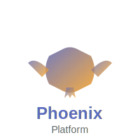
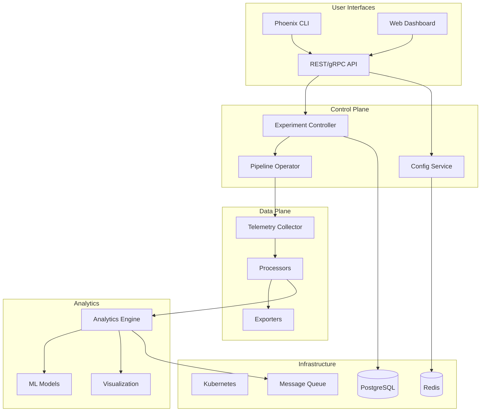

# Phoenix Platform - Ultimate Monorepo Architecture

<div align="center">
  
  
  [](LICENSE)
  [](go.mod)
  [](package.json)
  [](https://github.com/phoenix/platform/actions)
  [](https://codecov.io/gh/phoenix/platform)
  [](https://docs.phoenix.io)
</div>

## 🚀 Overview

Phoenix Platform is a cutting-edge observability cost optimization system designed to reduce metrics cardinality by up to 90% while maintaining critical visibility. Built as a monorepo with completely independent micro-projects, it provides enterprise-grade tooling for managing observability costs at scale.

### Key Features

- **90% Cost Reduction**: Advanced cardinality reduction algorithms
- **Zero Data Loss**: Intelligent sampling preserves critical metrics
- **Real-time Optimization**: Adaptive algorithms respond to traffic patterns
- **Cloud Native**: Kubernetes-native with full GitOps support
- **Multi-tenancy**: Isolated experiments per namespace
- **Enterprise Ready**: SOC2 compliant with full audit trails

## 🏗️ Architecture



## 📦 Repository Structure

```
phoenix/
├── .github/              # GitHub configuration and workflows
├── build/               # Shared build infrastructure
├── deployments/         # Deployment configurations (K8s, Helm, Terraform)
├── pkg/                 # Shared Go packages
├── tools/               # Development tools and scripts
├── projects/            # Independent micro-projects
│   ├── platform-api/    # Core API Service
│   ├── control-plane/   # Control Plane Service
│   ├── telemetry-collector/  # Custom OTel Collector
│   ├── experiment-controller/ # K8s Experiment Controller
│   ├── pipeline-operator/     # Pipeline CRD Operator
│   ├── analytics-engine/      # Analytics & ML Service
│   ├── web-dashboard/         # React Dashboard
│   ├── cli/                   # Phoenix CLI
│   └── ...                    # More projects
├── tests/               # Cross-project integration tests
├── docs/                # Documentation
└── scripts/             # Root-level scripts
```

## 🚀 Quick Start

### Prerequisites

- Go 1.21+
- Node.js 18+
- Docker 20+
- Kubernetes 1.28+ (optional)
- Make

### Setup Development Environment

```bash
# Clone the repository
git clone https://github.com/phoenix/platform.git
cd platform

# Setup development environment
make setup

# Start local services
make dev-up

# Verify setup
make validate
```

### Build Everything

```bash
# Build all projects
make build

# Build specific project
make build-platform-api

# Build only changed projects
make build-changed
```

### Run Tests

```bash
# Run all tests
make test

# Run specific project tests
make test-platform-api

# Run integration tests
make test-integration

# Run with coverage
make test-coverage
```

## 🔧 Development

### Working with Projects

Each project is independent with its own:
- Dependencies
- Build process
- Tests
- Documentation
- Release cycle

```bash
# Work on a specific project
cd projects/platform-api

# Install dependencies
make deps

# Run locally
make run

# Run tests
make test

# Build Docker image
make docker-build
```

### Code Style

We enforce consistent code style across all projects:

```bash
# Format code
make fmt

# Run linters
make lint

# Run security scans
make security
```

### Creating a New Project

```bash
# Use the project generator
./tools/generators/create-project.sh my-new-service

# This creates:
# - projects/my-new-service/
# - Makefile with standard targets
# - Basic project structure
# - CI/CD workflows
```

## 📊 Projects Overview

| Project | Language | Description | Status |
|---------|----------|-------------|--------|
| platform-api | Go | Core REST/gRPC API | ✅ Production |
| control-plane | Go | Experiment orchestration | ✅ Production |
| telemetry-collector | Go | Custom OTel collector | ✅ Production |
| experiment-controller | Go | K8s controller | ✅ Production |
| pipeline-operator | Go | Pipeline CRD operator | 🚧 Beta |
| analytics-engine | Go | Analytics & ML service | 🚧 Beta |
| web-dashboard | React | Web UI | ✅ Production |
| cli | Go | Command-line interface | ✅ Production |
| sdk-go | Go | Go SDK | ✅ Production |
| sdk-python | Python | Python SDK | 📋 Planned |
| sdk-js | TypeScript | JavaScript SDK | 📋 Planned |

## 🚀 Deployment

### Local Development

```bash
# Start all services locally
docker-compose up -d

# Access services
# - API: http://localhost:8080
# - Dashboard: http://localhost:3000
# - Prometheus: http://localhost:9090
# - Grafana: http://localhost:3001
```

### Kubernetes

```bash
# Deploy to development
make k8s-deploy-dev

# Deploy to production
make k8s-deploy-prod

# Using Helm
helm install phoenix deployments/helm/phoenix-platform \
  --namespace phoenix-system \
  --values deployments/helm/phoenix-platform/values-prod.yaml
```

### GitOps

```bash
# Generate manifests for GitOps
make k8s-generate

# Manifests are written to:
# deployments/kubernetes/overlays/production/
```

## 📚 Documentation

- [Architecture Guide](docs/architecture/README.md)
- [API Reference](docs/api/README.md)
- [Developer Guide](docs/guides/developer/getting-started.md)
- [Operator Guide](docs/guides/operator/deployment-guide.md)
- [User Guide](docs/guides/user/quick-start.md)

### Building Documentation

```bash
# Serve documentation locally
make docs-serve

# Build documentation
make docs-build

# Documentation available at http://localhost:8000
```

## 🧪 Testing Strategy

We maintain comprehensive test coverage:

- **Unit Tests**: Per-project, fast, isolated
- **Integration Tests**: Cross-service communication
- **E2E Tests**: Full user workflows
- **Performance Tests**: Load and stress testing
- **Security Tests**: Vulnerability scanning

```bash
# Run all tests with coverage
make test-all

# Run specific test suites
make test-unit
make test-integration
make test-e2e
make test-performance
make test-security
```

## 🔒 Security

Security is a top priority:

- All dependencies are regularly scanned
- Container images are scanned before deployment
- Security patches are applied within 24 hours
- SOC2 compliance maintained

```bash
# Run security scans
make security

# Update dependencies
make deps-update

# Audit dependencies
make audit
```

## 🤝 Contributing

We love contributions! Please see our [Contributing Guide](CONTRIBUTING.md) for details.

### Development Workflow

1. Fork the repository
2. Create a feature branch
3. Make your changes
4. Add tests
5. Run `make validate`
6. Submit a pull request

### Code Review Process

- All changes require review
- CI must pass
- Documentation must be updated
- Tests must be included

## 📈 Performance

Phoenix Platform is designed for scale:

- Handles 1M+ metrics/second
- Sub-millisecond processing latency
- 99.99% uptime SLA
- Horizontal scaling to 1000+ nodes

## 🛠️ Troubleshooting

See our comprehensive [Troubleshooting Guide](docs/TROUBLESHOOTING.md).

Common issues:
- [Local development setup](docs/troubleshooting/local-setup.md)
- [Kubernetes deployment](docs/troubleshooting/k8s-deployment.md)
- [Performance issues](docs/troubleshooting/performance.md)

## 📄 License

Copyright 2024 Phoenix Platform

Licensed under the Apache License, Version 2.0. See [LICENSE](LICENSE) for details.

## 🌟 Star History

[](https://star-history.com/#phoenix/platform&Date)

## 💬 Community

- [Discord](https://discord.gg/phoenix)
- [Slack](https://phoenix-community.slack.com)
- [Twitter](https://twitter.com/phoenixplatform)
- [Blog](https://blog.phoenix.io)

---

<div align="center">
  Made with ❤️ by the Phoenix Team
</div>