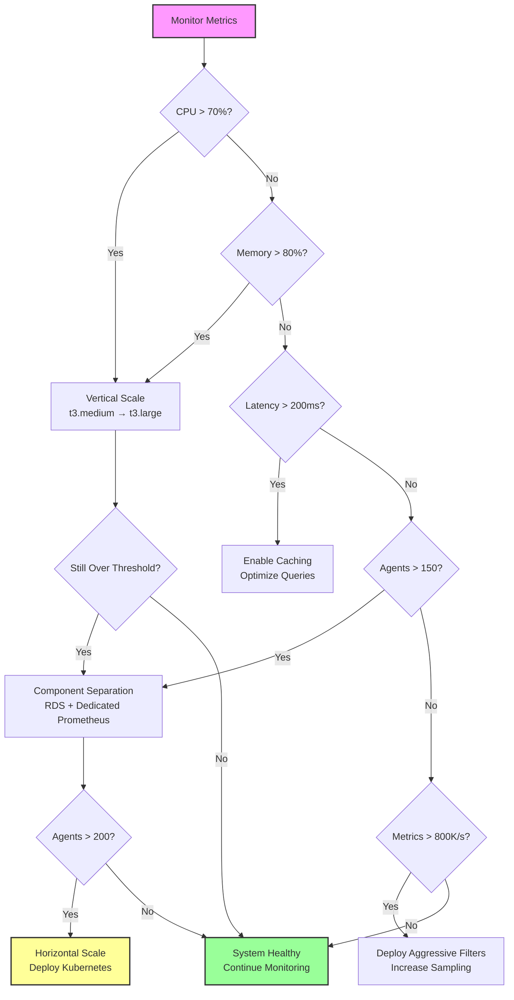

# Phoenix Scaling Decision Tree

## Visual Scaling Guide



## Scaling Thresholds at a Glance

| Metric | Green (Healthy) | Yellow (Warning) | Red (Critical) | Action |
|--------|-----------------|------------------|----------------|---------|
| **CPU** | < 70% | 70-85% | > 85% | Vertical scale |
| **Memory** | < 80% | 80-90% | > 90% | Add swap/scale |
| **API Latency** | < 200ms | 200-500ms | > 500ms | Optimize/cache |
| **Agents** | < 150 | 150-200 | > 200 | Horizontal scale |
| **Metrics/sec** | < 800K | 800K-1M | > 1M | Filter/scale |
| **Disk** | < 80% | 80-90% | > 90% | Cleanup/expand |

## Scaling Timeline

### Phase 1: Optimization (0-150 agents)
**Timeline**: Minutes to hours
- Enable caching
- Deploy filters
- Tune parameters
- Add swap space

### Phase 2: Vertical Scaling (100-150 agents)
**Timeline**: 15-30 minutes
- Stop services
- Resize VM
- Start services
- Verify health

### Phase 3: Component Separation (150-200 agents)
**Timeline**: 1-2 hours
1. **PostgreSQL → RDS** (30 min)
   ```bash
   # Backup database
   pg_dump > backup.sql
   # Create RDS instance
   # Restore to RDS
   # Update connection string
   ```

2. **Prometheus → Dedicated VM** (30 min)
   ```bash
   # Stop Prometheus
   # Copy data to new VM
   # Update scrape configs
   # Restart services
   ```

3. **Test & Verify** (30 min)

### Phase 4: Horizontal Scaling (200+ agents)
**Timeline**: 4-8 hours
- Deploy Kubernetes cluster
- Install Phoenix operators
- Migrate data
- Update agent configs

## Cost Impact by Phase

| Phase | Infrastructure | Monthly Cost | Agents | Savings |
|-------|---------------|--------------|---------|---------|
| **Current** | 1x t3.medium | $85 | 0-150 | 70%+ |
| **Vertical** | 1x t3.xlarge | $140 | 100-200 | 70%+ |
| **Separated** | API + RDS + Prom | $250 | 150-300 | 70%+ |
| **Horizontal** | K8s cluster | $500+ | 300+ | 70%+ |

## Quick Reference Commands

### Check Current State
```bash
# View all metrics
/opt/phoenix/scripts/health-check.sh

# Specific metric checks
docker stats --no-stream
df -h /opt/phoenix
docker-compose exec db psql -U phoenix -c "SELECT pg_database_size('phoenix');"
```

### Emergency Actions
```bash
# High CPU - Reduce load
phoenix pipeline deploy aggressive-filter --all

# High Memory - Free resources
docker-compose restart api
echo 3 > /proc/sys/vm/drop_caches

# High Disk - Cleanup
docker system prune -a
/opt/phoenix/scripts/backup.sh --rotate-aggressive

# High Latency - Enable cache
docker-compose exec api phoenix-cli config set cache.enabled=true
```

## Scaling Best Practices

### 1. **Monitor Trends, Not Spikes**
- Use 5-minute averages for decisions
- Don't react to temporary spikes
- Watch weekly growth patterns

### 2. **Scale Proactively**
- Plan scaling at 70% capacity
- Execute before 85%
- Never wait for 100%

### 3. **Test Scaling Procedures**
- Practice VM resizing monthly
- Test RDS migration quarterly
- Document lessons learned

### 4. **Optimize Before Scaling**
- Deploy filters first
- Enable caching second
- Scale infrastructure last

### 5. **Communicate Scaling Events**
- Announce maintenance windows
- Update documentation
- Train team on new setup

## Capacity Planning Worksheet

Use this monthly to plan ahead:

```
Current State (Date: ________)
- Active Agents: _____/200
- CPU Average: _____%
- Memory Average: _____%
- Metrics Rate: _____K/sec
- Database Size: _____GB

Growth Rate (Monthly)
- New Agents: +_____ per month
- Metrics Growth: +_____%
- Database Growth: +_____GB

Projected Scaling Need
- Vertical Scale: _____ months
- Component Split: _____ months
- Horizontal Scale: _____ months

Action Items
□ Budget approved for scaling
□ Team trained on procedures
□ Runbooks updated
□ Backups tested
```

## Remember

The beauty of Phoenix's single-VM architecture is that **you don't need to scale until you really need to**. The system is designed to handle significant load on minimal infrastructure. Trust the monitors, follow the thresholds, and scale with confidence when the time comes.