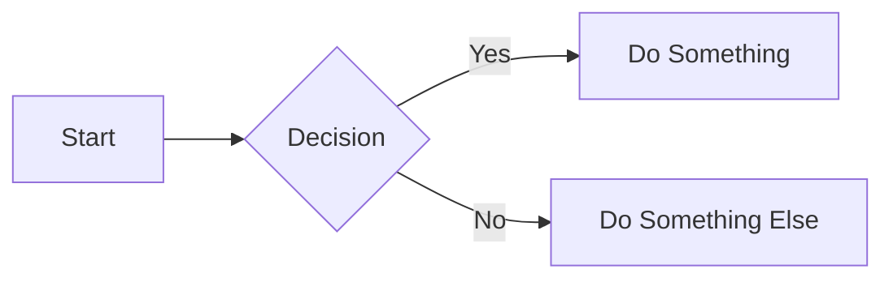

# Phoenix Documentation Setup

This document explains how to work with the Phoenix Platform documentation system built with Material for MkDocs.

## Overview

We use [Material for MkDocs](https://squidfunk.github.io/mkdocs-material/) to create a professional, searchable, and user-friendly documentation site from our Markdown files.

### Key Features

- 🔍 **Full-text search** - No server required
- 🎨 **Material Design** - Beautiful, modern UI
- 📱 **Mobile responsive** - Works on all devices
- 🌓 **Dark/Light mode** - User preference support
- 📊 **Mermaid diagrams** - Native diagram support
- 🔗 **API documentation** - Interactive API reference
- 📖 **Versioning** - Multiple version support
- 🚀 **Fast** - Static site generation

## Local Development

### Prerequisites

1. Python 3.8 or higher
2. pip (Python package manager)

### Installation

```bash
# Install documentation dependencies
pip install -r docs/requirements.txt
```

### Running Locally

```bash
# From phoenix-platform directory
make docs-serve

# Or from repository root
mkdocs serve

# The documentation will be available at http://localhost:8000
```

### Building Documentation

```bash
# Build static site
make docs

# Output will be in site/ directory
```

## Documentation Structure

```
docs/
├── index.md                    # Homepage
├── mkdocs.yml                  # MkDocs configuration
├── requirements.txt            # Python dependencies
├── api/                        # API documentation
│   ├── rest.md                # REST API reference
│   ├── grpc.md                # gRPC API reference
│   └── websocket.md           # WebSocket API
├── assets/                     # Images and logos
├── stylesheets/               # Custom CSS
│   └── extra.css
├── javascripts/               # Custom JavaScript
├── overrides/                 # Theme overrides
└── operations/                # Operations guides
```

## Writing Documentation

### File Naming

All documentation files should follow the `UPPERCASE_WITH_UNDERSCORES.md` convention as defined in our [File Naming Standards](../phoenix-platform/docs/FILE_NAMING_STANDARDS.md).

### Markdown Extensions

Material for MkDocs supports many markdown extensions:

#### Admonitions

```markdown
!!! note "Important Note"
    This is an important note with a custom title.

!!! warning
    This is a warning without a custom title.

!!! tip
    This is a helpful tip.

!!! danger
    This is a danger notice.
```

#### Code Blocks with Highlighting

````markdown
```python title="example.py" linenums="1" hl_lines="2 3"
def hello_world():
    print("Hello")  # (1)
    print("World")

# 1. This is an annotation
```
````

#### Content Tabs

```markdown
=== "Python"

    ```python
    print("Hello World")
    ```

=== "JavaScript"

    ```javascript
    console.log("Hello World");
    ```

=== "Go"

    ```go
    fmt.Println("Hello World")
    ```
```

#### Mermaid Diagrams

```markdown

```

### API Documentation

For API endpoints, use the custom styling:

```html
<div class="api-endpoint">
  <span class="method get">GET</span>
  <code>/v1/experiments</code>
</div>
```

## Navigation

The navigation structure is defined in `mkdocs.yml`. To add a new page:

1. Create the markdown file in the appropriate directory
2. Add it to the `nav` section in `mkdocs.yml`:

```yaml
nav:
  - Section Name:
    - Page Title: path/to/page.md
```

## Search

Search is automatically enabled and indexes all content. To exclude content from search:

```markdown
<!-- search:exclude -->
This content won't be searchable
<!-- search:include -->
```

## Deployment

### GitHub Pages

The documentation is automatically deployed to GitHub Pages when changes are pushed to the main branch.

Manual deployment:

```bash
make docs-deploy
```

### Versioning

We use [mike](https://github.com/jimporter/mike) for versioning:

```bash
# Deploy a new version
mike deploy v1.2.3 latest --push

# List versions
mike list

# Set default version
mike set-default latest --push
```

## Customization

### Theme Colors

Edit the color scheme in `mkdocs.yml`:

```yaml
theme:
  palette:
    primary: indigo
    accent: amber
```

### Custom CSS

Add custom styles to `docs/stylesheets/extra.css`.

### Custom JavaScript

Add custom scripts to `docs/javascripts/` and reference in `mkdocs.yml`.

## Best Practices

1. **Keep it Simple** - Write clear, concise documentation
2. **Use Examples** - Include code examples and diagrams
3. **Stay Organized** - Follow the established structure
4. **Test Locally** - Always preview changes before committing
5. **Update Navigation** - Keep mkdocs.yml in sync with new pages
6. **Use Extensions** - Take advantage of Material for MkDocs features
7. **Cross-Reference** - Link between related documentation

## Troubleshooting

### Common Issues

**Build Errors**
```bash
# Check for syntax errors
mkdocs build --strict
```

**Missing Dependencies**
```bash
# Reinstall dependencies
pip install -r docs/requirements.txt --upgrade
```

**Navigation Not Updating**
- Clear browser cache
- Restart mkdocs serve
- Check mkdocs.yml syntax

## Resources

- [Material for MkDocs Documentation](https://squidfunk.github.io/mkdocs-material/)
- [MkDocs Documentation](https://www.mkdocs.org/)
- [Markdown Guide](https://www.markdownguide.org/)
- [Mermaid Documentation](https://mermaid-js.github.io/)