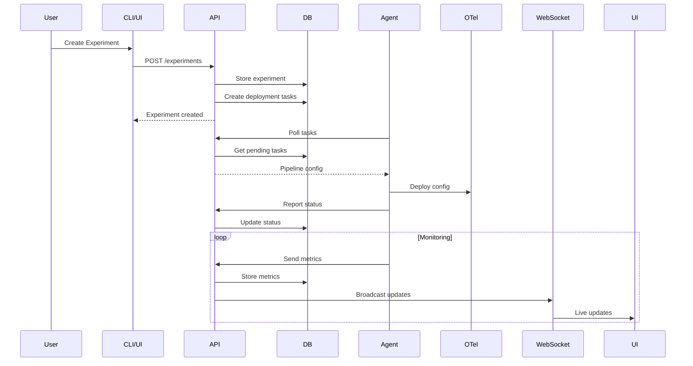

# Phoenix Platform System Architecture

## Overview

Phoenix Platform is a distributed observability cost optimization system that reduces metrics cardinality by up to 70% while maintaining critical visibility. The platform uses an agent-based architecture with centralized control, A/B testing capabilities, and real-time monitoring.

## Architecture Principles

### Design Goals
- **Cost Efficiency** - Reduce observability costs by 70% through intelligent filtering
- **Zero Data Loss** - Maintain critical metrics while reducing volume
- **Safe Rollout** - A/B testing framework for risk-free deployment
- **Scalability** - Support thousands of agents and millions of metrics/second
- **Real-time Visibility** - Live monitoring of experiments and cost savings

### Key Decisions
- **Agent-Based** - Distributed agents for local pipeline deployment
- **Task Polling** - Reliable task distribution without persistent connections
- **PostgreSQL** - Single source of truth for state management
- **WebSocket + REST** - Real-time updates with RESTful control plane
- **Monorepo Structure** - Shared packages with independent services

## System Components

### Core Services

```
┌──────────────────────────────────────────────────────────────┐
│                        Phoenix Platform                       │
├──────────────────────────────────────────────────────────────┤
│                                                              │
│  ┌─────────────┐    ┌─────────────┐    ┌─────────────┐     │
│  │   Phoenix   │    │   Phoenix   │    │  Dashboard  │     │
│  │     API     │◄───┤     CLI     │    │   (React)   │     │
│  │  Port 8080  │    └─────────────┘    └──────┬──────┘     │
│  └──────┬──────┘                              │             │
│         │                                      │             │
│         │ REST + WebSocket                     │ WebSocket   │
│         ▼                                      ▼             │
│  ┌─────────────────────────────────────────────────────┐    │
│  │                   PostgreSQL                         │    │
│  │  - Experiments    - Pipeline Deployments            │    │
│  │  - Task Queue     - Metrics Storage                 │    │
│  │  - Agent Registry - User Management                 │    │
│  └─────────────────────────────────────────────────────┘    │
│         ▲                                                    │
│         │ Task Polling (30s timeout)                         │
│         │                                                    │
│  ┌──────┴──────┐                                            │
│  │   Phoenix    │────► OpenTelemetry ────► Observability    │
│  │   Agents     │      Collector          Backends          │
│  └─────────────┘      (Modified)                            │
│                                                              │
└──────────────────────────────────────────────────────────────┘
```

### Component Responsibilities

#### Phoenix API (Control Plane)
- **Port**: 8080 (REST + WebSocket)
- **Responsibilities**:
  - Experiment lifecycle management
  - Pipeline deployment orchestration
  - Agent task distribution
  - Real-time metrics aggregation
  - WebSocket event broadcasting
- **Key Features**:
  - Task queue with PostgreSQL
  - Long-polling support (30s timeout)
  - JWT authentication
  - Rate limiting and quotas

#### Phoenix Agent (Data Plane)
- **Deployment**: One per host/cluster
- **Responsibilities**:
  - Poll for tasks from API
  - Deploy OpenTelemetry configurations
  - Collect and report metrics
  - Heartbeat monitoring
- **Key Features**:
  - X-Agent-Host-ID authentication
  - Graceful configuration updates
  - Local metric buffering
  - Automatic retry logic

#### Dashboard (UI)
- **Technology**: React 18 + TypeScript
- **Responsibilities**:
  - Real-time experiment monitoring
  - Cost savings visualization
  - Pipeline configuration UI
  - Alert management
- **Key Features**:
  - WebSocket integration
  - Live metric updates
  - Interactive cost flow diagrams
  - Agent fleet visualization

#### Phoenix CLI
- **Purpose**: Administrative operations
- **Responsibilities**:
  - Experiment management
  - Pipeline deployment
  - System diagnostics
  - Batch operations
- **Key Features**:
  - Structured output formats
  - Scriptable commands
  - Context management
  - Plugin architecture

## Data Flow

### Experiment Lifecycle



### Task Distribution

1. **Task Creation**
   - API creates tasks in PostgreSQL
   - Tasks include pipeline configurations
   - Priority and targeting metadata

2. **Agent Polling**
   - Agents poll `/api/v1/agent/tasks`
   - 30-second long-polling timeout
   - Atomic task assignment

3. **Task Execution**
   - Agent deploys configuration
   - Reports progress updates
   - Handles failures gracefully

4. **Result Collection**
   - Metrics sent to API
   - Aggregated in PostgreSQL
   - Real-time broadcast via WebSocket

## Storage Architecture

### PostgreSQL Schema

```sql
-- Core experiment tracking
experiments (
    id, name, description, status,
    baseline_pipeline_id, candidate_pipeline_id,
    traffic_split, created_at, updated_at
)

-- Pipeline configurations
pipelines (
    id, name, type, config_template,
    version, created_at
)

-- Deployment tracking
pipeline_deployments (
    id, pipeline_id, experiment_id,
    agent_id, status, metrics,
    created_at, updated_at
)

-- Task queue
tasks (
    id, type, payload, status,
    agent_id, priority,
    created_at, assigned_at, completed_at
)

-- Agent registry
agents (
    id, host_id, hostname,
    last_heartbeat, status,
    capabilities, metadata
)

-- Metrics storage
metrics (
    timestamp, experiment_id,
    pipeline_id, metric_name,
    value, tags
)
```

### Data Retention

- **Experiments**: Retained indefinitely
- **Metrics**: 30-day default retention
- **Tasks**: 7-day retention after completion
- **Logs**: 14-day retention

## Security Architecture

### Authentication
- **API**: JWT tokens with refresh
- **Agents**: X-Agent-Host-ID header
- **WebSocket**: Token-based auth

### Authorization
- **RBAC**: Role-based access control
- **Experiment ownership**: Creator permissions
- **Agent permissions**: Task-specific

### Network Security
- **TLS**: All communications encrypted
- **Certificate pinning**: Agent verification
- **Rate limiting**: API protection

## Scalability Design

### Horizontal Scaling
- **API**: Stateless, behind load balancer
- **Agents**: One per host, independent
- **Database**: Read replicas for queries

### Performance Targets
- **Agents**: Support 10,000+ concurrent
- **Metrics**: 1M+ per second ingestion
- **Experiments**: 1000+ concurrent
- **WebSocket**: 10,000+ connections

### Optimization Strategies
- **Batch operations**: Reduce API calls
- **Caching**: Redis for hot data
- **Compression**: Metric data compression
- **Partitioning**: Time-based data partitions

## Deployment Patterns

### Kubernetes
- **Helm charts**: Standardized deployment
- **Auto-scaling**: HPA for API pods
- **Service mesh**: Optional Istio integration

### Docker Compose
- **Development**: Full stack locally
- **Testing**: Integration test environment
- **Demo**: Quick evaluation setup

### Single VM
- **Small scale**: All-in-one deployment
- **Edge cases**: Restricted environments
- **Backup**: Disaster recovery option

## Monitoring and Observability

### Metrics
- **Prometheus**: System and business metrics
- **Custom metrics**: Cardinality reduction rates
- **SLIs**: Availability, latency, error rate

### Logging
- **Structured logs**: JSON format
- **Correlation IDs**: Request tracing
- **Log levels**: Dynamic adjustment

### Tracing
- **OpenTelemetry**: Distributed tracing
- **Span context**: Cross-service correlation
- **Sampling**: Adaptive sampling rates

## Failure Handling

### Resilience Patterns
- **Circuit breakers**: Prevent cascading failures
- **Retries**: Exponential backoff
- **Timeouts**: Aggressive timeouts
- **Bulkheads**: Resource isolation

### Failure Scenarios
1. **API Unavailable**: Agents buffer locally
2. **Database Down**: Read-only mode
3. **Agent Failure**: Task reassignment
4. **Network Partition**: Eventually consistent

## Future Considerations

### Planned Enhancements
- **Multi-region**: Global deployment
- **ML Integration**: Smarter filtering
- **Custom processors**: Plugin system
- **SaaS offering**: Managed service

### Technical Debt
- **Message queue**: Consider Kafka/NATS
- **Time-series DB**: Dedicated metrics store
- **GraphQL**: Alternative API
- **Service mesh**: Full adoption