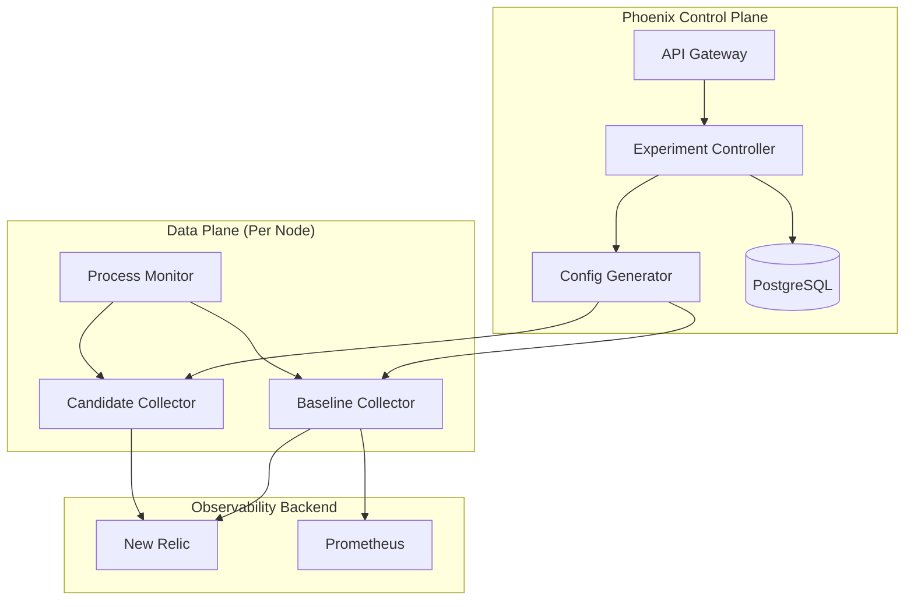

# Phoenix Platform

<div align="center">
  
  
  **Automated Observability Cost Optimization Platform**
  
  [](LICENSE)
  [](https://golang.org)
  [](https://reactjs.org)
  [](https://kubernetes.io)
  
  [Get Started](phoenix-platform/docs/DEVELOPER_QUICK_START.md){ .md-button .md-button--primary }
  [View Demo](https://demo.phoenix-platform.io){ .md-button }
</div>

---

## 🚀 What is Phoenix?

Phoenix is an **intelligent observability optimization platform** that automatically reduces OpenTelemetry metrics volume by 50-80% while maintaining complete visibility for critical processes. Using advanced A/B testing between baseline and optimized configurations, Phoenix helps organizations dramatically cut their observability costs without compromising monitoring quality.

<div class="grid cards" markdown>

-   :material-chart-line:{ .lg .middle } **50-80% Cost Reduction**

    ---

    Dramatically reduce metrics volume and associated costs through intelligent filtering and aggregation strategies

-   :material-ab-testing:{ .lg .middle } **Safe A/B Testing**

    ---

    Test optimizations safely with side-by-side comparison of baseline and candidate configurations

-   :material-drag:{ .lg .middle } **Visual Pipeline Builder**

    ---

    Create and modify OpenTelemetry pipelines through an intuitive drag-and-drop interface

-   :material-kubernetes:{ .lg .middle } **Kubernetes Native**

    ---

    Built for Kubernetes with operators, CRDs, and GitOps-friendly deployments

</div>

## ✨ Key Features

### 🧪 Intelligent A/B Testing
- Run baseline and optimized collectors side-by-side
- Compare metrics quality and cost in real-time
- Gradual rollout with automatic rollback on anomalies
- No service mesh required - uses dual collector pattern

### 🎯 Smart Optimization Strategies
- **Priority Filtering**: Keep only critical process metrics
- **Top-K Selection**: Retain metrics for top resource consumers
- **Intelligent Aggregation**: Combine similar metrics intelligently
- **Adaptive Sampling**: Dynamic sampling based on load patterns

### 📊 Comprehensive Analytics
- Real-time cost analysis and savings projections
- Cardinality tracking and reduction metrics
- Side-by-side quality comparison dashboards
- Automated recommendation engine

### 🔧 Enterprise Ready
- Multi-tenancy support with namespace isolation
- RBAC and JWT-based authentication
- Audit logging and compliance features
- High availability and horizontal scaling

## 🏗️ Architecture Overview



## 🚦 Getting Started

### Prerequisites

- Kubernetes 1.28+
- Helm 3.12+
- PostgreSQL 15+
- New Relic account with OTLP endpoint access

### Quick Installation

=== "Helm"

    ```bash
    # Add Phoenix Helm repository
    helm repo add phoenix https://phoenix-platform.io/helm
    helm repo update
    
    # Install Phoenix
    helm install phoenix phoenix/phoenix \
      --namespace phoenix-system \
      --create-namespace \
      --set newrelic.apiKey=$NEW_RELIC_API_KEY
    ```

=== "Kubectl"

    ```bash
    # Apply CRDs
    kubectl apply -f https://raw.githubusercontent.com/phoenix-platform/phoenix/main/k8s/crds/
    
    # Deploy Phoenix
    kubectl apply -f https://raw.githubusercontent.com/phoenix-platform/phoenix/main/k8s/phoenix.yaml
    ```

### Your First Experiment

```bash
# Create an experiment using the CLI
phoenix experiment create \
  --name "webserver-optimization" \
  --baseline "process-baseline-v1" \
  --candidate "process-priority-filter-v1" \
  --target-selector "app=webserver" \
  --duration "24h"

# Check status
phoenix experiment status webserver-optimization

# View real-time metrics
phoenix experiment metrics webserver-optimization --follow
```

## 📚 Documentation

<div class="grid cards" markdown>

-   :material-rocket-launch:{ .lg .middle } **[Quick Start Guide](phoenix-platform/docs/DEVELOPER_QUICK_START.md)**

    Get up and running with Phoenix in 5 minutes

-   :material-book-open-variant:{ .lg .middle } **[User Guide](phoenix-platform/docs/USER_GUIDE.md)**

    Comprehensive guide for platform users

-   :material-api:{ .lg .middle } **[API Reference](phoenix-platform/docs/API_REFERENCE.md)**

    Complete API documentation with examples

-   :material-cog:{ .lg .middle } **[Configuration Guide](phoenix-platform/docs/PIPELINE_GUIDE.md)**

    Learn how to configure optimization pipelines

</div>

## 🤝 Contributing

We welcome contributions! Please see our [Contributing Guide](CONTRIBUTING.md) for details.

### Development Setup

```bash
# Clone the repository
git clone https://github.com/phoenix-platform/phoenix.git
cd phoenix

# Install dependencies
make deps

# Run tests
make test

# Start local development
make dev
```

## 🗺️ Roadmap

- [ ] Machine Learning-based optimization recommendations
- [ ] Multi-cloud support (AWS CloudWatch, Azure Monitor)
- [ ] Cost allocation and chargeback features
- [ ] Advanced anomaly detection during experiments
- [ ] Pipeline marketplace for sharing optimizations

## 📄 License

Phoenix is licensed under the [Apache License 2.0](LICENSE).

## 🙏 Acknowledgments

Built with ❤️ by the Phoenix team using:
- [OpenTelemetry](https://opentelemetry.io)
- [Kubernetes](https://kubernetes.io)
- [React](https://reactjs.org)
- [Material-UI](https://mui.com)

---

<div align="center">
  <p>
    <a href="https://github.com/phoenix-platform/phoenix">GitHub</a> •
    <a href="https://phoenix-platform.io/docs">Documentation</a> •
    <a href="https://phoenix-community.slack.com">Community</a> •
    <a href="https://phoenix-platform.io/blog">Blog</a>
  </p>
</div>