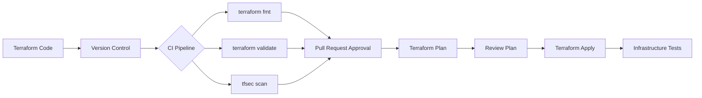

# Phoenix Platform Infrastructure Documentation

## Overview

This documentation describes the cloud infrastructure setup for the Phoenix Platform. The infrastructure is provisioned and managed using Terraform, with a modular approach to facilitate reuse and consistency across environments.

## Infrastructure Architecture

The Phoenix Platform infrastructure is designed to be cloud-agnostic, with initial implementation on AWS. The architecture follows modern cloud practices, including infrastructure as code, immutable infrastructure, and separation of concerns.

### Primary Components

1. **Kubernetes Cluster (EKS)**
   - Managed Kubernetes service for container orchestration
   - Separate node groups for specialized workloads
   - Auto-scaling enabled for resource optimization

2. **Database (RDS)**
   - Managed PostgreSQL database
   - Multi-AZ configuration for high availability in production
   - Automated backups and point-in-time recovery

3. **Monitoring Stack**
   - Prometheus for metrics collection and alerting
   - Grafana for visualization and dashboards
   - Node exporter for system metrics
   - Custom exporters for application metrics

4. **Networking**
   - VPC with public and private subnets
   - NAT Gateway for outbound connectivity
   - Network policies for fine-grained access control

5. **Security**
   - IAM roles with least privilege principle
   - Network security groups with restricted access
   - Secrets management for sensitive configuration
   - Encryption at rest and in transit

## Environment Structure

The Phoenix Platform is deployed across multiple environments:

- **Development (dev)**
  - Purpose: Feature development and integration
  - Scale: Minimal resources, cost-optimized
  - Data: Non-sensitive test data only

- **Staging (stg)**
  - Purpose: Pre-production testing and validation
  - Scale: Matches production at reduced capacity
  - Data: Anonymized copy of production data

- **Production (prod)**
  - Purpose: Live customer-facing environment
  - Scale: Full production capacity with auto-scaling
  - Data: Customer production data with enhanced security

## Terraform Module Structure

```
/deployments/terraform/
├── environments/
│   ├── dev/
│   │   ├── main.tf          # Dev environment configuration
│   │   ├── variables.tf     # Environment-specific variables
│   │   └── outputs.tf       # Environment outputs
│   ├── staging/
│   └── production/
└── modules/
    ├── eks/                 # Kubernetes cluster module
    ├── rds/                 # Database module
    ├── monitoring/          # Monitoring infrastructure
    ├── networking/          # VPC and network configuration
    └── security/            # IAM and security configurations
```

## Provisioning Process

Infrastructure is provisioned following these steps:

1. **Initialize Terraform**
   ```bash
   terraform init
   ```

2. **Plan Changes**
   ```bash
   terraform plan -out=plan.out
   ```

3. **Review Plan**
   - Verify resource additions, changes, and removals
   - Validate costs and potential impact

4. **Apply Changes**
   ```bash
   terraform apply plan.out
   ```

5. **Verify Deployment**
   - Ensure all resources are created correctly
   - Validate connectivity and functionality
   - Run infrastructure tests

## Deployment Workflow



## Security Controls

1. **Access Management**
   - Admin access via bastion host or VPN only
   - Jump servers for manual debugging
   - Role-based access control (RBAC) for all components

2. **Network Security**
   - Private subnets for sensitive services
   - Security groups with minimal required access
   - No direct internet access for databases

3. **Secrets Management**
   - AWS Secrets Manager for credentials
   - Kubernetes secrets for application configuration
   - No plaintext secrets in code or config files

4. **Compliance**
   - Regular security scans using Prowler and tfsec
   - CIS benchmark compliance
   - Regular access reviews

## Monitoring and Alerting

1. **Infrastructure Metrics**
   - CPU, memory, disk, and network utilization
   - Instance health and availability
   - Database performance metrics

2. **Application Metrics**
   - Request rates and response times
   - Error rates and status codes
   - Business-specific KPIs

3. **Log Management**
   - Centralized logging with CloudWatch Logs
   - Log retention policies for compliance
   - Structured logging for searchability

4. **Alerts**
   - PagerDuty integration for critical alerts
   - Tiered alert severity based on impact
   - Runbooks for common alert scenarios

## Disaster Recovery

1. **Backup Strategy**
   - Database: Automated daily backups, 30-day retention
   - Configuration: Terraform state in S3 with versioning
   - Data: Regular snapshots to S3

2. **Recovery Procedures**
   - RDS point-in-time recovery for database restoration
   - Infrastructure rebuild via Terraform
   - Regular DR drills and testing

3. **High Availability**
   - Multi-AZ deployments for critical services
   - Load balancing for traffic distribution
   - Auto-scaling for capacity management

## Maintenance Procedures

1. **Routine Updates**
   - OS patching: Automated monthly with Kubernetes node rotation
   - Database: Minor versions applied in maintenance windows
   - Dependencies: Updated through CI/CD pipeline

2. **Scale Changes**
   - Vertical scaling: Instance class changes during maintenance windows
   - Horizontal scaling: Managed through Kubernetes HPA and cluster autoscaler

3. **Schema Changes**
   - Applied through migrations in CI/CD pipeline
   - Backward compatible changes preferred
   - Major changes scheduled during maintenance windows

## Cost Management

1. **Resource Optimization**
   - Right-sizing instances based on utilization
   - Auto-scaling for variable workloads
   - Spot instances for non-critical workloads

2. **Monitoring**
   - AWS Cost Explorer for trend analysis
   - Budget alerts for unexpected increases
   - Resource tagging for cost allocation

## Known Limitations and Considerations

1. **Performance**
   - RDS connection limits based on instance size
   - API rate limits for AWS service APIs
   - Kubernetes pod density vs. resource availability trade-offs

2. **Scalability**
   - RDS vertical scaling requires downtime
   - Some AWS services have quotas that require advance requests
   - Consider regional service availability when expanding

3. **Operational**
   - Terraform state locking for concurrent operations
   - Careful coordination for stateful service changes
   - Backup/restore testing recommended before major changes

## Appendix

### Common Infrastructure Tasks

#### Connect to EKS Cluster
```bash
aws eks update-kubeconfig --name phoenix-dev-cluster --region us-west-2
```

#### Access Database
```bash
# Via bastion host
ssh -i ~/.ssh/bastion-key.pem ec2-user@bastion.phoenix-dev.example.com
psql -h phoenix-dev-db.internal -U postgres -d phoenix
```

#### View Grafana Dashboards
```bash
# Port forward from Kubernetes
kubectl port-forward svc/grafana 3000:3000 -n monitoring
# Then open http://localhost:3000 in browser
```

### Reference Documentation

- [AWS EKS Documentation](https://docs.aws.amazon.com/eks/latest/userguide/what-is-eks.html)
- [AWS RDS Documentation](https://docs.aws.amazon.com/AmazonRDS/latest/UserGuide/Welcome.html)
- [Terraform AWS Provider](https://registry.terraform.io/providers/hashicorp/aws/latest/docs)
- [Kubernetes Documentation](https://kubernetes.io/docs/home/)

---

*Last updated: May 26, 2025*  
*Author: Abhinav*  
*Department: Platform Engineering*
