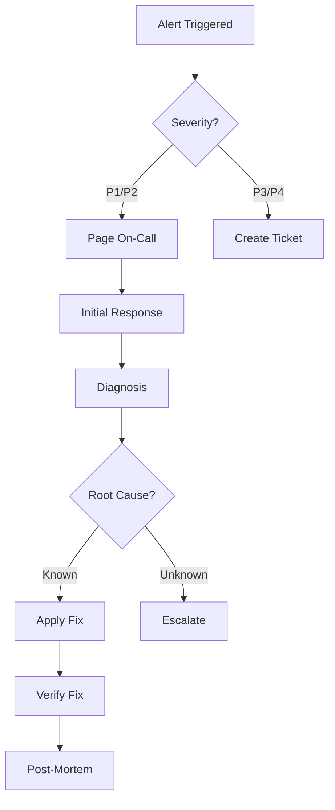

# Phoenix Platform Operations Guide - Complete Documentation

## 📋 Table of Contents

1. [Operations Overview](#operations-overview)
2. [Deployment Procedures](#deployment-procedures)
3. [Monitoring & Alerting](#monitoring--alerting)
4. [Incident Response](#incident-response)
5. [Maintenance Procedures](#maintenance-procedures)
6. [Backup & Recovery](#backup--recovery)
7. [Security Operations](#security-operations)
8. [Performance Tuning](#performance-tuning)
9. [Troubleshooting Guide](#troubleshooting-guide)
10. [Operational Checklists](#operational-checklists)

---

## Operations Overview

The Phoenix Platform operations focus on maintaining high availability, performance, and security while minimizing operational overhead through automation and standardization.

### Key Operational Principles
- **Automation First**: Automate repetitive tasks
- **Observability**: Monitor everything that matters
- **Resilience**: Design for failure
- **Security**: Defense in depth
- **Documentation**: Keep runbooks current

### Service Level Objectives (SLOs)
| Service | Availability | Latency (p95) | Error Rate |
|---------|--------------|---------------|------------|
| API Gateway | 99.9% | < 100ms | < 0.1% |
| Controller | 99.5% | < 500ms | < 0.5% |
| Dashboard | 99.5% | < 2s | < 1% |
| Analytics | 99.0% | < 5s | < 1% |

---

## Deployment Procedures

### Pre-Deployment Checklist
```bash
# 1. Validate code changes
make validate
./tools/analyzers/boundary-check.sh

# 2. Run tests
make test
make test-integration

# 3. Build and scan images
make docker
make security

# 4. Check deployment readiness
./scripts/pre-deployment-check.sh
```

### Development Deployment
```bash
# Local deployment
docker-compose up -d

# Development Kubernetes
kubectl apply -k deployments/kubernetes/overlays/development/
```

### Staging Deployment
```bash
# 1. Create deployment branch
git checkout -b deploy/staging-$(date +%Y%m%d)

# 2. Update image tags
./scripts/update-staging-images.sh

# 3. Deploy to staging
kubectl apply -k deployments/kubernetes/overlays/staging/

# 4. Run smoke tests
./scripts/smoke-test.sh staging
```

### Production Deployment

#### Blue-Green Deployment
```bash
# 1. Deploy to green environment
./scripts/deploy-green.sh

# 2. Run health checks
./scripts/health-check.sh green

# 3. Switch traffic
kubectl patch service platform-api -p '{"spec":{"selector":{"version":"green"}}}'

# 4. Monitor metrics
./scripts/monitor-deployment.sh

# 5. Cleanup blue environment (after 24h)
./scripts/cleanup-blue.sh
```

#### Canary Deployment
```yaml
# canary-rollout.yaml
apiVersion: flagger.app/v1beta1
kind: Canary
metadata:
  name: platform-api
spec:
  targetRef:
    apiVersion: apps/v1
    kind: Deployment
    name: platform-api
  progressDeadlineSeconds: 300
  service:
    port: 8080
  analysis:
    interval: 1m
    threshold: 5
    maxWeight: 50
    stepWeight: 10
    metrics:
    - name: request-success-rate
      thresholdRange:
        min: 99
      interval: 1m
    - name: request-duration
      thresholdRange:
        max: 500
      interval: 1m
```

### Rollback Procedures
```bash
# Immediate rollback
kubectl rollout undo deployment/platform-api -n phoenix-system

# Rollback to specific revision
kubectl rollout undo deployment/platform-api --to-revision=42 -n phoenix-system

# Emergency rollback script
./scripts/emergency-rollback.sh
```

---

## Monitoring & Alerting

### Monitoring Stack
```
┌─────────────┐     ┌──────────────┐     ┌─────────┐
│ Application │────▶│ OTel         │────▶│Prometheus│
│  Metrics    │     │ Collector    │     └────┬─────┘
└─────────────┘     └──────────────┘          │
                                               ▼
┌─────────────┐     ┌──────────────┐     ┌─────────┐
│   Alerts    │◀────│ AlertManager │◀────│ Grafana │
└─────────────┘     └──────────────┘     └─────────┘
```

### Key Metrics

#### Golden Signals
```yaml
# Latency
histogram_quantile(0.95, 
  rate(http_request_duration_seconds_bucket[5m])
)

# Traffic
sum(rate(http_requests_total[5m])) by (service)

# Errors
sum(rate(http_requests_total{status=~"5.."}[5m])) by (service)

# Saturation
avg(container_cpu_usage_seconds_total) by (pod)
```

#### Business Metrics
- Cost reduction percentage
- Metrics cardinality reduction
- Active experiments
- Pipeline efficiency

### Alert Configuration
```yaml
# alerts/critical.yaml
groups:
  - name: critical
    rules:
      - alert: HighErrorRate
        expr: |
          sum(rate(http_requests_total{status=~"5.."}[5m])) by (service)
          / sum(rate(http_requests_total[5m])) by (service) > 0.05
        for: 5m
        labels:
          severity: critical
        annotations:
          summary: "High error rate on {{ $labels.service }}"
          runbook: "https://docs.phoenix.io/runbooks/high-error-rate"
```

### Dashboards
1. **System Overview** - Overall health
2. **Service Details** - Per-service metrics
3. **Business Metrics** - Cost and efficiency
4. **Infrastructure** - K8s and cloud resources

---

## Incident Response

### Incident Severity Levels
| Level | Impact | Response Time | Examples |
|-------|--------|---------------|----------|
| P1 | Critical | < 15 min | Complete outage |
| P2 | High | < 30 min | Degraded performance |
| P3 | Medium | < 2 hours | Feature unavailable |
| P4 | Low | < 8 hours | Minor issues |

### Incident Response Process


### On-Call Procedures
```bash
# 1. Acknowledge alert
./scripts/acknowledge-alert.sh <alert-id>

# 2. Initial assessment
./scripts/incident-assessment.sh

# 3. Start incident channel
./scripts/create-incident.sh <severity> "<description>"

# 4. Gather diagnostics
./scripts/gather-diagnostics.sh

# 5. Apply mitigation
# See specific runbooks

# 6. Verify resolution
./scripts/verify-resolution.sh

# 7. Close incident
./scripts/close-incident.sh <incident-id>
```

### Common Incident Runbooks

#### High Memory Usage
```bash
# 1. Identify memory consumers
kubectl top pods -n phoenix-system --sort-by=memory

# 2. Check for memory leaks
kubectl exec -it <pod> -- go tool pprof -http=:6060 /tmp/heap.prof

# 3. Scale or restart
kubectl scale deployment <name> --replicas=5
kubectl rollout restart deployment <name>
```

#### Database Connection Issues
```bash
# 1. Check connection pool
psql -h $DB_HOST -c "SELECT count(*) FROM pg_stat_activity;"

# 2. Kill idle connections
psql -h $DB_HOST -c "
  SELECT pg_terminate_backend(pid) 
  FROM pg_stat_activity 
  WHERE state = 'idle' 
  AND state_change < now() - interval '10 minutes';"

# 3. Restart connection pools
kubectl rollout restart deployment -l app=phoenix
```

---

## Maintenance Procedures

### Regular Maintenance Schedule
| Task | Frequency | Duration | Impact |
|------|-----------|----------|---------|
| Security patches | Weekly | 30 min | None |
| Dependency updates | Bi-weekly | 1 hour | Minimal |
| Database maintenance | Monthly | 2 hours | Read-only |
| Certificate rotation | Quarterly | 1 hour | Brief outage |
| Disaster recovery test | Quarterly | 4 hours | None |

### Database Maintenance
```bash
# 1. Enable maintenance mode
./scripts/enable-maintenance.sh

# 2. Backup database
./scripts/backup-database.sh

# 3. Run maintenance
psql -h $DB_HOST << EOF
  VACUUM ANALYZE;
  REINDEX DATABASE phoenix;
EOF

# 4. Verify health
./scripts/check-db-health.sh

# 5. Disable maintenance mode
./scripts/disable-maintenance.sh
```

### Certificate Rotation
```bash
# 1. Generate new certificates
./scripts/generate-certs.sh

# 2. Update secrets
kubectl create secret tls phoenix-tls \
  --cert=tls.crt \
  --key=tls.key \
  --dry-run=client -o yaml | \
  kubectl apply -f -

# 3. Rolling restart
kubectl rollout restart deployment -n phoenix-system

# 4. Verify certificates
./scripts/verify-certs.sh
```

---

## Backup & Recovery

### Backup Strategy
```yaml
# Backup Configuration
backups:
  database:
    schedule: "0 2 * * *"  # Daily at 2 AM
    retention: 30          # 30 days
    type: full            # Full backup
    
  incremental:
    schedule: "0 */6 * * *" # Every 6 hours
    retention: 7            # 7 days
    type: incremental
    
  configs:
    schedule: "0 0 * * 0"   # Weekly
    retention: 90           # 90 days
    type: full
```

### Backup Procedures
```bash
# Manual backup
./scripts/backup-all.sh

# Database backup
pg_dump -h $DB_HOST -U $DB_USER -d phoenix > backup-$(date +%Y%m%d).sql

# Configuration backup
kubectl get all,cm,secret -n phoenix-system -o yaml > k8s-backup.yaml

# Verify backup
./scripts/verify-backup.sh backup-$(date +%Y%m%d).sql
```

### Recovery Procedures

#### Database Recovery
```bash
# 1. Stop applications
kubectl scale deployment --all --replicas=0 -n phoenix-system

# 2. Restore database
psql -h $DB_HOST -U $DB_USER -d phoenix < backup-20250526.sql

# 3. Verify data
./scripts/verify-db-integrity.sh

# 4. Start applications
kubectl scale deployment --all --replicas=3 -n phoenix-system
```

#### Disaster Recovery
```bash
# 1. Activate DR site
./scripts/activate-dr-site.sh

# 2. Update DNS
./scripts/update-dns-dr.sh

# 3. Verify services
./scripts/verify-dr-services.sh

# 4. Notify stakeholders
./scripts/send-dr-notification.sh
```

---

## Security Operations

### Security Scanning
```bash
# Container scanning
trivy image phoenix/platform-api:latest

# Dependency scanning
./scripts/scan-dependencies.sh

# Security audit
./scripts/security-audit.sh
```

### Access Management
```bash
# Add user
./scripts/add-user.sh <username> <role>

# Rotate credentials
./scripts/rotate-credentials.sh

# Audit access
./scripts/audit-access.sh
```

### Security Incident Response
1. **Isolate** affected systems
2. **Investigate** root cause
3. **Remediate** vulnerability
4. **Verify** fix effectiveness
5. **Document** lessons learned

---

## Performance Tuning

### Performance Analysis
```bash
# CPU profiling
go tool pprof http://service:6060/debug/pprof/profile

# Memory profiling
go tool pprof http://service:6060/debug/pprof/heap

# Trace analysis
go tool trace trace.out
```

### Optimization Techniques

#### Database Optimization
```sql
-- Index analysis
SELECT schemaname, tablename, indexname, idx_scan
FROM pg_stat_user_indexes
ORDER BY idx_scan;

-- Query optimization
EXPLAIN ANALYZE <query>;

-- Connection pooling
ALTER SYSTEM SET max_connections = 200;
```

#### Application Optimization
```yaml
# Resource limits
resources:
  requests:
    memory: "256Mi"
    cpu: "100m"
  limits:
    memory: "512Mi"
    cpu: "500m"

# HPA configuration
autoscaling:
  enabled: true
  minReplicas: 2
  maxReplicas: 10
  targetCPUUtilizationPercentage: 70
```

---

## Troubleshooting Guide

### Common Issues

#### Service Not Starting
```bash
# Check logs
kubectl logs -n phoenix-system deployment/platform-api --tail=100

# Check events
kubectl events -n phoenix-system --for deployment/platform-api

# Check resource constraints
kubectl describe pod <pod-name> -n phoenix-system
```

#### High Latency
```bash
# Check service metrics
curl -s http://service:9090/metrics | grep http_request_duration

# Check database queries
pg_stat_statements

# Check network latency
kubectl exec -it <pod> -- curl -w "@curl-format.txt" -o /dev/null -s http://service
```

#### Memory Leaks
```bash
# Get heap dump
kubectl exec <pod> -- kill -USR1 1
kubectl cp <pod>:/tmp/heap.prof ./heap.prof

# Analyze
go tool pprof -http=:8080 heap.prof
```

### Debug Tools
```bash
# Enable debug logging
kubectl set env deployment/platform-api LOG_LEVEL=debug

# Port forwarding
kubectl port-forward deployment/platform-api 8080:8080

# Execute commands
kubectl exec -it deployment/platform-api -- /bin/sh
```

---

## Operational Checklists

### Daily Operations
- [ ] Check dashboard for anomalies
- [ ] Review overnight alerts
- [ ] Verify backup completion
- [ ] Check resource utilization
- [ ] Review error logs

### Weekly Operations
- [ ] Apply security patches
- [ ] Update dependencies
- [ ] Review performance metrics
- [ ] Clean up old logs
- [ ] Update documentation

### Monthly Operations
- [ ] Database maintenance
- [ ] Security audit
- [ ] Capacity planning review
- [ ] Cost optimization review
- [ ] Update runbooks

### Pre-Release Checklist
- [ ] Code review completed
- [ ] Tests passing
- [ ] Security scan clean
- [ ] Performance benchmarks met
- [ ] Documentation updated
- [ ] Rollback plan ready
- [ ] Stakeholders notified

---

## Appendix: Quick Commands

### Health Checks
```bash
# All services health
for svc in api controller generator analytics; do
  echo -n "$svc: "
  curl -s http://$svc:8080/health | jq .status
done

# Database health
pg_isready -h $DB_HOST

# Redis health
redis-cli -h $REDIS_HOST ping
```

### Emergency Commands
```bash
# Stop all traffic
kubectl scale deployment --all --replicas=0 -n phoenix-system

# Emergency cache clear
redis-cli -h $REDIS_HOST FLUSHALL

# Force pod restart
kubectl delete pod -n phoenix-system -l app=phoenix

# Enable debug mode
kubectl set env deployment --all LOG_LEVEL=debug -n phoenix-system
```

---

*This operations guide provides comprehensive procedures for running the Phoenix Platform.*  
*Keep this document updated with lessons learned from incidents and operational experience.*  
*Last Updated: May 2025*