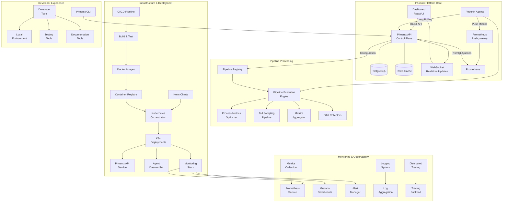

# Phoenix Platform Team Task Distribution

## Table of Contents
1. [Architecture Overview](#architecture-overview)
2. [Team Structure](#team-structure)
3. [Task Distribution](#task-distribution)
4. [Project Timeline](#project-timeline)
5. [Getting Started Resources](#getting-started-resources)

## Architecture Overview

## Team Structure

The Phoenix Platform team consists of 10 members with distinct roles and responsibilities, organized around key architectural components:

| Name | Role | Focus Area | Components |
|------|------|------------|------------|
| Palash | Principal Engineer | Platform Architecture | Architecture Design, Interfaces, Performance |
| Abhinav | Senior Engineer | Infrastructure & DevOps | Kubernetes, Monitoring, CI/CD |
| Srikanth | Senior Engineer | Core Services | API, Database, Task Distribution |
| Shivani | Engineer | Process Metrics Optimizer | Metrics Processing, Optimization Algorithms |
| Jyothi | Engineer | Tail Sampling Pipeline | Sampling Algorithms, Buffer Management |
| Anitha | Engineer | Metrics Aggregator | Aggregation, Storage Optimization |
| Tharun | Engineer | Pipeline Framework | Execution Engine, Configuration System |
| Tanush | Engineer | Agent Integration | Agent Core, OTel Integration |
| Ramana | Engineer | Dashboard & Visualization | UI Components, Real-time Updates |
| Praveen | Engineer | Security & Compliance | Authentication, Encryption, Audit Logging |

## Component Ownership

| Component | Primary Owner | Secondary Owner |
|-----------|---------------|----------------|
| Phoenix API | Srikanth | Palash |
| Phoenix Agent | Tanush | Abhinav |
| Dashboard | Ramana | Srikanth |
| Pipeline Engine | Tharun | Palash |
| Process Metrics Optimizer | Shivani | Tharun |
| Tail Sampling Pipeline | Jyothi | Tharun |
| Metrics Aggregator | Anitha | Srikanth |
| Monitoring Infrastructure | Abhinav | Tanush |
| Test Framework | Abhinav | Shivani |
| CI/CD Pipeline | Abhinav | Srikanth |
| Kubernetes Deployment | Abhinav | Tanush |
| Security Framework | Praveen | Srikanth |
| Documentation | Palash | All |

## Task Distribution

### 1. Palash (Principal Engineer, Platform Architecture)

**Focus Areas**: Overall architecture, system design, cross-team coordination

**Deliverables**:
1. **Architecture & Design**
   - Define overall system architecture and component interactions
   - Create architectural decision records (ADRs)
   - Reference: `/docs/architecture/PLATFORM_ARCHITECTURE.md`, `/docs/design/ADR/`

2. **Pipeline Framework Interfaces**
   - Design core interfaces for pipeline components
   - Define extension points and plugin architecture
   - Reference: `/pkg/interfaces/pipeline.go`, `/pkg/interfaces/processors.go`

3. **Performance Benchmarks & Optimization**
   - Establish performance SLAs for each component
   - Design system-wide performance testing methodology
   - Reference: `/tests/e2e/performance/README.md`, `/docs/design/PERFORMANCE_TARGETS.md`

4. **Cross-Team Technical Leadership**
   - Technical guidance for implementation challenges
   - Review and approve critical design decisions
   - Reference: `/docs/project/DESIGN_REVIEW_PROCESS.md`

### 2. Abhinav (Senior Engineer, Infrastructure & DevOps)

**Focus Areas**: Infrastructure, monitoring, deployment automation

**Deliverables**:
1. **Kubernetes Deployment Architecture**
   - Design and implement production-grade Kubernetes deployments
   - Configure high-availability patterns for all components
   - Reference: `/deployments/kubernetes/production/`, `/deployments/kubernetes/phoenix-api.yaml`, `/deployments/kubernetes/phoenix-agent.yaml`

2. **Comprehensive Monitoring Stack**
   - Implement Prometheus, Grafana, and AlertManager setup
   - Create component-specific dashboards and alerting rules
   - Reference: `/deployments/monitoring/prometheus/configmap.yaml`, `/deployments/monitoring/grafana/dashboards/`, `/deployments/monitoring/alertmanager/rules.yaml`

3. **CI/CD Pipeline Enhancement**
   - Build multi-stage CI/CD pipeline for all components
   - Implement automated testing and deployment gates
   - Reference: `/.github/workflows/`, `/scripts/ci/`

4. **Infrastructure as Code**
   - Maintain Terraform modules for cloud infrastructure
   - Develop Helm charts for Kubernetes deployments
   - Reference: `/deployments/terraform/modules/`, `/deployments/helm/phoenix/`

### 3. Srikanth (Senior Engineer, Core Services)

**Focus Areas**: API, core services, database optimization

**Deliverables**:
1. **Phoenix API Core Development**
   - Implement RESTful API endpoints with OpenAPI specification
   - Design and optimize API request handling and rate limiting
   - Reference: `/projects/api/`, `/projects/phoenix-api/internal/api/`, `/projects/api/openapi/`

2. **Database & State Management**
   - Design optimized database schema for performance
   - Implement connection pooling and query optimization
   - Reference: `/projects/phoenix-api/internal/database/`, `/scripts/create-all-tables.sql`

3. **Task Distribution System**
   - Develop the PostgreSQL-based task queue
   - Implement efficient long-polling mechanism for agents
   - Reference: `/projects/phoenix-api/internal/queue/`, `/pkg/taskqueue/`

4. **Configuration Management System**
   - Implement dynamic configuration with versioning
   - Create configuration validation framework
   - Reference: `/configs/control/`, `/pkg/config/`

### 4. Shivani (Engineer)

**Focus Areas**: Process Metrics Optimizer implementation

**Deliverables**:
1. **Metrics Optimizer Core**
   - Implement histogram compression algorithms for metric reduction
   - Develop cardinality limiting strategies
   - Reference: `/pkg/aggregation/histogram_compression.go`, `/pkg/aggregation/cardinality_limiter.go`

2. **Metadata Optimization**
   - Create intelligent label filtering system
   - Implement metric metadata reduction algorithms
   - Reference: `/pkg/aggregation/label_filter.go`, `/pkg/aggregation/metadata_optimizer.go`

3. **Optimization Rules Engine**
   - Develop rule evaluation engine for metrics
   - Create YAML-based configuration for optimization rules
   - Reference: `/pkg/rules/metrics_rules.go`, `/configs/pipelines/catalog/process_metrics_optimizer.yaml`

4. **Testing & Documentation**
   - Build comprehensive test suite with performance metrics
   - Create detailed documentation with configuration examples
   - Reference: `/tests/integration/metrics_optimizer_test.go`, `/docs/architecture/PROCESS_METRICS_OPTIMIZER.md`

### 5. Jyothi (Engineer)

**Focus Areas**: Tail Sampling Pipeline implementation

**Deliverables**:
1. **Sampling Algorithms**
   - Implement probabilistic and rate-limited sampling strategies
   - Create priority-based sampling with configurable rules
   - Develop time-based retention policies
   - Reference: `/pkg/telemetry/sampling/probabilistic.go`, `/pkg/telemetry/sampling/priority_sampler.go`

2. **Buffer Management**
   - Design efficient buffer management for high-throughput
   - Implement memory-safe circular buffer with backpressure
   - Reference: `/pkg/telemetry/sampling/buffer.go`, `/pkg/telemetry/sampling/buffer_management.go`

3. **Sampling Decision Framework**
   - Create rule-based sampling decision engine
   - Implement dynamic sampling rate adjustment
   - Reference: `/pkg/telemetry/sampling/decision_engine.go`

4. **Configuration & Integration**
   - Design YAML schema for sampling configuration
   - Integrate with Pipeline framework and OTel collectors
   - Reference: `/configs/pipelines/catalog/tail_sampling_template.yaml`, `/pkg/telemetry/sampling/otel_integration.go`

### 6. Anitha (Engineer)

**Focus Areas**: Metrics Aggregator implementation

**Deliverables**:
1. **Time Series Aggregation**
   - Implement configurable temporal aggregation (rollups)
   - Create dynamic down-sampling algorithms
   - Reference: `/pkg/aggregation/time_series_rollup.go`, `/pkg/aggregation/downsampling.go`

2. **Dimensional Aggregation**
   - Develop dimension reduction techniques for metrics
   - Implement hierarchical aggregation patterns
   - Reference: `/pkg/aggregation/dimension_reducer.go`, `/pkg/aggregation/hierarchical_aggregation.go`

3. **Storage & Retrieval Optimization**
   - Design efficient storage formats for aggregated metrics
   - Implement caching strategy for hot metrics
   - Reference: `/pkg/storage/metrics_store.go`, `/pkg/storage/cache_strategy.go`

4. **Data Analysis Components**
   - Create analytics for aggregation impact assessment
   - Develop cost savings calculation algorithms
   - Reference: `/pkg/analytics/aggregation_impact.go`, `/pkg/analytics/cost_calculator.go`

### 7. Tharun (Engineer)

**Focus Areas**: Pipeline framework and integration

**Deliverables**:
1. **Pipeline Execution Engine**
   - Design modular pipeline architecture with stages
   - Implement execution framework with error handling
   - Create pipeline lifecycle management
   - Reference: `/pkg/pipeline/execution_engine.go`, `/pkg/pipeline/pipeline.go`

2. **Plugin System**
   - Develop dynamic plugin loading architecture
   - Create extension points for custom processors
   - Reference: `/pkg/pipeline/plugin_system.go`, `/pkg/pipeline/extension_points.go`

3. **Configuration System**
   - Implement YAML-based pipeline configuration
   - Create schema validation and safety checks
   - Reference: `/pkg/validation/pipeline_config_validator.go`, `/configs/pipelines/schema/`

4. **Pipeline Observability**
   - Add detailed metrics for pipeline performance
   - Implement pipeline-specific tracing and logging
   - Reference: `/pkg/telemetry/pipeline_metrics.go`, `/pkg/telemetry/pipeline_tracing.go`

### 8. Tanush (Engineer)

**Focus Areas**: Agent integration and deployment

**Deliverables**:
1. **Phoenix Agent Core**
   - Implement lightweight agent with minimal footprint
   - Create self-registration and heartbeat mechanisms
   - Design secure API communication with long-polling
   - Reference: `/projects/phoenix-agent/core/`, `/projects/phoenix-agent/api/`

2. **OTel Collector Management**
   - Implement dynamic OTel collector configuration
   - Create management interface for collectors
   - Reference: `/projects/phoenix-agent/collectors/`, `/projects/phoenix-agent/otel/`

3. **Pipeline Integration**
   - Develop pipeline loading and execution in agent
   - Create pipeline lifecycle management
   - Reference: `/projects/phoenix-agent/pipeline/loader.go`, `/projects/phoenix-agent/pipeline/manager.go`

4. **Agent Observability**
   - Add health monitoring for the agent
   - Implement self-diagnostics and reporting
   - Reference: `/projects/phoenix-agent/health/`, `/projects/phoenix-agent/metrics/`

### 9. Ramana (Engineer)

**Focus Areas**: Dashboard and visualization

**Deliverables**:
1. **Phoenix Dashboard**
   - Develop React-based UI with modern component structure
   - Implement responsive design for all screen sizes
   - Create state management with Redux Toolkit
   - Reference: `/projects/dashboard/`, `/projects/dashboard/src/app/`

2. **Real-time Updates**
   - Implement WebSocket integration for live updates
   - Create real-time data visualization components
   - Reference: `/projects/dashboard/src/api/websocket.ts`, `/projects/dashboard/src/components/realtime/`

3. **Pipeline Management UI**
   - Build UI for pipeline configuration and management
   - Create visual pipeline builder with drag-and-drop
   - Implement pipeline performance visualization
   - Reference: `/projects/dashboard/src/pages/PipelineManagement.tsx`, `/projects/dashboard/src/components/pipeline/`

4. **Experiment & A/B Testing UI**
   - Create experiment management interface
   - Develop visual comparison of optimization results
   - Build cost savings calculator and visualizations
   - Reference: `/projects/dashboard/src/components/experiments/`, `/projects/dashboard/src/pages/Experiments.tsx`

### 10. Praveen (Engineer)

**Focus Areas**: Security and compliance

**Deliverables**:
1. **Authentication & Authorization Framework**
   - Implement JWT-based authentication system
   - Create role-based access control (RBAC) framework
   - Design secure token management and rotation
   - Reference: `/pkg/auth/jwt.go`, `/pkg/auth/rbac.go`, `/pkg/auth/token_manager.go`

2. **Encryption & Secure Communication**
   - Implement TLS communication between components
   - Create secrets management infrastructure
   - Design encrypted storage for sensitive data
   - Reference: `/pkg/security/encryption.go`, `/pkg/security/secrets_manager.go`

3. **Audit Logging & Compliance**
   - Develop comprehensive audit logging system
   - Create compliance reporting framework
   - Implement data retention and privacy controls
   - Reference: `/pkg/audit/logger.go`, `/pkg/compliance/reports.go`, `/pkg/compliance/data_privacy.go`

4. **Security Testing & Validation**
   - Create security testing framework
   - Implement vulnerability scanning integration
   - Design security benchmark tests
   - Reference: `/tests/security/`, `/pkg/security/scanner.go`

## Core Components Implementation

### Phoenix API (Control Plane)
- **Owner**: Srikanth
- **Contributors**: Palash
- **Location**: `/projects/phoenix-api/`
- **Key Features**:
  - RESTful API with OpenAPI spec
  - PostgreSQL-based task queue
  - WebSocket support for real-time updates
  - Experiment management
  - Configuration management

### Phoenix Agent (Data Plane)
- **Owner**: Tanush
- **Contributors**: Abhinav
- **Location**: `/projects/phoenix-agent/`
- **Key Features**:
  - Lightweight polling agent (<50MB RAM)
  - OTel collector management
  - Pipeline execution
  - Self-registration
  - Health monitoring

### Dashboard (UI)
- **Owner**: Ramana
- **Contributors**: Srikanth
- **Location**: `/projects/dashboard/`
- **Key Features**:
  - React-based web interface
  - Real-time updates via WebSocket
  - Experiment management
  - Pipeline visualization
  - Cost analytics display

### Pipeline Framework
- **Owner**: Tharun
- **Contributors**: Palash
- **Location**: `/pkg/pipeline/`
- **Key Features**:
  - Modular pipeline architecture
  - Plugin system for extensions
  - Configuration validation
  - Observability hooks

### Infrastructure & Deployment
- **Owner**: Abhinav
- **Contributors**: Tanush, Srikanth
- **Location**: `/deployments/`, `/infrastructure/`
- **Key Features**:
  - Kubernetes manifests
  - Helm charts
  - Monitoring stack
  - CI/CD pipeline

### Security Framework
- **Owner**: Praveen
- **Contributors**: Srikanth
- **Location**: `/pkg/auth/`, `/pkg/security/`
- **Key Features**:
  - Authentication and authorization
  - Encryption and secure communication
  - Audit logging system
  - Compliance reporting

## Core Algorithms Implementation

### 1. Process Metrics Optimizer
- **Owner**: Shivani
- **Tech Advisor**: Palash
- **Location**: `/pkg/aggregation/`
- **Description**: Reduces cardinality of metrics while preserving essential information
- **Key Components**:
  - Histogram compression
  - Cardinality limiting
  - Label filtering
  - Metadata optimization

### 2. Tail Sampling Pipeline
- **Owner**: Jyothi
- **Tech Advisor**: Palash
- **Location**: `/pkg/telemetry/sampling/`
- **Description**: Implements intelligent sampling for high-volume metrics
- **Key Components**:
  - Probabilistic sampling
  - Priority-based sampling
  - Buffer management
  - Decision engine

### 3. Metrics Aggregator
- **Owner**: Anitha
- **Tech Advisor**: Srikanth
- **Location**: `/pkg/aggregation/`, `/pkg/storage/`
- **Description**: Pre-aggregates metrics to reduce storage and processing costs
- **Key Components**:
  - Time-series rollups
  - Dimension reduction
  - Hierarchical aggregation
  - Efficient storage formats

## Project Timeline

### Phase 1: Architecture & Design (2 weeks)
- **Week 1: Foundation**
  - Architecture review and documentation (Palash)
  - Interface definitions for all components (Palash, Srikanth)
  - Infrastructure planning (Abhinav)
  - Database schema design (Srikanth)
  
- **Week 2: Design**
  - Pipeline framework design (Tharun, Palash)
  - Algorithm specifications (Shivani, Jyothi, Anitha)
  - UI/UX wireframes (Ramana)
  - Test framework setup (Abhinav)

### Phase 2: Core Implementation (5 weeks)
- **Week 3-4: Foundations**
  - API core implementation (Srikanth)
  - Agent core implementation (Tanush)
  - Pipeline framework implementation (Tharun)
  - Basic UI implementation (Ramana)
  - Security foundation implementation (Praveen)
  
- **Week 5-7: Features**
  - Process Metrics Optimizer implementation (Shivani)
  - Tail Sampling Pipeline implementation (Jyothi)
  - Metrics Aggregator implementation (Anitha)
  - Dashboard feature implementation (Ramana)
  - Infrastructure automation (Abhinav)
  - Authentication and authorization implementation (Praveen)

### Phase 3: Integration & Testing (3 weeks)
- **Week 8-9: Integration**
  - Component integration (All)
  - End-to-end testing (Abhinav, Srikanth)
  - Performance optimization (Palash, Tharun)
  
- **Week 10: Refinement**
  - Performance tuning (Palash, Shivani, Jyothi, Anitha)
  - UI/UX refinement (Ramana)
  - Monitoring enhancements (Abhinav)

### Phase 4: Documentation & Release (2 weeks)
- **Week 11: Pre-release**
  - Documentation finalization (All, coordinated by Palash)
  - User guides and examples (Ramana, Shivani, Jyothi, Anitha)
  - Deployment automation (Abhinav, Srikanth)
  
- **Week 12: Release**
  - Final testing and bug fixes (All)
  - Release preparation (Abhinav)
  - Demo preparation (Palash, Ramana)

## Getting Started Resources

### Development Setup
- **Local Environment**: Follow `/DEVELOPMENT_GUIDE.md` and run `/scripts/setup-dev-env.sh`
- **Architecture Overview**: Read `/docs/architecture/PLATFORM_ARCHITECTURE.md` and `/ARCHITECTURE.md`
- **Docker Environment**: Use `docker-compose.yml` for local development

### Component References
| Component | Starting Point | Key Files |
|-----------|----------------|-----------|
| Phoenix API | `/projects/phoenix-api/README.md` | `/projects/phoenix-api/cmd/main.go`, `/projects/api/handlers/` |
| Phoenix Agent | `/projects/phoenix-agent/README.md` | `/projects/phoenix-agent/cmd/main.go` |
| Dashboard | `/projects/dashboard/README.md` | `/projects/dashboard/src/App.tsx` |
| Pipeline Framework | `/pkg/pipeline/README.md` | `/pkg/interfaces/pipeline.go` |
| Process Metrics Optimizer | `/docs/algorithms/metrics_optimizer.md` | `/pkg/aggregation/` |
| Tail Sampling | `/docs/algorithms/tail_sampling.md` | `/pkg/telemetry/sampling/` |
| Metrics Aggregation | `/docs/algorithms/metrics_aggregation.md` | `/pkg/aggregation/` |
| Security Framework | `/docs/security/README.md` | `/pkg/auth/`, `/pkg/security/` |
| Kubernetes | `/deployments/kubernetes/README.md` | `/deployments/kubernetes/` |

### Testing Standards
- **Coverage Target**: >80% unit test coverage
- **Test Categories**:
  - Unit tests: `/pkg/**/*_test.go`
  - Integration tests: `/tests/integration/`
  - E2E tests: `/tests/e2e/`
  - Performance benchmarks: `/tests/performance/`
- **Running Tests**: Use `make test`, `make test-integration`, `make test-e2e`

### Documentation Requirements
- Follow guidelines in `/CONTRIBUTING.md`
- Update architecture documents in `/docs/architecture/`
- Create user-friendly examples in `/examples/`
- Add comments to exported functions and types
- Maintain up-to-date README files in each component directory
