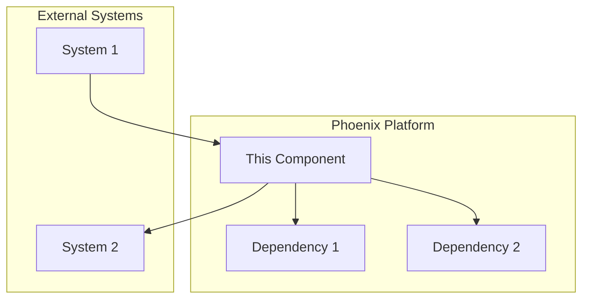
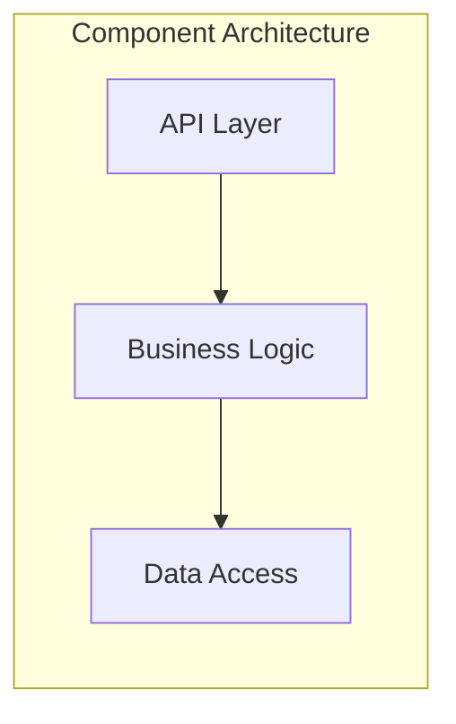
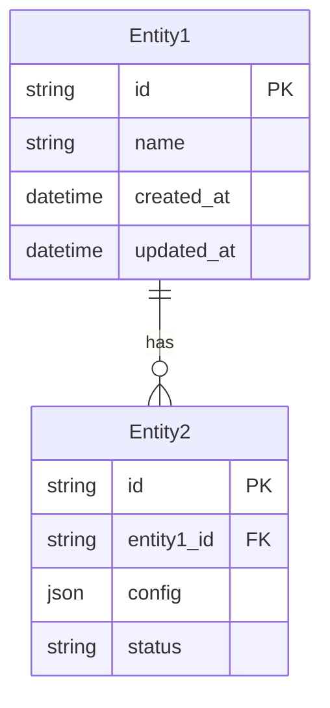

# Technical Specification: [Component Name]

**Version:** 1.0.0  
**Status:** Draft | In Review | Approved | Implemented  
**Last Updated:** [Date]  
**Author(s):** [Names]  
**Reviewers:** [Names]

---

## Executive Summary

[2-3 paragraph summary of what this component does, why it's needed, and its key design decisions]

### Key Features
- [Feature 1]
- [Feature 2]
- [Feature 3]

### Non-Goals
- [What this component explicitly does NOT do]
- [Scope limitations]

---

## Background & Motivation

### Problem Statement

[Detailed description of the problem this component solves]

### Current State

[How things work today without this component]

### Proposed Solution

[High-level overview of the solution]

---

## Architecture

### System Context



### Component Design



### Data Model



---

## Technical Design

### API Design

#### REST Endpoints

| Method | Path | Description |
|--------|------|-------------|
| GET | `/api/v1/resources` | List resources |
| POST | `/api/v1/resources` | Create resource |
| GET | `/api/v1/resources/{id}` | Get resource |
| PUT | `/api/v1/resources/{id}` | Update resource |
| DELETE | `/api/v1/resources/{id}` | Delete resource |

#### gRPC Services

```protobuf
service ResourceService {
    rpc ListResources(ListResourcesRequest) returns (ListResourcesResponse);
    rpc CreateResource(CreateResourceRequest) returns (Resource);
    rpc GetResource(GetResourceRequest) returns (Resource);
    rpc UpdateResource(UpdateResourceRequest) returns (Resource);
    rpc DeleteResource(DeleteResourceRequest) returns (Empty);
}
```

### Data Structures

```go
// Core data structures
type Resource struct {
    ID          string            `json:"id"`
    Name        string            `json:"name"`
    Config      map[string]string `json:"config"`
    Status      ResourceStatus    `json:"status"`
    CreatedAt   time.Time         `json:"created_at"`
    UpdatedAt   time.Time         `json:"updated_at"`
}

type ResourceStatus string

const (
    ResourceStatusPending   ResourceStatus = "pending"
    ResourceStatusActive    ResourceStatus = "active"
    ResourceStatusInactive  ResourceStatus = "inactive"
)
```

### Algorithms

```python
def optimize_resources(resources: List[Resource]) -> List[Resource]:
    """
    Algorithm description and complexity analysis
    Time Complexity: O(n log n)
    Space Complexity: O(n)
    """
    # Algorithm implementation
    pass
```

---

## Implementation Plan

### Phase 1: Foundation (Week 1-2)
- [ ] Set up project structure
- [ ] Implement core data models
- [ ] Create database migrations
- [ ] Basic CRUD operations

### Phase 2: Core Features (Week 3-4)
- [ ] Implement business logic
- [ ] Add validation rules
- [ ] Create unit tests
- [ ] Integration with existing services

### Phase 3: Advanced Features (Week 5-6)
- [ ] Performance optimizations
- [ ] Monitoring and metrics
- [ ] Documentation
- [ ] Load testing

---

## Testing Strategy

### Unit Tests
- Coverage target: 80%
- Focus areas: Business logic, validations
- Testing framework: [Framework]

### Integration Tests
- API endpoint testing
- Database operations
- External service mocks

### Performance Tests
- Load testing: 1000 RPS target
- Latency: p99 < 100ms
- Resource usage benchmarks

---

## Security Considerations

### Authentication & Authorization
- [Authentication method]
- [Authorization model]
- [Token management]

### Data Security
- Encryption at rest
- Encryption in transit
- PII handling

### Vulnerabilities
- Input validation
- SQL injection prevention
- XSS protection

---

## Performance Requirements

| Metric | Requirement | Measurement |
|--------|-------------|-------------|
| Latency (p50) | < 50ms | API response time |
| Latency (p99) | < 100ms | API response time |
| Throughput | 1000 RPS | Requests per second |
| Availability | 99.9% | Uptime percentage |
| Error Rate | < 0.1% | Failed requests |

---

## Monitoring & Observability

### Metrics
- Request rate
- Error rate
- Latency percentiles
- Resource utilization

### Logging
- Structured logging with context
- Log levels: ERROR, WARN, INFO, DEBUG
- Centralized log aggregation

### Tracing
- Distributed tracing with OpenTelemetry
- Trace sampling rate: 10%

### Alerts
| Alert | Condition | Severity |
|-------|-----------|----------|
| High Error Rate | Error rate > 1% for 5 min | Critical |
| High Latency | p99 > 200ms for 5 min | Warning |
| Low Availability | Uptime < 99.9% | Critical |

---

## Dependencies

### Internal Dependencies
- [Service 1]: [Purpose]
- [Service 2]: [Purpose]

### External Dependencies
- [Library/Service]: [Version] - [Purpose]
- [Database]: [Version] - [Purpose]

### API Contracts
- [Link to API specifications]
- [Link to proto files]

---

## Migration Plan

### Data Migration
1. [Step 1]
2. [Step 2]
3. [Rollback procedure]

### Service Migration
1. [Deployment strategy]
2. [Traffic routing plan]
3. [Rollback procedure]

---

## Risks & Mitigations

| Risk | Impact | Likelihood | Mitigation |
|------|--------|------------|------------|
| [Risk 1] | High | Medium | [Mitigation strategy] |
| [Risk 2] | Medium | Low | [Mitigation strategy] |

---

## Future Considerations

### Scalability
- Horizontal scaling strategy
- Database partitioning
- Caching layer

### Extensibility
- Plugin architecture
- API versioning strategy
- Backward compatibility

---

## References

- [Related Technical Spec 1]
- [Related Technical Spec 2]
- [External Documentation]
- [Research Papers]

---

## Appendix

### A. Database Schema

```sql
CREATE TABLE resources (
    id UUID PRIMARY KEY DEFAULT gen_random_uuid(),
    name VARCHAR(255) NOT NULL,
    config JSONB NOT NULL DEFAULT '{}',
    status VARCHAR(50) NOT NULL DEFAULT 'pending',
    created_at TIMESTAMP WITH TIME ZONE DEFAULT CURRENT_TIMESTAMP,
    updated_at TIMESTAMP WITH TIME ZONE DEFAULT CURRENT_TIMESTAMP
);

CREATE INDEX idx_resources_status ON resources(status);
CREATE INDEX idx_resources_created_at ON resources(created_at);
```

### B. Configuration Examples

```yaml
# Example configuration
component:
  setting1: value1
  setting2: value2
  advanced:
    option1: true
    option2: 100
```

### C. Error Codes

| Code | Description | HTTP Status |
|------|-------------|-------------|
| COMP001 | Invalid configuration | 400 |
| COMP002 | Resource not found | 404 |
| COMP003 | Operation timeout | 408 |

---

## Approval

| Role | Name | Date | Signature |
|------|------|------|-----------|
| Author | [Name] | [Date] | [Signature] |
| Tech Lead | [Name] | [Date] | [Signature] |
| Manager | [Name] | [Date] | [Signature] |