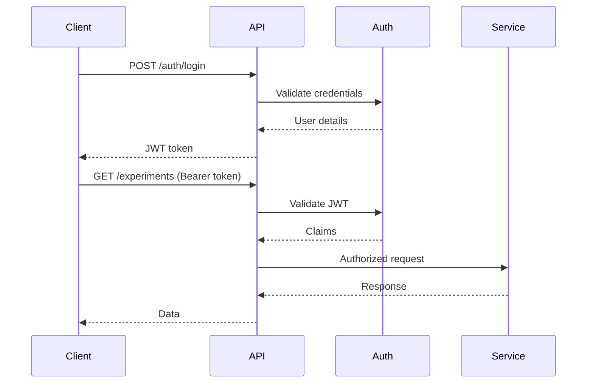

# Phoenix Platform API Contract Specifications

**Version**: 1.0  
**Last Updated**: January 25, 2025

## Overview

This document defines the complete API contracts for the Phoenix Platform, including REST endpoints, gRPC services, WebSocket events, and inter-service communication protocols.

## 1. REST API Contracts

### 1.1 Base Configuration

```yaml
base_url: https://api.phoenix.io
version: v1
content_type: application/json
authentication: Bearer JWT
rate_limits:
  default: 1000/hour
  experiment_creation: 100/hour
  metrics_query: 10000/hour
```

### 1.2 Experiment Management API

#### Create Experiment
```yaml
endpoint: POST /api/v1/experiments
request:
  headers:
    Authorization: Bearer <jwt>
    Content-Type: application/json
    X-Request-ID: <uuid>
  body:
    name: string (required, 3-100 chars)
    description: string (optional, max 500 chars)
    baseline_pipeline: string (required, pipeline template ID)
    candidate_pipeline: string (required, pipeline template ID)
    target_nodes: string[] (required, min 1)
    config:
      duration: string (required, e.g., "30m", "2h")
      traffic_split:
        baseline_percentage: integer (0-100)
        candidate_percentage: integer (0-100)
      success_criteria:
        min_cardinality_reduction: float (0-100)
        max_latency_increase: float (0-100)
        max_error_rate: float (0-100)
        critical_process_coverage: float (0-100)
      load_profile: string (optional, default: "realistic")
      
response:
  success:
    status: 201
    body:
      id: string (uuid)
      name: string
      state: string
      created_at: string (ISO8601)
      estimated_completion: string (ISO8601)
      _links:
        self: string
        metrics: string
        cancel: string
  errors:
    400:
      code: "VALIDATION_ERROR"
      message: string
      details: object
    409:
      code: "CONFLICT"
      message: "Experiment already exists for these nodes"
    503:
      code: "SERVICE_UNAVAILABLE"
      message: "Unable to create experiment"
```

#### Get Experiment
```yaml
endpoint: GET /api/v1/experiments/{id}
request:
  headers:
    Authorization: Bearer <jwt>
    Accept: application/json
    
response:
  success:
    status: 200
    body:
      id: string
      name: string
      description: string
      state: string (pending|initializing|running|analyzing|completed|failed|cancelled)
      baseline_pipeline: string
      candidate_pipeline: string
      target_nodes: string[]
      config: object
      results: object (nullable)
      created_at: string
      updated_at: string
      started_at: string (nullable)
      completed_at: string (nullable)
      _links: object
      _embedded:
        metrics: object (optional)
        events: array (optional)
```

#### List Experiments
```yaml
endpoint: GET /api/v1/experiments
request:
  headers:
    Authorization: Bearer <jwt>
  query_params:
    state: string[] (optional)
    created_after: string (optional, ISO8601)
    created_before: string (optional, ISO8601)
    page: integer (optional, default: 1)
    per_page: integer (optional, default: 20, max: 100)
    sort: string (optional, default: "-created_at")
    
response:
  success:
    status: 200
    body:
      experiments: array[Experiment]
      _meta:
        current_page: integer
        per_page: integer
        total_pages: integer
        total_count: integer
      _links:
        self: string
        next: string (nullable)
        prev: string (nullable)
        first: string
        last: string
```

#### Update Experiment State
```yaml
endpoint: PATCH /api/v1/experiments/{id}/state
request:
  headers:
    Authorization: Bearer <jwt>
    Content-Type: application/json
  body:
    action: string (start|pause|resume|cancel)
    reason: string (optional)
    
response:
  success:
    status: 200
    body:
      id: string
      previous_state: string
      current_state: string
      transition_time: string
  errors:
    400:
      code: "INVALID_TRANSITION"
      message: "Cannot transition from X to Y"
    423:
      code: "LOCKED"
      message: "Experiment is locked by another operation"
```

### 1.3 Metrics API

#### Query Experiment Metrics
```yaml
endpoint: GET /api/v1/experiments/{id}/metrics
request:
  headers:
    Authorization: Bearer <jwt>
  query_params:
    start_time: string (optional, ISO8601)
    end_time: string (optional, ISO8601)
    metric_names: string[] (optional)
    variant: string (optional, baseline|candidate|both)
    resolution: string (optional, 1m|5m|15m|1h)
    
response:
  success:
    status: 200
    body:
      experiment_id: string
      time_range:
        start: string
        end: string
      metrics:
        baseline:
          time_series_count: integer
          samples_per_second: float
          cpu_usage_percent: float
          memory_usage_mb: float
          series: array[TimeSeries]
        candidate:
          time_series_count: integer
          samples_per_second: float
          cpu_usage_percent: float
          memory_usage_mb: float
          series: array[TimeSeries]
      comparison:
        cardinality_reduction: float
        cpu_improvement: float
        memory_improvement: float
        cost_reduction_estimate: float
```

### 1.4 Pipeline API

#### List Pipeline Templates
```yaml
endpoint: GET /api/v1/pipelines
request:
  headers:
    Authorization: Bearer <jwt>
  query_params:
    category: string (optional)
    tags: string[] (optional)
    
response:
  success:
    status: 200
    body:
      pipelines: array[
        {
          id: string
          name: string
          version: string
          description: string
          category: string
          tags: string[]
          parameters: array[Parameter]
          estimated_reduction: string
          _links: object
        }
      ]
```

## 2. gRPC Service Contracts

### 2.1 Experiment Service

```protobuf
syntax = "proto3";

package phoenix.experiment.v1;

service ExperimentService {
  // Experiment lifecycle
  rpc CreateExperiment(CreateExperimentRequest) returns (CreateExperimentResponse);
  rpc GetExperiment(GetExperimentRequest) returns (GetExperimentResponse);
  rpc ListExperiments(ListExperimentsRequest) returns (ListExperimentsResponse);
  rpc UpdateExperimentState(UpdateExperimentStateRequest) returns (UpdateExperimentStateResponse);
  rpc DeleteExperiment(DeleteExperimentRequest) returns (DeleteExperimentResponse);
  
  // Metrics and results
  rpc GetExperimentMetrics(GetExperimentMetricsRequest) returns (GetExperimentMetricsResponse);
  rpc GetExperimentResults(GetExperimentResultsRequest) returns (GetExperimentResultsResponse);
  
  // Real-time updates
  rpc StreamExperimentUpdates(StreamExperimentUpdatesRequest) returns (stream ExperimentUpdate);
}

message CreateExperimentRequest {
  string name = 1;
  string description = 2;
  string baseline_pipeline_id = 3;
  string candidate_pipeline_id = 4;
  repeated string target_nodes = 5;
  ExperimentConfig config = 6;
  map<string, string> metadata = 7;
}

message ExperimentConfig {
  google.protobuf.Duration duration = 1;
  TrafficSplit traffic_split = 2;
  SuccessCriteria success_criteria = 3;
  string load_profile = 4;
  map<string, google.protobuf.Any> advanced_options = 5;
}

message TrafficSplit {
  int32 baseline_percentage = 1;
  int32 candidate_percentage = 2;
}

message SuccessCriteria {
  double min_cardinality_reduction = 1;
  double max_latency_increase = 2;
  double max_error_rate = 3;
  double critical_process_coverage = 4;
}
```

### 2.2 Config Generator Service

```protobuf
service ConfigGeneratorService {
  rpc GenerateConfig(GenerateConfigRequest) returns (GenerateConfigResponse);
  rpc ValidateConfig(ValidateConfigRequest) returns (ValidateConfigResponse);
  rpc GetPipelineTemplate(GetPipelineTemplateRequest) returns (GetPipelineTemplateResponse);
  rpc ListPipelineTemplates(ListPipelineTemplatesRequest) returns (ListPipelineTemplatesResponse);
}

message GenerateConfigRequest {
  string experiment_id = 1;
  string pipeline_template_id = 2;
  repeated string target_nodes = 3;
  map<string, string> variables = 4;
  ConfigFormat format = 5;
}

enum ConfigFormat {
  CONFIG_FORMAT_UNSPECIFIED = 0;
  CONFIG_FORMAT_YAML = 1;
  CONFIG_FORMAT_OTEL = 2;
  CONFIG_FORMAT_KUBERNETES = 3;
}

message GenerateConfigResponse {
  string config_id = 1;
  string content = 2;
  string git_commit_sha = 3;
  string git_branch = 4;
  map<string, string> metadata = 5;
}
```

## 3. WebSocket Event Contracts

### 3.1 Connection Protocol

```javascript
// Connection URL
wss://api.phoenix.io/v1/ws

// Authentication
{
  "type": "auth",
  "token": "<jwt>"
}

// Subscribe to events
{
  "type": "subscribe",
  "channels": ["experiments", "metrics"],
  "filters": {
    "experiment_id": "uuid",
    "tenant_id": "uuid"
  }
}

// Heartbeat
{
  "type": "ping",
  "timestamp": 1234567890
}
```

### 3.2 Event Types

```typescript
// Experiment State Change
interface ExperimentStateChangeEvent {
  type: "experiment.state_changed";
  timestamp: string;
  data: {
    experiment_id: string;
    previous_state: string;
    current_state: string;
    reason: string;
    metadata: Record<string, any>;
  };
}

// Metrics Update
interface MetricsUpdateEvent {
  type: "metrics.update";
  timestamp: string;
  data: {
    experiment_id: string;
    variant: "baseline" | "candidate";
    metrics: {
      time_series_count: number;
      samples_per_second: number;
      cpu_usage: number;
      memory_usage: number;
    };
    comparison: {
      cardinality_reduction: number;
      cost_savings: number;
    };
  };
}

// Alert Event
interface AlertEvent {
  type: "alert.triggered";
  timestamp: string;
  data: {
    alert_id: string;
    severity: "info" | "warning" | "critical";
    experiment_id?: string;
    title: string;
    description: string;
    actions: string[];
  };
}

// Progress Update
interface ProgressUpdateEvent {
  type: "progress.update";
  timestamp: string;
  data: {
    experiment_id: string;
    phase: string;
    progress_percentage: number;
    estimated_completion: string;
    current_step: string;
  };
}
```

## 4. Inter-Service Communication

### 4.1 Service Discovery

```yaml
services:
  experiment-controller:
    protocol: grpc
    port: 50051
    health_check: /health
    endpoints:
      - ExperimentService
      
  config-generator:
    protocol: grpc
    port: 50052
    health_check: /health
    endpoints:
      - ConfigGeneratorService
      
  api-gateway:
    protocol: http
    port: 8080
    health_check: /health
    endpoints:
      - REST API
      - WebSocket
```

### 4.2 Authentication Between Services

```go
// Service-to-service auth using mTLS
type ServiceAuth struct {
    CertFile   string
    KeyFile    string
    CAFile     string
    ServerName string
}

// JWT for service accounts
type ServiceJWT struct {
    Issuer    string
    Subject   string
    Audience  []string
    ExpiresIn time.Duration
    Claims    map[string]interface{}
}
```

## 5. Error Response Standards

### 5.1 Error Response Format

```json
{
  "error": {
    "code": "VALIDATION_ERROR",
    "message": "Invalid experiment configuration",
    "details": {
      "field_errors": [
        {
          "field": "config.duration",
          "code": "required",
          "message": "Duration is required"
        }
      ]
    },
    "trace_id": "abc123",
    "timestamp": "2025-01-25T10:00:00Z"
  }
}
```

### 5.2 Standard Error Codes

| Code | HTTP Status | Description |
|------|-------------|-------------|
| `VALIDATION_ERROR` | 400 | Invalid request data |
| `AUTHENTICATION_ERROR` | 401 | Invalid or missing credentials |
| `AUTHORIZATION_ERROR` | 403 | Insufficient permissions |
| `NOT_FOUND` | 404 | Resource not found |
| `CONFLICT` | 409 | Resource conflict |
| `RATE_LIMIT_EXCEEDED` | 429 | Too many requests |
| `INTERNAL_ERROR` | 500 | Internal server error |
| `SERVICE_UNAVAILABLE` | 503 | Service temporarily unavailable |

## 6. Pagination Standards

### 6.1 Request Parameters

```yaml
page: integer (1-based)
per_page: integer (max: 100)
sort: string (field:direction)
```

### 6.2 Response Format

```json
{
  "data": [...],
  "_meta": {
    "current_page": 1,
    "per_page": 20,
    "total_pages": 5,
    "total_count": 100
  },
  "_links": {
    "self": "/api/v1/experiments?page=1",
    "next": "/api/v1/experiments?page=2",
    "prev": null,
    "first": "/api/v1/experiments?page=1",
    "last": "/api/v1/experiments?page=5"
  }
}
```

## 7. API Versioning Strategy

### 7.1 Version Headers

```http
# Request
Accept: application/vnd.phoenix.v1+json

# Response
Content-Type: application/vnd.phoenix.v1+json
X-API-Version: v1
X-API-Deprecation-Date: 2025-12-31
```

### 7.2 Deprecation Process

1. Add deprecation headers 6 months before removal
2. Include sunset date in response headers
3. Provide migration guide in documentation
4. Send deprecation notices to API consumers
5. Maintain old version for minimum 6 months

## 8. Rate Limiting

### 8.1 Rate Limit Headers

```http
X-RateLimit-Limit: 1000
X-RateLimit-Remaining: 999
X-RateLimit-Reset: 1640995200
X-RateLimit-Reset-After: 3600
```

### 8.2 Rate Limit Response

```json
{
  "error": {
    "code": "RATE_LIMIT_EXCEEDED",
    "message": "API rate limit exceeded",
    "details": {
      "limit": 1000,
      "window": "1h",
      "retry_after": 3600
    }
  }
}
```

## 9. API Security

### 9.1 Authentication Flow



### 9.2 CORS Configuration

```yaml
cors:
  allowed_origins:
    - https://dashboard.phoenix.io
    - https://app.phoenix.io
  allowed_methods:
    - GET
    - POST
    - PUT
    - PATCH
    - DELETE
    - OPTIONS
  allowed_headers:
    - Authorization
    - Content-Type
    - X-Request-ID
  exposed_headers:
    - X-RateLimit-*
    - X-API-Version
  max_age: 86400
  allow_credentials: true
```

## 10. Contract Testing

### 10.1 Contract Test Example

```go
func TestExperimentAPIContract(t *testing.T) {
    // Provider test
    pact := &dsl.Pact{
        Consumer: "phoenix-dashboard",
        Provider: "phoenix-api",
    }
    
    pact.AddInteraction().
        Given("An experiment exists").
        UponReceiving("A request for experiment details").
        WithRequest(dsl.Request{
            Method: "GET",
            Path:   dsl.String("/api/v1/experiments/123"),
            Headers: dsl.MapMatcher{
                "Authorization": dsl.String("Bearer token"),
            },
        }).
        WillRespondWith(dsl.Response{
            Status: 200,
            Headers: dsl.MapMatcher{
                "Content-Type": dsl.String("application/json"),
            },
            Body: dsl.Match(&Experiment{}),
        })
}
```

## 11. API Documentation

### 11.1 OpenAPI Specification

```yaml
openapi: 3.0.3
info:
  title: Phoenix Platform API
  version: 1.0.0
  description: |
    Phoenix Platform API for observability cost optimization
  contact:
    email: api@phoenix.io
  license:
    name: Apache 2.0
    
servers:
  - url: https://api.phoenix.io/v1
    description: Production
  - url: https://staging-api.phoenix.io/v1
    description: Staging
    
security:
  - bearerAuth: []
  
components:
  securitySchemes:
    bearerAuth:
      type: http
      scheme: bearer
      bearerFormat: JWT
```

## 12. SLA Commitments

| Endpoint | Latency P99 | Availability | Rate Limit |
|----------|-------------|--------------|------------|
| GET /experiments | 100ms | 99.9% | 10000/hour |
| POST /experiments | 500ms | 99.9% | 100/hour |
| GET /metrics | 200ms | 99.5% | 5000/hour |
| WebSocket | 50ms | 99.5% | 1000 connections |