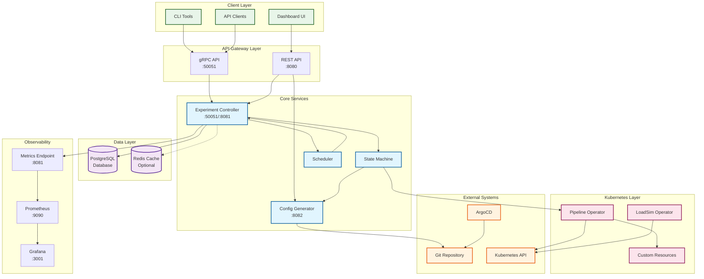
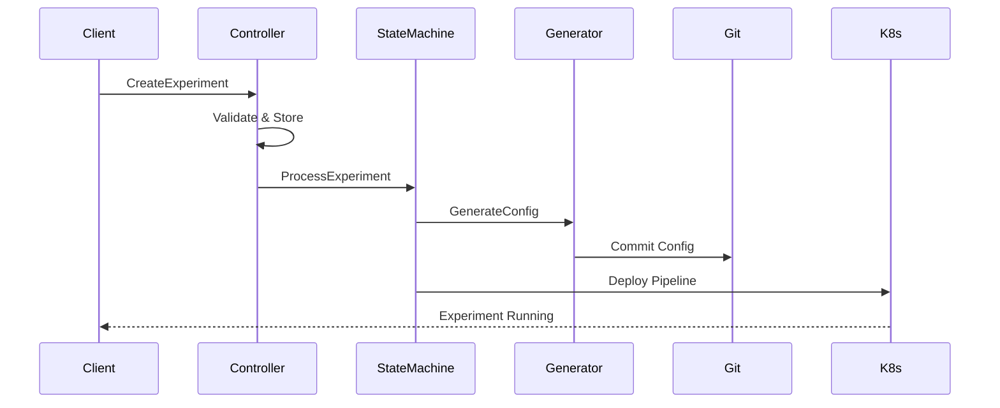
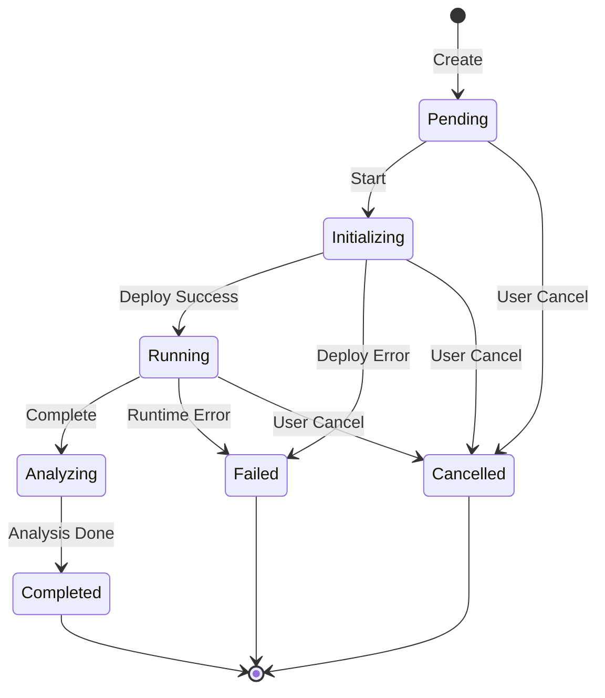

# Phoenix Platform Architecture

## System Architecture Diagram

## Component Descriptions

### Client Layer
- **Dashboard UI**: React-based web interface for experiment management
- **CLI Tools**: Command-line tools for automation and scripting
- **API Clients**: External service integrations

### Core Services

#### Experiment Controller (Port 50051/8081)
- Manages experiment lifecycle
- Handles state transitions
- Provides gRPC API for experiment operations
- Exposes Prometheus metrics on port 8081

#### Config Generator (Port 8082)
- Generates OpenTelemetry collector configurations
- Manages pipeline templates
- Provides HTTP API for configuration generation

#### State Machine
- Manages experiment state transitions
- Orchestrates workflow steps
- Ensures valid state changes

#### Scheduler
- Periodically processes experiments
- Triggers state transitions
- Manages timed operations

### Data Layer

#### PostgreSQL Database
- Primary data store for experiments
- Stores experiment metadata and state
- Handles concurrent access

#### Redis Cache (Optional)
- Caches frequently accessed data
- Pub/sub for real-time updates
- Session storage

### Kubernetes Integration

#### Pipeline Operator
- Deploys pipeline configurations
- Manages PhoenixProcessPipeline CRDs
- Monitors pipeline health

#### LoadSim Operator
- Creates load simulation jobs
- Manages LoadSimulationJob CRDs
- Collects performance metrics

### Observability

#### Prometheus
- Collects metrics from all services
- Stores time-series data
- Provides query interface

#### Grafana
- Visualizes metrics
- Custom dashboards for experiments
- Alerting capabilities

## Data Flow

### Experiment Creation Flow

### State Transitions

## Security Considerations

1. **Authentication**: JWT tokens for API access
2. **Authorization**: Role-based access control
3. **Network Security**: TLS for external communications
4. **Secrets Management**: Kubernetes secrets for sensitive data
5. **Audit Logging**: All operations logged for compliance

## Scalability

1. **Horizontal Scaling**: All services are stateless and can scale
2. **Database Pooling**: Connection pooling for PostgreSQL
3. **Caching Strategy**: Redis for frequently accessed data
4. **Load Balancing**: Kubernetes service load balancing
5. **Resource Limits**: Defined CPU/memory limits for all pods

## High Availability

1. **Service Replicas**: Multiple instances of each service
2. **Database HA**: PostgreSQL with replication
3. **Health Checks**: Liveness and readiness probes
4. **Circuit Breakers**: Prevent cascade failures
5. **Graceful Degradation**: Services continue with reduced functionality