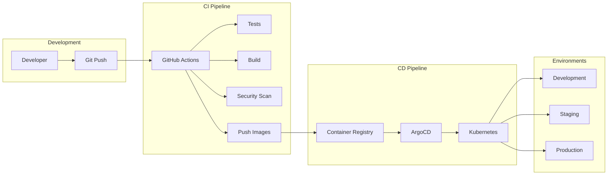

# Phoenix Platform CI/CD Pipeline Implementation

**Version**: 1.0  
**Last Updated**: January 25, 2025

## Overview

This document provides a complete CI/CD implementation for the Phoenix Platform using GitHub Actions, ArgoCD, and supporting tools for automated testing, building, and deployment.

## 1. Pipeline Architecture



## 2. GitHub Actions Workflows

### 2.1 Main CI Pipeline

```yaml
# .github/workflows/ci.yml
name: CI Pipeline

on:
  push:
    branches: [main, develop]
  pull_request:
    branches: [main]

env:
  GO_VERSION: '1.21'
  NODE_VERSION: '18'
  DOCKER_BUILDKIT: 1

jobs:
  # Validate code quality and structure
  validate:
    runs-on: ubuntu-latest
    steps:
      - uses: actions/checkout@v4
        
      - name: Validate mono-repo structure
        run: |
          chmod +x ./phoenix-platform/scripts/validate/validate-structure.sh
          ./phoenix-platform/scripts/validate/validate-structure.sh
          
      - name: Validate imports
        run: |
          cd phoenix-platform
          go run ./scripts/validate/validate-imports.go
          
      - name: Check documentation
        run: |
          # Ensure all services have README
          for dir in phoenix-platform/cmd/*; do
            if [ -d "$dir" ] && [ ! -f "$dir/README.md" ]; then
              echo "Missing README.md in $dir"
              exit 1
            fi
          done

  # Lint all code
  lint:
    runs-on: ubuntu-latest
    needs: validate
    strategy:
      matrix:
        component: [backend, frontend]
    steps:
      - uses: actions/checkout@v4
      
      - name: Setup Go
        if: matrix.component == 'backend'
        uses: actions/setup-go@v5
        with:
          go-version: ${{ env.GO_VERSION }}
          
      - name: Setup Node
        if: matrix.component == 'frontend'
        uses: actions/setup-node@v4
        with:
          node-version: ${{ env.NODE_VERSION }}
          
      - name: Lint Go code
        if: matrix.component == 'backend'
        run: |
          cd phoenix-platform
          curl -sSfL https://raw.githubusercontent.com/golangci/golangci-lint/master/install.sh | sh -s -- -b $(go env GOPATH)/bin v1.55.2
          golangci-lint run --timeout=10m
          
      - name: Lint TypeScript/React
        if: matrix.component == 'frontend'
        run: |
          cd phoenix-platform/dashboard
          npm ci
          npm run lint
          npm run type-check

  # Run tests
  test:
    runs-on: ubuntu-latest
    needs: lint
    services:
      postgres:
        image: postgres:15
        env:
          POSTGRES_USER: phoenix
          POSTGRES_PASSWORD: phoenix
          POSTGRES_DB: phoenix_test
        options: >-
          --health-cmd pg_isready
          --health-interval 10s
          --health-timeout 5s
          --health-retries 5
        ports:
          - 5432:5432
          
      redis:
        image: redis:7
        options: >-
          --health-cmd "redis-cli ping"
          --health-interval 10s
          --health-timeout 5s
          --health-retries 5
        ports:
          - 6379:6379
          
    strategy:
      matrix:
        test-suite: [unit, integration, frontend]
        
    steps:
      - uses: actions/checkout@v4
      
      - name: Setup Go
        if: matrix.test-suite != 'frontend'
        uses: actions/setup-go@v5
        with:
          go-version: ${{ env.GO_VERSION }}
          
      - name: Setup Node
        if: matrix.test-suite == 'frontend'
        uses: actions/setup-node@v4
        with:
          node-version: ${{ env.NODE_VERSION }}
          
      - name: Run unit tests
        if: matrix.test-suite == 'unit'
        run: |
          cd phoenix-platform
          go test -v -race -coverprofile=coverage.out ./...
          go tool cover -html=coverage.out -o coverage.html
          
      - name: Run integration tests
        if: matrix.test-suite == 'integration'
        env:
          POSTGRES_HOST: localhost
          POSTGRES_PORT: 5432
          REDIS_HOST: localhost
          REDIS_PORT: 6379
        run: |
          cd phoenix-platform
          go test -v -tags=integration -timeout=20m ./test/integration/...
          
      - name: Run frontend tests
        if: matrix.test-suite == 'frontend'
        run: |
          cd phoenix-platform/dashboard
          npm ci
          npm run test:ci
          npm run test:coverage
          
      - name: Upload coverage
        uses: codecov/codecov-action@v3
        if: matrix.test-suite != 'integration'
        with:
          file: ./coverage.out
          flags: ${{ matrix.test-suite }}

  # Security scanning
  security:
    runs-on: ubuntu-latest
    needs: validate
    steps:
      - uses: actions/checkout@v4
      
      - name: Run Trivy vulnerability scanner
        uses: aquasecurity/trivy-action@master
        with:
          scan-type: 'fs'
          scan-ref: '.'
          severity: 'CRITICAL,HIGH'
          
      - name: Run gosec security scanner
        uses: securego/gosec@master
        with:
          args: './phoenix-platform/...'
          
      - name: Dependency check
        uses: dependency-check/Dependency-Check_Action@main
        with:
          project: 'phoenix-platform'
          path: '.'
          format: 'ALL'
          
      - name: Upload security results
        uses: github/codeql-action/upload-sarif@v2
        if: always()
        with:
          sarif_file: results.sarif

  # Build and push images
  build:
    runs-on: ubuntu-latest
    needs: [test, security]
    if: github.event_name == 'push'
    strategy:
      matrix:
        service:
          - api
          - controller
          - generator
          - dashboard
          - simulator
    permissions:
      contents: read
      packages: write
      
    steps:
      - uses: actions/checkout@v4
      
      - name: Set up Docker Buildx
        uses: docker/setup-buildx-action@v3
        
      - name: Log in to GitHub Container Registry
        uses: docker/login-action@v3
        with:
          registry: ghcr.io
          username: ${{ github.actor }}
          password: ${{ secrets.GITHUB_TOKEN }}
          
      - name: Extract metadata
        id: meta
        uses: docker/metadata-action@v5
        with:
          images: ghcr.io/${{ github.repository }}/${{ matrix.service }}
          tags: |
            type=ref,event=branch
            type=ref,event=pr
            type=semver,pattern={{version}}
            type=semver,pattern={{major}}.{{minor}}
            type=sha,prefix={{branch}}-
            
      - name: Build and push
        uses: docker/build-push-action@v5
        with:
          context: ./phoenix-platform
          file: ./phoenix-platform/docker/${{ matrix.service }}/Dockerfile
          push: true
          tags: ${{ steps.meta.outputs.tags }}
          labels: ${{ steps.meta.outputs.labels }}
          cache-from: type=gha
          cache-to: type=gha,mode=max
          build-args: |
            VERSION=${{ github.sha }}
            BUILD_DATE=$(date -u +'%Y-%m-%dT%H:%M:%SZ')

  # Update manifests for ArgoCD
  update-manifests:
    runs-on: ubuntu-latest
    needs: build
    if: github.ref == 'refs/heads/main'
    steps:
      - uses: actions/checkout@v4
        with:
          repository: ${{ github.repository }}-configs
          token: ${{ secrets.MANIFEST_REPO_TOKEN }}
          
      - name: Update image tags
        run: |
          # Update development environment
          cd environments/development
          kustomize edit set image \
            api=ghcr.io/${{ github.repository }}/api:main-${{ github.sha }} \
            controller=ghcr.io/${{ github.repository }}/controller:main-${{ github.sha }} \
            generator=ghcr.io/${{ github.repository }}/generator:main-${{ github.sha }}
            
      - name: Commit and push
        run: |
          git config user.name "GitHub Actions"
          git config user.email "actions@github.com"
          git add .
          git commit -m "Update images to main-${{ github.sha }}"
          git push
```

### 2.2 Release Pipeline

```yaml
# .github/workflows/release.yml
name: Release Pipeline

on:
  push:
    tags:
      - 'v*'

jobs:
  release:
    runs-on: ubuntu-latest
    permissions:
      contents: write
      packages: write
      
    steps:
      - uses: actions/checkout@v4
        with:
          fetch-depth: 0
          
      - name: Validate tag
        run: |
          if ! [[ "${{ github.ref }}" =~ ^refs/tags/v[0-9]+\.[0-9]+\.[0-9]+$ ]]; then
            echo "Invalid tag format. Must be vX.Y.Z"
            exit 1
          fi
          
      - name: Generate changelog
        id: changelog
        run: |
          # Generate changelog from commits
          git log --pretty=format:"- %s (%h)" \
            $(git describe --tags --abbrev=0 HEAD^)..HEAD > CHANGELOG.md
            
      - name: Create release
        uses: softprops/action-gh-release@v1
        with:
          body_path: CHANGELOG.md
          draft: false
          prerelease: false
          
      - name: Build and push release images
        run: |
          VERSION=${GITHUB_REF#refs/tags/}
          make docker VERSION=$VERSION
          make push VERSION=$VERSION
          
      - name: Update Helm chart
        run: |
          cd phoenix-platform/helm/phoenix
          # Update Chart.yaml version
          sed -i "s/^version:.*/version: ${VERSION#v}/" Chart.yaml
          sed -i "s/^appVersion:.*/appVersion: $VERSION/" Chart.yaml
          
      - name: Package Helm chart
        run: |
          cd phoenix-platform/helm
          helm package phoenix
          helm repo index . --url https://charts.phoenix.io
          
      - name: Upload Helm chart
        uses: actions/upload-release-asset@v1
        with:
          upload_url: ${{ steps.create_release.outputs.upload_url }}
          asset_path: ./phoenix-platform/helm/phoenix-*.tgz
          asset_name: phoenix-chart-${{ github.ref_name }}.tgz
          asset_content_type: application/gzip
```

### 2.3 Nightly Build

```yaml
# .github/workflows/nightly.yml
name: Nightly Build

on:
  schedule:
    - cron: '0 2 * * *'  # 2 AM UTC daily
  workflow_dispatch:

jobs:
  nightly:
    runs-on: ubuntu-latest
    steps:
      - uses: actions/checkout@v4
      
      - name: Run extended tests
        run: |
          cd phoenix-platform
          # Run performance tests
          go test -v -tags=performance -timeout=1h ./test/performance/...
          
          # Run E2E tests
          make cluster-up
          make deploy ENV=test
          go test -v -tags=e2e -timeout=30m ./test/e2e/...
          make cluster-down
          
      - name: Security audit
        run: |
          # Check for outdated dependencies
          cd phoenix-platform
          go list -u -m all
          
          # Audit npm packages
          cd dashboard
          npm audit
          
      - name: Build nightly images
        run: |
          TIMESTAMP=$(date +%Y%m%d)
          make docker VERSION=nightly-$TIMESTAMP
          make push VERSION=nightly-$TIMESTAMP
          
      - name: Deploy to staging
        run: |
          # Update staging environment
          kubectl set image deployment/phoenix-api \
            api=ghcr.io/${{ github.repository }}/api:nightly-$TIMESTAMP \
            -n phoenix-staging
```

## 3. ArgoCD Configuration

### 3.1 ArgoCD Application

```yaml
# argocd/applications/phoenix-dev.yaml
apiVersion: argoproj.io/v1alpha1
kind: Application
metadata:
  name: phoenix-development
  namespace: argocd
  finalizers:
    - resources-finalizer.argocd.argoproj.io
spec:
  project: default
  
  source:
    repoURL: https://github.com/phoenix/platform-configs
    targetRevision: main
    path: environments/development
    
  destination:
    server: https://kubernetes.default.svc
    namespace: phoenix-dev
    
  syncPolicy:
    automated:
      prune: true
      selfHeal: true
      allowEmpty: false
    syncOptions:
    - CreateNamespace=true
    - PrunePropagationPolicy=foreground
    - PruneLast=true
    retry:
      limit: 5
      backoff:
        duration: 5s
        factor: 2
        maxDuration: 3m
        
  revisionHistoryLimit: 10
```

### 3.2 Environment Configurations

```yaml
# environments/development/kustomization.yaml
apiVersion: kustomize.config.k8s.io/v1beta1
kind: Kustomization

namespace: phoenix-dev

bases:
  - ../../base

patchesStrategicMerge:
  - deployment-patches.yaml
  - configmap-patches.yaml

configMapGenerator:
  - name: phoenix-config
    behavior: merge
    literals:
      - ENVIRONMENT=development
      - LOG_LEVEL=debug
      - METRICS_ENABLED=true

secretGenerator:
  - name: phoenix-secrets
    behavior: merge
    envs:
      - secrets.env

images:
  - name: phoenix/api
    newName: ghcr.io/phoenix/platform/api
    newTag: main-latest
  - name: phoenix/controller
    newName: ghcr.io/phoenix/platform/controller
    newTag: main-latest
  - name: phoenix/generator
    newName: ghcr.io/phoenix/platform/generator
    newTag: main-latest

replicas:
  - name: phoenix-api
    count: 1
  - name: experiment-controller
    count: 1
```

### 3.3 Progressive Delivery

```yaml
# argocd/rollouts/phoenix-api.yaml
apiVersion: argoproj.io/v1alpha1
kind: Rollout
metadata:
  name: phoenix-api
spec:
  replicas: 5
  strategy:
    canary:
      canaryService: phoenix-api-canary
      stableService: phoenix-api-stable
      trafficRouting:
        nginx:
          stableIngress: phoenix-api-ingress
      steps:
      - setWeight: 20
      - pause: {duration: 5m}
      - analysis:
          templates:
          - templateName: success-rate
          args:
          - name: service-name
            value: phoenix-api
      - setWeight: 40
      - pause: {duration: 5m}
      - setWeight: 60
      - pause: {duration: 5m}
      - setWeight: 80
      - pause: {duration: 5m}
      - setWeight: 100
  template:
    metadata:
      labels:
        app: phoenix-api
    spec:
      containers:
      - name: api
        image: ghcr.io/phoenix/platform/api:latest
        ports:
        - containerPort: 8080
```

## 4. Quality Gates

### 4.1 Pre-merge Checks

```yaml
# .github/branch-protection.yml
protection_rules:
  main:
    required_status_checks:
      strict: true
      contexts:
        - "CI Pipeline / validate"
        - "CI Pipeline / lint (backend)"
        - "CI Pipeline / lint (frontend)"
        - "CI Pipeline / test (unit)"
        - "CI Pipeline / test (integration)"
        - "CI Pipeline / test (frontend)"
        - "CI Pipeline / security"
        - "codecov/patch"
        - "codecov/project"
    enforce_admins: true
    required_pull_request_reviews:
      required_approving_review_count: 2
      dismiss_stale_reviews: true
      require_code_owner_reviews: true
    restrictions:
      users: []
      teams: ["platform-team"]
```

### 4.2 Code Coverage Requirements

```yaml
# codecov.yml
coverage:
  status:
    project:
      default:
        target: 80%
        threshold: 2%
    patch:
      default:
        target: 85%
        threshold: 0%
        
comment:
  layout: "reach,diff,flags,files,footer"
  behavior: default
  require_changes: true
  
flags:
  unit:
    paths:
      - "phoenix-platform/**/*.go"
    carryforward: false
  frontend:
    paths:
      - "phoenix-platform/dashboard/src/**"
    carryforward: false
```

## 5. Secret Management

### 5.1 GitHub Secrets

```bash
# Required secrets in GitHub
MANIFEST_REPO_TOKEN     # PAT for updating manifests repo
DOCKER_REGISTRY_TOKEN   # Docker registry credentials
SONAR_TOKEN            # SonarCloud token
CODECOV_TOKEN          # Codecov token
SLACK_WEBHOOK          # Notifications
```

### 5.2 Kubernetes Secrets

```yaml
# Using Sealed Secrets
apiVersion: bitnami.com/v1alpha1
kind: SealedSecret
metadata:
  name: phoenix-secrets
  namespace: phoenix-system
spec:
  encryptedData:
    database-url: AgA...
    jwt-secret: AgB...
    newrelic-api-key: AgC...
```

## 6. Monitoring CI/CD

### 6.1 Pipeline Metrics

```yaml
# Prometheus metrics for CI/CD
groups:
  - name: cicd
    rules:
      - record: cicd:pipeline_duration_seconds
        expr: |
          histogram_quantile(0.95,
            sum(rate(github_actions_workflow_run_duration_seconds_bucket[5m])) 
            by (workflow, le)
          )
          
      - record: cicd:pipeline_success_rate
        expr: |
          sum(rate(github_actions_workflow_run_total{status="completed"}[1h])) /
          sum(rate(github_actions_workflow_run_total[1h]))
          
      - alert: CICDPipelineFailureRate
        expr: |
          (1 - cicd:pipeline_success_rate) > 0.1
        for: 30m
        annotations:
          summary: "High CI/CD pipeline failure rate"
```

### 6.2 Deployment Metrics

```go
// Track deployment metrics
var (
    DeploymentDuration = prometheus.NewHistogramVec(
        prometheus.HistogramOpts{
            Name: "phoenix_deployment_duration_seconds",
            Help: "Time taken to deploy services",
        },
        []string{"service", "environment"},
    )
    
    DeploymentStatus = prometheus.NewCounterVec(
        prometheus.CounterOpts{
            Name: "phoenix_deployment_total",
            Help: "Total deployments by status",
        },
        []string{"service", "environment", "status"},
    )
)
```

## 7. Rollback Procedures

### 7.1 Automated Rollback

```yaml
# ArgoCD auto-rollback on failure
apiVersion: argoproj.io/v1alpha1
kind: AnalysisTemplate
metadata:
  name: success-rate
spec:
  metrics:
  - name: success-rate
    interval: 5m
    successCondition: result[0] >= 0.95
    failureLimit: 3
    provider:
      prometheus:
        address: http://prometheus:9090
        query: |
          sum(rate(
            phoenix_api_request_total{status=~"2.."}[5m]
          )) / 
          sum(rate(
            phoenix_api_request_total[5m]
          ))
```

### 7.2 Manual Rollback

```bash
#!/bin/bash
# rollback.sh

SERVICE=$1
ENVIRONMENT=$2
PREVIOUS_VERSION=$3

# Rollback using ArgoCD
argocd app rollback phoenix-$ENVIRONMENT $PREVIOUS_VERSION

# Verify rollback
kubectl rollout status deployment/$SERVICE -n phoenix-$ENVIRONMENT

# Run smoke tests
./scripts/smoke-test.sh $ENVIRONMENT
```

## 8. CI/CD Best Practices

### 8.1 Pipeline Optimization

1. **Parallel Execution**: Run independent jobs in parallel
2. **Caching**: Cache dependencies and build artifacts
3. **Fail Fast**: Stop pipeline on first failure
4. **Resource Limits**: Set appropriate timeouts
5. **Conditional Steps**: Skip unnecessary steps

### 8.2 Security Practices

1. **Least Privilege**: Minimal permissions for CI/CD
2. **Secret Rotation**: Regular rotation of tokens
3. **Signed Commits**: Require GPG signed commits
4. **Image Scanning**: Scan all container images
5. **SBOM Generation**: Generate software bill of materials

## 9. Troubleshooting

### 9.1 Common Issues

| Issue | Cause | Solution |
|-------|-------|----------|
| **Pipeline Timeout** | Long-running tests | Increase timeout, optimize tests |
| **Image Push Failed** | Registry auth | Check credentials, permissions |
| **ArgoCD Sync Failed** | Invalid manifests | Validate YAML, check resources |
| **Test Flakiness** | Race conditions | Add retries, fix race conditions |

### 9.2 Debug Commands

```bash
# Check GitHub Actions logs
gh run list --limit 10
gh run view <run-id>

# ArgoCD debugging
argocd app get phoenix-dev
argocd app logs phoenix-dev
argocd app diff phoenix-dev

# Kubernetes debugging
kubectl describe deployment phoenix-api -n phoenix-dev
kubectl logs -l app=phoenix-api -n phoenix-dev
```

## 10. Future Enhancements

1. **GitOps for Helm Charts**: Automated chart testing
2. **Multi-Cloud Deployment**: Support for AWS, GCP, Azure
3. **Chaos Engineering**: Automated chaos tests in CI
4. **Cost Optimization**: Track and optimize CI costs
5. **AI-Powered Testing**: Smart test selection based on changes