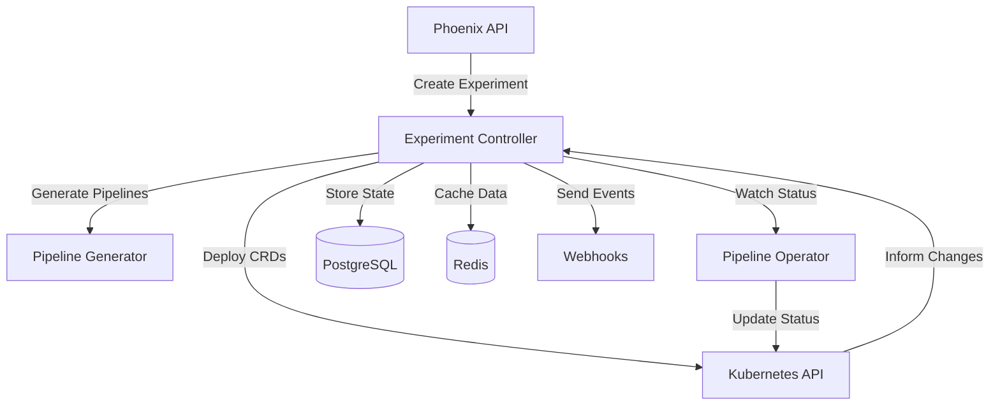

# Phoenix Experiment Controller Technical Specification

## Overview

The Phoenix Experiment Controller is a Go-based microservice responsible for orchestrating A/B testing experiments, managing pipeline deployments, and coordinating with the Kubernetes Pipeline Operator. It serves as the control plane for experiment lifecycle management.

**Implementation Status**: 80% Complete (Core functionality implemented, integration pending)

## Service Identity

- **Service Name**: phoenix-experiment-controller
- **Type**: Backend Microservice
- **Repository Path**: `/cmd/controller/`
- **Port**: 8081 (HTTP/Metrics), 50051 (gRPC)
- **Technology Stack**: Go 1.21, gRPC, PostgreSQL, Zap logger
- **Binary**: `build/experiment-controller`

## Architecture

### Service Architecture (As Implemented)

```
cmd/controller/
├── main.go                    # Service entry point with gRPC/HTTP servers
├── internal/
│   ├── controller/           # Core control logic
│   │   ├── experiment.go    # Experiment types and controller
│   │   ├── state_machine.go # Complete state machine implementation
│   │   └── scheduler.go     # Periodic reconciliation scheduler
│   ├── store/              # Data persistence
│   │   └── postgres.go     # PostgreSQL adapter with migrations
│   └── grpc/               # gRPC service
│       └── adapter.go      # gRPC adapter for proto compatibility
```

### Planned Architecture (Not Yet Implemented)

```
├── internal/
│   ├── k8s/                 # Kubernetes integration (TODO)
│   │   ├── client.go       # K8s client wrapper
│   │   └── crd.go          # CRD operations
│   ├── generator/          # Pipeline generation client (TODO)
│   │   └── client.go       # Config generator gRPC client
│   └── notifier/           # Event notifications (TODO)
│       └── webhook.go      # Webhook dispatcher
```

### Component Interaction



## Implementation Details

### Current Implementation Status

The Experiment Controller has been implemented with the following features:

1. **Service Initialization**
   - Full gRPC server with health checks on port 50051
   - HTTP metrics/health endpoint on port 8081
   - Graceful shutdown with 30-second timeout
   - Environment-based configuration

2. **State Machine Implementation**
   - Complete state transitions: Pending → Initializing → Running → Analyzing → Completed/Failed/Cancelled
   - Automatic state progression with timeouts
   - Placeholder methods for integration points (pipeline validation, git operations, k8s resources)
   - State persistence in PostgreSQL

3. **Database Integration**
   - PostgreSQL store with automatic migrations
   - Full CRUD operations for experiments
   - JSON storage for complex fields (config, status, metadata)
   - Connection pooling and proper error handling

4. **Scheduler**
   - Periodic reconciliation every 30 seconds
   - Automatic timeout handling for stuck experiments
   - Concurrent experiment processing

5. **gRPC Service**
   - Adapter pattern to work with existing proto definitions
   - Basic implementation of all required endpoints
   - Health check service for Kubernetes probes

### Key Implementation Files

- `main.go`: Service initialization and orchestration
- `internal/controller/experiment.go`: Core experiment types and controller logic
- `internal/controller/state_machine.go`: Complete state machine implementation
- `internal/controller/scheduler.go`: Periodic reconciliation logic
- `internal/store/postgres.go`: PostgreSQL persistence layer
- `internal/grpc/adapter.go`: gRPC service adapter

### Integration Points (TODO)

1. **Config Generator Service**: Methods exist but need gRPC client implementation
2. **Pipeline Operator**: Kubernetes resource creation placeholders ready
3. **Git Integration**: Branch creation and commit logic placeholders
4. **Prometheus Metrics**: Endpoint ready, instrumentation needed

## Core Components

### 1. Experiment State Machine

```go
// State definitions
type ExperimentState string

const (
    StatePending      ExperimentState = "pending"
    StateInitializing ExperimentState = "initializing"
    StateDeploying    ExperimentState = "deploying"
    StateRunning      ExperimentState = "running"
    StateAnalyzing    ExperimentState = "analyzing"
    StateCompleted    ExperimentState = "completed"
    StateFailed       ExperimentState = "failed"
    StateCancelled    ExperimentState = "cancelled"
)

// State transitions
type StateMachine struct {
    transitions map[ExperimentState][]ExperimentState
    handlers    map[ExperimentState]StateHandler
}

type StateHandler func(ctx context.Context, exp *Experiment) error

// State machine implementation
func NewExperimentStateMachine() *StateMachine {
    return &StateMachine{
        transitions: map[ExperimentState][]ExperimentState{
            StatePending:      {StateInitializing, StateCancelled},
            StateInitializing: {StateDeploying, StateFailed},
            StateDeploying:    {StateRunning, StateFailed},
            StateRunning:      {StateAnalyzing, StateFailed, StateCancelled},
            StateAnalyzing:    {StateCompleted, StateFailed},
            StateCompleted:    {},
            StateFailed:       {},
            StateCancelled:    {},
        },
        handlers: map[ExperimentState]StateHandler{
            StateInitializing: handleInitializing,
            StateDeploying:    handleDeploying,
            StateRunning:      handleRunning,
            StateAnalyzing:    handleAnalyzing,
        },
    }
}
```

### 2. Pipeline Generator

```go
// Pipeline generation logic
type PipelineGenerator struct {
    templates  *template.Template
    validator  *ConfigValidator
    optimizer  *PipelineOptimizer
}

func (pg *PipelineGenerator) GeneratePipeline(
    ctx context.Context,
    spec PipelineSpec,
) (*GeneratedPipeline, error) {
    // Load base template
    baseTemplate, err := pg.loadTemplate(spec.BaseTemplate)
    if err != nil {
        return nil, fmt.Errorf("loading template: %w", err)
    }
    
    // Apply optimizations
    optimized, err := pg.optimizer.Optimize(baseTemplate, spec.Optimizations)
    if err != nil {
        return nil, fmt.Errorf("optimizing pipeline: %w", err)
    }
    
    // Validate configuration
    if err := pg.validator.Validate(optimized); err != nil {
        return nil, fmt.Errorf("validation failed: %w", err)
    }
    
    // Generate YAML
    var buf bytes.Buffer
    if err := pg.templates.Execute(&buf, optimized); err != nil {
        return nil, fmt.Errorf("template execution: %w", err)
    }
    
    return &GeneratedPipeline{
        Name:   fmt.Sprintf("%s-%s", spec.Name, generateSuffix()),
        Config: buf.String(),
        Hash:   calculateHash(buf.Bytes()),
    }, nil
}

// Pipeline optimization strategies
type PipelineOptimizer struct {
    strategies []OptimizationStrategy
}

type OptimizationStrategy interface {
    Apply(config *PipelineConfig) error
    Name() string
}

// Example: Process filtering optimization
type ProcessFilterOptimization struct {
    Patterns []string
}

func (pfo *ProcessFilterOptimization) Apply(config *PipelineConfig) error {
    for _, receiver := range config.Receivers {
        if hostmetrics, ok := receiver.(*HostmetricsReceiver); ok {
            hostmetrics.Scrapers.Process.Include.Names = pfo.Patterns
            hostmetrics.Scrapers.Process.Include.MatchType = "regexp"
        }
    }
    return nil
}
```

### 3. Kubernetes Integration

```go
// Kubernetes client wrapper
type K8sClient struct {
    client    kubernetes.Interface
    dynClient dynamic.Interface
    mapper    meta.RESTMapper
}

// Deploy pipeline CRD
func (k *K8sClient) DeployPipeline(
    ctx context.Context,
    pipeline *phoenixv1.PhoenixProcessPipeline,
) error {
    // Get GVR for PhoenixProcessPipeline
    gvr := schema.GroupVersionResource{
        Group:    "phoenix.io",
        Version:  "v1",
        Resource: "phoenixprocesspipelines",
    }
    
    // Create unstructured object
    unstructured, err := runtime.DefaultUnstructuredConverter.ToUnstructured(pipeline)
    if err != nil {
        return fmt.Errorf("converting to unstructured: %w", err)
    }
    
    // Deploy to cluster
    _, err = k.dynClient.Resource(gvr).
        Namespace(pipeline.Namespace).
        Create(ctx, &unstructuredv1.Unstructured{Object: unstructured}, metav1.CreateOptions{})
    
    return err
}

// Watch pipeline status
func (k *K8sClient) WatchPipelineStatus(
    ctx context.Context,
    namespace string,
    handler func(*phoenixv1.PhoenixProcessPipeline),
) error {
    informerFactory := dynamicinformer.NewFilteredDynamicSharedInformerFactory(
        k.dynClient,
        time.Minute,
        namespace,
        nil,
    )
    
    gvr := schema.GroupVersionResource{
        Group:    "phoenix.io",
        Version:  "v1",
        Resource: "phoenixprocesspipelines",
    }
    
    informer := informerFactory.ForResource(gvr).Informer()
    
    informer.AddEventHandler(cache.ResourceEventHandlerFuncs{
        UpdateFunc: func(oldObj, newObj interface{}) {
            pipeline := &phoenixv1.PhoenixProcessPipeline{}
            if err := runtime.DefaultUnstructuredConverter.FromUnstructured(
                newObj.(*unstructuredv1.Unstructured).Object,
                pipeline,
            ); err == nil {
                handler(pipeline)
            }
        },
    })
    
    informerFactory.Start(ctx.Done())
    informerFactory.WaitForCacheSync(ctx.Done())
    
    <-ctx.Done()
    return nil
}
```

### 4. Experiment Scheduler

```go
// Scheduler for experiment execution
type ExperimentScheduler struct {
    store      ExperimentStore
    controller *ExperimentController
    ticker     *time.Ticker
}

func (es *ExperimentScheduler) Start(ctx context.Context) error {
    es.ticker = time.NewTicker(30 * time.Second)
    defer es.ticker.Stop()
    
    for {
        select {
        case <-ctx.Done():
            return ctx.Err()
        case <-es.ticker.C:
            if err := es.processScheduledExperiments(ctx); err != nil {
                log.Printf("Error processing experiments: %v", err)
            }
        }
    }
}

func (es *ExperimentScheduler) processScheduledExperiments(ctx context.Context) error {
    // Get experiments ready to start
    experiments, err := es.store.GetExperimentsByState(ctx, StatePending)
    if err != nil {
        return fmt.Errorf("fetching pending experiments: %w", err)
    }
    
    now := time.Now()
    for _, exp := range experiments {
        if exp.ScheduledStart != nil && exp.ScheduledStart.Before(now) {
            if err := es.controller.StartExperiment(ctx, exp.ID); err != nil {
                log.Printf("Failed to start experiment %s: %v", exp.ID, err)
            }
        }
    }
    
    // Check for experiments that need to end
    runningExps, err := es.store.GetExperimentsByState(ctx, StateRunning)
    if err != nil {
        return fmt.Errorf("fetching running experiments: %w", err)
    }
    
    for _, exp := range runningExps {
        if exp.ScheduledEnd != nil && exp.ScheduledEnd.Before(now) {
            if err := es.controller.StopExperiment(ctx, exp.ID); err != nil {
                log.Printf("Failed to stop experiment %s: %v", exp.ID, err)
            }
        }
    }
    
    return nil
}
```

### 5. Metrics Collection

```go
// Metrics collector for experiments
type MetricsCollector struct {
    promClient   prometheus.Client
    experiments  map[string]*ExperimentMetrics
    mu           sync.RWMutex
}

type ExperimentMetrics struct {
    ID               string
    BaselineMetrics  *PipelineMetrics
    VariantMetrics   *PipelineMetrics
    ComparisonResult *ComparisonResult
}

type PipelineMetrics struct {
    ProcessCount      float64
    MemoryUsage       float64
    CPUUsage          float64
    DatapointsPerSec  float64
    ErrorRate         float64
}

func (mc *MetricsCollector) CollectMetrics(ctx context.Context, expID string) error {
    exp, err := mc.getExperiment(expID)
    if err != nil {
        return err
    }
    
    // Collect baseline metrics
    baselineMetrics, err := mc.collectPipelineMetrics(ctx, exp.BaselinePipeline)
    if err != nil {
        return fmt.Errorf("collecting baseline metrics: %w", err)
    }
    
    // Collect variant metrics
    variantMetrics, err := mc.collectPipelineMetrics(ctx, exp.VariantPipeline)
    if err != nil {
        return fmt.Errorf("collecting variant metrics: %w", err)
    }
    
    // Calculate comparison
    comparison := mc.compareMetrics(baselineMetrics, variantMetrics)
    
    // Store results
    mc.mu.Lock()
    mc.experiments[expID] = &ExperimentMetrics{
        ID:               expID,
        BaselineMetrics:  baselineMetrics,
        VariantMetrics:   variantMetrics,
        ComparisonResult: comparison,
    }
    mc.mu.Unlock()
    
    return nil
}

func (mc *MetricsCollector) collectPipelineMetrics(
    ctx context.Context,
    pipelineName string,
) (*PipelineMetrics, error) {
    queries := map[string]string{
        "process_count": fmt.Sprintf(
            `count(count by (process_name) (system_processes_count{pipeline="%s"}))`,
            pipelineName,
        ),
        "memory_usage": fmt.Sprintf(
            `sum(system_memory_usage{pipeline="%s"})`,
            pipelineName,
        ),
        "cpu_usage": fmt.Sprintf(
            `sum(rate(system_cpu_time{pipeline="%s"}[5m]))`,
            pipelineName,
        ),
        "datapoints_rate": fmt.Sprintf(
            `sum(rate(otel_datapoints_total{pipeline="%s"}[5m]))`,
            pipelineName,
        ),
        "error_rate": fmt.Sprintf(
            `sum(rate(otel_errors_total{pipeline="%s"}[5m]))`,
            pipelineName,
        ),
    }
    
    metrics := &PipelineMetrics{}
    
    for metric, query := range queries {
        result, err := mc.promClient.Query(ctx, query, time.Now())
        if err != nil {
            return nil, fmt.Errorf("querying %s: %w", metric, err)
        }
        
        if vector, ok := result.(model.Vector); ok && len(vector) > 0 {
            value := float64(vector[0].Value)
            switch metric {
            case "process_count":
                metrics.ProcessCount = value
            case "memory_usage":
                metrics.MemoryUsage = value
            case "cpu_usage":
                metrics.CPUUsage = value
            case "datapoints_rate":
                metrics.DatapointsPerSec = value
            case "error_rate":
                metrics.ErrorRate = value
            }
        }
    }
    
    return metrics, nil
}
```

## API Specification

### gRPC Service Definition

```protobuf
syntax = "proto3";

package phoenix.controller.v1;

service ExperimentController {
    // Experiment lifecycle
    rpc GetExperiment(GetExperimentRequest) returns (Experiment);
    rpc UpdateExperimentState(UpdateStateRequest) returns (Experiment);
    rpc GetExperimentMetrics(GetMetricsRequest) returns (ExperimentMetrics);
    
    // Pipeline operations
    rpc GeneratePipeline(GeneratePipelineRequest) returns (Pipeline);
    rpc DeployPipeline(DeployPipelineRequest) returns (DeploymentStatus);
    rpc GetPipelineStatus(GetPipelineStatusRequest) returns (PipelineStatus);
    
    // Streaming
    rpc StreamExperimentUpdates(StreamUpdatesRequest) returns (stream ExperimentUpdate);
}

message Experiment {
    string id = 1;
    string name = 2;
    ExperimentState state = 3;
    ExperimentSpec spec = 4;
    ExperimentStatus status = 5;
    google.protobuf.Timestamp created_at = 6;
    google.protobuf.Timestamp updated_at = 7;
}

message ExperimentState {
    enum State {
        PENDING = 0;
        INITIALIZING = 1;
        DEPLOYING = 2;
        RUNNING = 3;
        ANALYZING = 4;
        COMPLETED = 5;
        FAILED = 6;
        CANCELLED = 7;
    }
    State value = 1;
}
```

### REST API Endpoints

```yaml
openapi: 3.0.0
info:
  title: Phoenix Experiment Controller API
  version: 1.0.0

paths:
  /v1/controller/health:
    get:
      summary: Health check
      responses:
        '200':
          description: Service is healthy
          
  /v1/controller/experiments/{id}/state:
    get:
      summary: Get experiment state
      parameters:
        - name: id
          in: path
          required: true
          schema:
            type: string
      responses:
        '200':
          description: Current experiment state
          
  /v1/controller/experiments/{id}/metrics:
    get:
      summary: Get experiment metrics
      parameters:
        - name: id
          in: path
          required: true
          schema:
            type: string
      responses:
        '200':
          description: Experiment metrics
          
  /v1/controller/pipelines/generate:
    post:
      summary: Generate pipeline configuration
      requestBody:
        required: true
        content:
          application/json:
            schema:
              $ref: '#/components/schemas/PipelineSpec'
      responses:
        '200':
          description: Generated pipeline configuration
```

## Data Models

### Database Schema

#### Implemented Schema

```sql
-- Main experiments table (IMPLEMENTED)
CREATE TABLE IF NOT EXISTS experiments (
    id VARCHAR(255) PRIMARY KEY,
    name VARCHAR(255) NOT NULL,
    description TEXT,
    phase VARCHAR(50) NOT NULL,
    config JSONB NOT NULL,     -- Stores ExperimentConfig
    status JSONB NOT NULL,     -- Stores ExperimentStatus
    metadata JSONB,
    created_at TIMESTAMP NOT NULL,
    updated_at TIMESTAMP NOT NULL
);

-- Indexes for performance (IMPLEMENTED)
CREATE INDEX IF NOT EXISTS idx_experiments_phase ON experiments(phase);
CREATE INDEX IF NOT EXISTS idx_experiments_created_at ON experiments(created_at DESC);
CREATE INDEX IF NOT EXISTS idx_experiments_updated_at ON experiments(updated_at DESC);
```

#### Planned Schema (TODO)

```sql
-- Pipeline deployments
CREATE TABLE pipeline_deployments (
    id UUID PRIMARY KEY DEFAULT gen_random_uuid(),
    experiment_id VARCHAR(255) NOT NULL REFERENCES experiments(id),
    pipeline_name VARCHAR(255) NOT NULL,
    pipeline_type VARCHAR(50) NOT NULL, -- 'baseline' or 'candidate'
    config_hash VARCHAR(64) NOT NULL,
    config TEXT NOT NULL,
    k8s_namespace VARCHAR(255) NOT NULL,
    k8s_resource_version VARCHAR(255),
    status VARCHAR(50) NOT NULL,
    created_at TIMESTAMP WITH TIME ZONE DEFAULT NOW(),
    updated_at TIMESTAMP WITH TIME ZONE DEFAULT NOW()
);

-- Experiment metrics snapshots
CREATE TABLE experiment_metrics (
    id UUID PRIMARY KEY DEFAULT gen_random_uuid(),
    experiment_id VARCHAR(255) NOT NULL REFERENCES experiments(id),
    pipeline_name VARCHAR(255) NOT NULL,
    metrics JSONB NOT NULL,
    collected_at TIMESTAMP WITH TIME ZONE DEFAULT NOW()
);
CREATE INDEX idx_experiment_metrics_time ON experiment_metrics(experiment_id, collected_at DESC);
```

### Cache Schema (Redis)

```
# Experiment state cache
experiment:state:{experiment_id} -> {state}
TTL: 300 seconds

# Pipeline status cache
pipeline:status:{pipeline_name} -> {status_json}
TTL: 60 seconds

# Metrics cache
experiment:metrics:{experiment_id}:{metric_type} -> {metric_value}
TTL: 30 seconds

# Lock for state transitions
lock:experiment:{experiment_id} -> {owner_id}
TTL: 30 seconds
```

## Configuration

### Service Configuration

```yaml
# controller-config.yaml
service:
  name: phoenix-experiment-controller
  version: 1.0.0
  
server:
  http:
    port: 8090
    read_timeout: 30s
    write_timeout: 30s
  grpc:
    port: 9091
    max_connection_idle: 900s
    max_connection_age: 3600s
  metrics:
    port: 9092
    path: /metrics

database:
  postgres:
    host: postgres.phoenix.svc.cluster.local
    port: 5432
    database: phoenix
    max_connections: 50
    connection_timeout: 10s
    
cache:
  redis:
    host: redis.phoenix.svc.cluster.local
    port: 6379
    max_retries: 3
    dial_timeout: 5s
    
kubernetes:
  in_cluster: true
  namespace: phoenix-system
  qps: 100
  burst: 200
  
prometheus:
  url: http://prometheus.monitoring.svc.cluster.local:9090
  timeout: 30s
  
pipeline_generator:
  template_dir: /etc/phoenix/templates
  validation:
    strict_mode: true
    max_processors: 10
    allowed_exporters:
      - otlp
      - prometheus
      
scheduler:
  interval: 30s
  max_concurrent: 10
  
notifications:
  webhooks:
    - url: ${WEBHOOK_URL}
      events:
        - experiment.started
        - experiment.completed
        - experiment.failed
      retry_count: 3
      timeout: 10s
```

## Security

### Authentication & Authorization

```go
// JWT validation middleware
func JWTAuthMiddleware(jwtSecret string) func(http.Handler) http.Handler {
    return func(next http.Handler) http.Handler {
        return http.HandlerFunc(func(w http.ResponseWriter, r *http.Request) {
            token := extractToken(r)
            if token == "" {
                http.Error(w, "Unauthorized", http.StatusUnauthorized)
                return
            }
            
            claims, err := validateJWT(token, jwtSecret)
            if err != nil {
                http.Error(w, "Invalid token", http.StatusUnauthorized)
                return
            }
            
            ctx := context.WithValue(r.Context(), "user_claims", claims)
            next.ServeHTTP(w, r.WithContext(ctx))
        })
    }
}

// RBAC authorization
func RequirePermission(permission string) func(http.Handler) http.Handler {
    return func(next http.Handler) http.Handler {
        return http.HandlerFunc(func(w http.ResponseWriter, r *http.Request) {
            claims := r.Context().Value("user_claims").(*UserClaims)
            
            if !hasPermission(claims.Permissions, permission) {
                http.Error(w, "Forbidden", http.StatusForbidden)
                return
            }
            
            next.ServeHTTP(w, r)
        })
    }
}
```

### Kubernetes RBAC

```yaml
apiVersion: rbac.authorization.k8s.io/v1
kind: ClusterRole
metadata:
  name: phoenix-controller
rules:
  - apiGroups: ["phoenix.io"]
    resources: ["phoenixprocesspipelines"]
    verbs: ["get", "list", "watch", "create", "update", "patch", "delete"]
  - apiGroups: ["apps"]
    resources: ["daemonsets"]
    verbs: ["get", "list", "watch"]
  - apiGroups: [""]
    resources: ["configmaps", "secrets"]
    verbs: ["get", "list", "watch", "create", "update"]
```

## Monitoring & Observability

### Metrics

```go
var (
    experimentStateTransitions = promauto.NewCounterVec(
        prometheus.CounterOpts{
            Name: "phoenix_controller_state_transitions_total",
            Help: "Total number of experiment state transitions",
        },
        []string{"from_state", "to_state", "success"},
    )
    
    pipelineGenerationDuration = promauto.NewHistogramVec(
        prometheus.HistogramOpts{
            Name:    "phoenix_controller_pipeline_generation_duration_seconds",
            Help:    "Time taken to generate pipeline configurations",
            Buckets: prometheus.DefBuckets,
        },
        []string{"template"},
    )
    
    activeExperiments = promauto.NewGaugeVec(
        prometheus.GaugeOpts{
            Name: "phoenix_controller_active_experiments",
            Help: "Number of active experiments by state",
        },
        []string{"state"},
    )
    
    k8sAPILatency = promauto.NewHistogramVec(
        prometheus.HistogramOpts{
            Name:    "phoenix_controller_k8s_api_latency_seconds",
            Help:    "Kubernetes API operation latency",
            Buckets: prometheus.DefBuckets,
        },
        []string{"operation", "resource"},
    )
)
```

### Logging

```go
// Structured logging setup
func setupLogging() *zap.Logger {
    config := zap.NewProductionConfig()
    config.EncoderConfig.TimeKey = "timestamp"
    config.EncoderConfig.EncodeTime = zapcore.ISO8601TimeEncoder
    
    logger, _ := config.Build(
        zap.AddCaller(),
        zap.AddStacktrace(zapcore.ErrorLevel),
    )
    
    return logger
}

// Request logging middleware
func LoggingMiddleware(logger *zap.Logger) func(http.Handler) http.Handler {
    return func(next http.Handler) http.Handler {
        return http.HandlerFunc(func(w http.ResponseWriter, r *http.Request) {
            start := time.Now()
            wrapped := wrapResponseWriter(w)
            
            next.ServeHTTP(wrapped, r)
            
            logger.Info("http_request",
                zap.String("method", r.Method),
                zap.String("path", r.URL.Path),
                zap.Int("status", wrapped.status),
                zap.Duration("duration", time.Since(start)),
                zap.String("remote_addr", r.RemoteAddr),
            )
        })
    }
}
```

### Tracing

```go
// OpenTelemetry setup
func setupTracing(serviceName string) (*trace.TracerProvider, error) {
    exporter, err := otlptrace.New(
        context.Background(),
        otlptracegrpc.NewClient(
            otlptracegrpc.WithEndpoint("otel-collector:4317"),
            otlptracegrpc.WithInsecure(),
        ),
    )
    if err != nil {
        return nil, err
    }
    
    tp := trace.NewTracerProvider(
        trace.WithBatcher(exporter),
        trace.WithResource(resource.NewWithAttributes(
            semconv.SchemaURL,
            semconv.ServiceNameKey.String(serviceName),
            semconv.ServiceVersionKey.String(version),
        )),
    )
    
    otel.SetTracerProvider(tp)
    return tp, nil
}

// Trace experiment operations
func (ec *ExperimentController) StartExperiment(ctx context.Context, id string) error {
    ctx, span := otel.Tracer("controller").Start(ctx, "StartExperiment")
    defer span.End()
    
    span.SetAttributes(
        attribute.String("experiment.id", id),
    )
    
    // Implementation...
}
```

## Error Handling

### Error Types

```go
// Custom error types
type ControllerError struct {
    Code    string
    Message string
    Details map[string]interface{}
    Err     error
}

func (e *ControllerError) Error() string {
    return fmt.Sprintf("[%s] %s", e.Code, e.Message)
}

func (e *ControllerError) Unwrap() error {
    return e.Err
}

// Error codes
const (
    ErrCodeStateTransition = "STATE_TRANSITION_INVALID"
    ErrCodePipelineGen     = "PIPELINE_GENERATION_FAILED"
    ErrCodeK8sOperation    = "K8S_OPERATION_FAILED"
    ErrCodeMetricsQuery    = "METRICS_QUERY_FAILED"
    ErrCodeValidation      = "VALIDATION_FAILED"
)

// Error creation helpers
func NewStateTransitionError(from, to ExperimentState, err error) error {
    return &ControllerError{
        Code:    ErrCodeStateTransition,
        Message: fmt.Sprintf("Invalid state transition from %s to %s", from, to),
        Details: map[string]interface{}{
            "from_state": from,
            "to_state":   to,
        },
        Err: err,
    }
}
```

### Recovery Mechanisms

```go
// Panic recovery middleware
func RecoveryMiddleware(logger *zap.Logger) func(http.Handler) http.Handler {
    return func(next http.Handler) http.Handler {
        return http.HandlerFunc(func(w http.ResponseWriter, r *http.Request) {
            defer func() {
                if err := recover(); err != nil {
                    logger.Error("panic recovered",
                        zap.Any("error", err),
                        zap.String("stack", string(debug.Stack())),
                    )
                    
                    http.Error(w, "Internal Server Error", http.StatusInternalServerError)
                }
            }()
            
            next.ServeHTTP(w, r)
        })
    }
}

// Retry with exponential backoff
func RetryWithBackoff(ctx context.Context, operation func() error) error {
    backoff := 100 * time.Millisecond
    maxRetries := 5
    
    for i := 0; i < maxRetries; i++ {
        err := operation()
        if err == nil {
            return nil
        }
        
        if i == maxRetries-1 {
            return err
        }
        
        select {
        case <-ctx.Done():
            return ctx.Err()
        case <-time.After(backoff):
            backoff *= 2
        }
    }
    
    return nil
}
```

## Testing

### Unit Tests

```go
func TestExperimentStateMachine(t *testing.T) {
    sm := NewExperimentStateMachine()
    
    tests := []struct {
        name      string
        from      ExperimentState
        to        ExperimentState
        wantError bool
    }{
        {
            name:      "valid transition pending to initializing",
            from:      StatePending,
            to:        StateInitializing,
            wantError: false,
        },
        {
            name:      "invalid transition completed to running",
            from:      StateCompleted,
            to:        StateRunning,
            wantError: true,
        },
    }
    
    for _, tt := range tests {
        t.Run(tt.name, func(t *testing.T) {
            err := sm.ValidateTransition(tt.from, tt.to)
            if (err != nil) != tt.wantError {
                t.Errorf("ValidateTransition() error = %v, wantError %v", err, tt.wantError)
            }
        })
    }
}
```

### Integration Tests

```go
func TestPipelineDeployment(t *testing.T) {
    // Setup test cluster
    testEnv := &envtest.Environment{
        CRDDirectoryPaths: []string{"../../k8s/crds"},
    }
    
    cfg, err := testEnv.Start()
    require.NoError(t, err)
    defer testEnv.Stop()
    
    // Create k8s client
    k8sClient, err := client.New(cfg, client.Options{})
    require.NoError(t, err)
    
    // Test pipeline deployment
    controller := &ExperimentController{
        k8sClient: k8sClient,
    }
    
    pipeline := &phoenixv1.PhoenixProcessPipeline{
        ObjectMeta: metav1.ObjectMeta{
            Name:      "test-pipeline",
            Namespace: "default",
        },
        Spec: phoenixv1.PipelineSpec{
            Config: "test-config",
        },
    }
    
    err = controller.DeployPipeline(context.Background(), pipeline)
    assert.NoError(t, err)
    
    // Verify deployment
    deployed := &phoenixv1.PhoenixProcessPipeline{}
    err = k8sClient.Get(context.Background(), client.ObjectKey{
        Name:      "test-pipeline",
        Namespace: "default",
    }, deployed)
    assert.NoError(t, err)
    assert.Equal(t, "test-config", deployed.Spec.Config)
}
```

## Performance Requirements

- **State Transition Latency**: < 100ms
- **Pipeline Generation Time**: < 500ms
- **K8s API Operations**: < 200ms
- **Metrics Query Time**: < 1s
- **Concurrent Experiments**: Support 100+ active experiments

## Deployment

### Kubernetes Deployment

```yaml
apiVersion: apps/v1
kind: Deployment
metadata:
  name: phoenix-experiment-controller
  namespace: phoenix-system
spec:
  replicas: 2
  selector:
    matchLabels:
      app: phoenix-experiment-controller
  template:
    metadata:
      labels:
        app: phoenix-experiment-controller
    spec:
      serviceAccountName: phoenix-controller
      containers:
      - name: controller
        image: phoenix/experiment-controller:1.0.0
        ports:
        - containerPort: 8090
          name: http
        - containerPort: 9091
          name: grpc
        - containerPort: 9092
          name: metrics
        env:
        - name: DATABASE_URL
          valueFrom:
            secretKeyRef:
              name: phoenix-db-secret
              key: url
        - name: REDIS_URL
          valueFrom:
            secretKeyRef:
              name: phoenix-redis-secret
              key: url
        resources:
          requests:
            memory: "256Mi"
            cpu: "100m"
          limits:
            memory: "1Gi"
            cpu: "1000m"
        livenessProbe:
          httpGet:
            path: /health
            port: 8090
          initialDelaySeconds: 30
          periodSeconds: 10
        readinessProbe:
          httpGet:
            path: /ready
            port: 8090
          initialDelaySeconds: 5
          periodSeconds: 5
```

### Service Configuration

```yaml
apiVersion: v1
kind: Service
metadata:
  name: phoenix-experiment-controller
  namespace: phoenix-system
spec:
  selector:
    app: phoenix-experiment-controller
  ports:
  - name: http
    port: 8090
    targetPort: 8090
  - name: grpc
    port: 9091
    targetPort: 9091
  - name: metrics
    port: 9092
    targetPort: 9092
```

## Compliance with Static Analysis Rules

### Folder Structure Validation

```yaml
controller_structure:
  pattern: "cmd/controller/*"
  requires:
    - internal/controller/
    - internal/k8s/
    - internal/store/
    - internal/generator/
    - pkg/controller/client/
    - configs/
  enforced_by:
    - Go module boundaries
    - Makefile validation targets
    - CI/CD checks
```

### Code Quality Rules

```makefile
# Makefile targets for validation
.PHONY: validate-structure
validate-structure:
	@echo "Validating controller structure..."
	@test -d internal/controller || (echo "Missing internal/controller" && exit 1)
	@test -d internal/k8s || (echo "Missing internal/k8s" && exit 1)
	@test -d pkg/controller/client || (echo "Missing client package" && exit 1)

.PHONY: lint
lint:
	golangci-lint run --config=.golangci.yml ./...

.PHONY: test
test:
	go test -v -race -coverprofile=coverage.out ./...
```