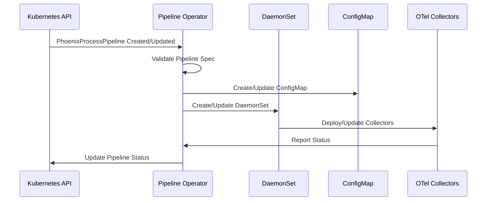

# Phoenix Pipeline Operator Technical Specification

## Overview

The Phoenix Pipeline Operator is a Kubernetes operator that manages the lifecycle of OpenTelemetry collector pipelines deployed as DaemonSets. It watches PhoenixProcessPipeline custom resources and ensures the corresponding OTel collectors are deployed, configured, and monitored correctly.

## Service Identity

- **Service Name**: phoenix-pipeline-operator
- **Type**: Kubernetes Operator
- **Repository Path**: `/operators/pipeline/`
- **Controller Runtime**: v0.16.0
- **Technology Stack**: Go 1.21, Kubebuilder, controller-runtime

## Architecture

### Operator Architecture

```
operators/pipeline/
├── main.go                      # Operator entry point
├── api/
│   └── v1/
│       ├── phoenixprocesspipeline_types.go  # CRD types
│       ├── groupversion_info.go             # API group info
│       └── zz_generated.deepcopy.go         # Generated code
├── controllers/
│   ├── pipeline_controller.go   # Main reconciliation logic
│   ├── daemonset_builder.go    # DaemonSet construction
│   ├── configmap_builder.go    # ConfigMap management
│   └── status_updater.go       # Status updates
├── internal/
│   ├── predicates/             # Event filtering
│   ├── metrics/                # Custom metrics
│   ├── validation/             # Config validation
│   └── finalizers/             # Resource cleanup
└── config/
    ├── crd/                    # CRD definitions
    ├── rbac/                   # RBAC rules
    └── manager/                # Operator deployment
```

### Control Flow



## Core Components

### 1. Custom Resource Definition

```go
// PhoenixProcessPipeline is the Schema for the phoenixprocesspipelines API
type PhoenixProcessPipeline struct {
    metav1.TypeMeta   `json:",inline"`
    metav1.ObjectMeta `json:"metadata,omitempty"`

    Spec   PhoenixProcessPipelineSpec   `json:"spec,omitempty"`
    Status PhoenixProcessPipelineStatus `json:"status,omitempty"`
}

// PhoenixProcessPipelineSpec defines the desired state
type PhoenixProcessPipelineSpec struct {
    // OTel collector configuration in YAML format
    Config string `json:"config"`
    
    // Target selector for nodes
    NodeSelector map[string]string `json:"nodeSelector,omitempty"`
    
    // Resource requirements
    Resources corev1.ResourceRequirements `json:"resources,omitempty"`
    
    // Image configuration
    Image ImageSpec `json:"image,omitempty"`
    
    // Service account
    ServiceAccount string `json:"serviceAccount,omitempty"`
    
    // Environment variables
    Env []corev1.EnvVar `json:"env,omitempty"`
    
    // Volume mounts for host paths
    VolumeMounts []VolumeMount `json:"volumeMounts,omitempty"`
    
    // Tolerations for node taints
    Tolerations []corev1.Toleration `json:"tolerations,omitempty"`
    
    // Update strategy
    UpdateStrategy UpdateStrategy `json:"updateStrategy,omitempty"`
}

// PhoenixProcessPipelineStatus defines the observed state
type PhoenixProcessPipelineStatus struct {
    // Current state of the pipeline
    Phase PipelinePhase `json:"phase,omitempty"`
    
    // Deployment status
    DeploymentStatus DeploymentStatus `json:"deploymentStatus,omitempty"`
    
    // Last applied configuration hash
    ConfigHash string `json:"configHash,omitempty"`
    
    // Conditions
    Conditions []metav1.Condition `json:"conditions,omitempty"`
    
    // Collector instances
    CollectorInstances []CollectorInstance `json:"collectorInstances,omitempty"`
    
    // Metrics summary
    Metrics MetricsSummary `json:"metrics,omitempty"`
    
    // Last update time
    LastUpdateTime *metav1.Time `json:"lastUpdateTime,omitempty"`
}

type PipelinePhase string

const (
    PhasePending     PipelinePhase = "Pending"
    PhaseDeploying   PipelinePhase = "Deploying"
    PhaseRunning     PipelinePhase = "Running"
    PhaseFailed      PipelinePhase = "Failed"
    PhaseTerminating PipelinePhase = "Terminating"
)
```

### 2. Reconciliation Controller

```go
// PipelineReconciler reconciles a PhoenixProcessPipeline object
type PipelineReconciler struct {
    client.Client
    Scheme         *runtime.Scheme
    Recorder       record.EventRecorder
    ConfigBuilder  *ConfigMapBuilder
    DSBuilder      *DaemonSetBuilder
    StatusUpdater  *StatusUpdater
    MetricsClient  metrics.Client
}

// Reconcile implements the main control loop
func (r *PipelineReconciler) Reconcile(ctx context.Context, req ctrl.Request) (ctrl.Result, error) {
    logger := log.FromContext(ctx)
    logger.Info("Reconciling PhoenixProcessPipeline", "name", req.Name)
    
    // Fetch the pipeline instance
    pipeline := &phoenixv1.PhoenixProcessPipeline{}
    if err := r.Get(ctx, req.NamespacedName, pipeline); err != nil {
        if errors.IsNotFound(err) {
            return ctrl.Result{}, nil
        }
        return ctrl.Result{}, err
    }
    
    // Handle deletion
    if !pipeline.DeletionTimestamp.IsZero() {
        return r.handleDeletion(ctx, pipeline)
    }
    
    // Ensure finalizer
    if !controllerutil.ContainsFinalizer(pipeline, finalizerName) {
        controllerutil.AddFinalizer(pipeline, finalizerName)
        if err := r.Update(ctx, pipeline); err != nil {
            return ctrl.Result{}, err
        }
    }
    
    // Validate configuration
    if err := r.validateConfig(pipeline.Spec.Config); err != nil {
        r.Recorder.Event(pipeline, corev1.EventTypeWarning, "InvalidConfig", err.Error())
        return r.updateStatus(ctx, pipeline, PhaseFailed, err)
    }
    
    // Reconcile ConfigMap
    configMap, err := r.reconcileConfigMap(ctx, pipeline)
    if err != nil {
        return ctrl.Result{}, fmt.Errorf("reconciling configmap: %w", err)
    }
    
    // Reconcile DaemonSet
    daemonSet, err := r.reconcileDaemonSet(ctx, pipeline, configMap)
    if err != nil {
        return ctrl.Result{}, fmt.Errorf("reconciling daemonset: %w", err)
    }
    
    // Update status
    return r.updatePipelineStatus(ctx, pipeline, daemonSet)
}

// reconcileConfigMap ensures the ConfigMap exists and is up to date
func (r *PipelineReconciler) reconcileConfigMap(
    ctx context.Context,
    pipeline *phoenixv1.PhoenixProcessPipeline,
) (*corev1.ConfigMap, error) {
    desired := r.ConfigBuilder.Build(pipeline)
    
    // Set owner reference
    if err := controllerutil.SetControllerReference(pipeline, desired, r.Scheme); err != nil {
        return nil, err
    }
    
    // Check if ConfigMap exists
    found := &corev1.ConfigMap{}
    err := r.Get(ctx, types.NamespacedName{
        Name:      desired.Name,
        Namespace: desired.Namespace,
    }, found)
    
    if err != nil && errors.IsNotFound(err) {
        // Create new ConfigMap
        if err := r.Create(ctx, desired); err != nil {
            return nil, err
        }
        r.Recorder.Event(pipeline, corev1.EventTypeNormal, "Created", 
            fmt.Sprintf("Created ConfigMap %s", desired.Name))
        return desired, nil
    } else if err != nil {
        return nil, err
    }
    
    // Update if needed
    if !reflect.DeepEqual(found.Data, desired.Data) {
        found.Data = desired.Data
        if err := r.Update(ctx, found); err != nil {
            return nil, err
        }
        r.Recorder.Event(pipeline, corev1.EventTypeNormal, "Updated",
            fmt.Sprintf("Updated ConfigMap %s", found.Name))
    }
    
    return found, nil
}

// reconcileDaemonSet ensures the DaemonSet exists and is configured correctly
func (r *PipelineReconciler) reconcileDaemonSet(
    ctx context.Context,
    pipeline *phoenixv1.PhoenixProcessPipeline,
    configMap *corev1.ConfigMap,
) (*appsv1.DaemonSet, error) {
    desired := r.DSBuilder.Build(pipeline, configMap)
    
    // Set owner reference
    if err := controllerutil.SetControllerReference(pipeline, desired, r.Scheme); err != nil {
        return nil, err
    }
    
    // Check if DaemonSet exists
    found := &appsv1.DaemonSet{}
    err := r.Get(ctx, types.NamespacedName{
        Name:      desired.Name,
        Namespace: desired.Namespace,
    }, found)
    
    if err != nil && errors.IsNotFound(err) {
        // Create new DaemonSet
        if err := r.Create(ctx, desired); err != nil {
            return nil, err
        }
        r.Recorder.Event(pipeline, corev1.EventTypeNormal, "Created",
            fmt.Sprintf("Created DaemonSet %s", desired.Name))
        return desired, nil
    } else if err != nil {
        return nil, err
    }
    
    // Update if spec changed
    if !r.isDaemonSetUpToDate(found, desired) {
        // Apply update strategy
        if err := r.applyUpdateStrategy(ctx, pipeline, found, desired); err != nil {
            return nil, err
        }
    }
    
    return found, nil
}
```

### 3. DaemonSet Builder

```go
type DaemonSetBuilder struct {
    defaultImage   string
    defaultCPU     resource.Quantity
    defaultMemory  resource.Quantity
}

func (b *DaemonSetBuilder) Build(
    pipeline *phoenixv1.PhoenixProcessPipeline,
    configMap *corev1.ConfigMap,
) *appsv1.DaemonSet {
    labels := map[string]string{
        "app.kubernetes.io/name":       "otel-collector",
        "app.kubernetes.io/instance":   pipeline.Name,
        "app.kubernetes.io/component":  "collector",
        "app.kubernetes.io/managed-by": "phoenix-operator",
        "phoenix.io/pipeline":          pipeline.Name,
    }
    
    // Build container
    container := corev1.Container{
        Name:  "otel-collector",
        Image: b.getImage(pipeline),
        Args: []string{
            "--config=/etc/otel-collector/config.yaml",
        },
        Env: b.buildEnvVars(pipeline),
        Resources: b.getResources(pipeline),
        Ports: []corev1.ContainerPort{
            {Name: "metrics", ContainerPort: 8888, Protocol: corev1.ProtocolTCP},
            {Name: "health", ContainerPort: 13133, Protocol: corev1.ProtocolTCP},
        },
        VolumeMounts: b.buildVolumeMounts(pipeline),
        LivenessProbe: &corev1.Probe{
            ProbeHandler: corev1.ProbeHandler{
                HTTPGet: &corev1.HTTPGetAction{
                    Path: "/",
                    Port: intstr.FromInt(13133),
                },
            },
            InitialDelaySeconds: 15,
            PeriodSeconds:       20,
        },
        ReadinessProbe: &corev1.Probe{
            ProbeHandler: corev1.ProbeHandler{
                HTTPGet: &corev1.HTTPGetAction{
                    Path: "/",
                    Port: intstr.FromInt(13133),
                },
            },
            InitialDelaySeconds: 5,
            PeriodSeconds:       10,
        },
        SecurityContext: &corev1.SecurityContext{
            Capabilities: &corev1.Capabilities{
                Add: []corev1.Capability{"SYS_PTRACE"},
            },
        },
    }
    
    // Build pod spec
    podSpec := corev1.PodSpec{
        ServiceAccountName: b.getServiceAccount(pipeline),
        Containers:         []corev1.Container{container},
        Volumes:            b.buildVolumes(pipeline, configMap),
        NodeSelector:       pipeline.Spec.NodeSelector,
        Tolerations:        pipeline.Spec.Tolerations,
        HostNetwork:        true,
        HostPID:            true,
        DNSPolicy:          corev1.DNSClusterFirstWithHostNet,
    }
    
    // Build DaemonSet
    return &appsv1.DaemonSet{
        ObjectMeta: metav1.ObjectMeta{
            Name:      fmt.Sprintf("%s-collector", pipeline.Name),
            Namespace: pipeline.Namespace,
            Labels:    labels,
        },
        Spec: appsv1.DaemonSetSpec{
            Selector: &metav1.LabelSelector{
                MatchLabels: labels,
            },
            Template: corev1.PodTemplateSpec{
                ObjectMeta: metav1.ObjectMeta{
                    Labels: labels,
                    Annotations: map[string]string{
                        "config-hash": calculateConfigHash(configMap.Data["config.yaml"]),
                    },
                },
                Spec: podSpec,
            },
            UpdateStrategy: b.getUpdateStrategy(pipeline),
        },
    }
}

func (b *DaemonSetBuilder) buildVolumeMounts(pipeline *phoenixv1.PhoenixProcessPipeline) []corev1.VolumeMount {
    mounts := []corev1.VolumeMount{
        {
            Name:      "config",
            MountPath: "/etc/otel-collector",
            ReadOnly:  true,
        },
        {
            Name:      "hostfs",
            MountPath: "/hostfs",
            ReadOnly:  true,
        },
    }
    
    // Add custom volume mounts
    for _, vm := range pipeline.Spec.VolumeMounts {
        mounts = append(mounts, corev1.VolumeMount{
            Name:      vm.Name,
            MountPath: vm.MountPath,
            ReadOnly:  vm.ReadOnly,
        })
    }
    
    return mounts
}

func (b *DaemonSetBuilder) buildVolumes(
    pipeline *phoenixv1.PhoenixProcessPipeline,
    configMap *corev1.ConfigMap,
) []corev1.Volume {
    volumes := []corev1.Volume{
        {
            Name: "config",
            VolumeSource: corev1.VolumeSource{
                ConfigMap: &corev1.ConfigMapVolumeSource{
                    LocalObjectReference: corev1.LocalObjectReference{
                        Name: configMap.Name,
                    },
                },
            },
        },
        {
            Name: "hostfs",
            VolumeSource: corev1.VolumeSource{
                HostPath: &corev1.HostPathVolumeSource{
                    Path: "/",
                },
            },
        },
    }
    
    // Add custom volumes
    for _, vm := range pipeline.Spec.VolumeMounts {
        volumes = append(volumes, corev1.Volume{
            Name: vm.Name,
            VolumeSource: corev1.VolumeSource{
                HostPath: &corev1.HostPathVolumeSource{
                    Path: vm.HostPath,
                },
            },
        })
    }
    
    return volumes
}
```

### 4. Status Management

```go
type StatusUpdater struct {
    client        client.Client
    metricsClient metrics.Client
}

func (u *StatusUpdater) UpdateStatus(
    ctx context.Context,
    pipeline *phoenixv1.PhoenixProcessPipeline,
    daemonSet *appsv1.DaemonSet,
) error {
    // Calculate new status
    newStatus := u.calculateStatus(pipeline, daemonSet)
    
    // Check if update needed
    if reflect.DeepEqual(pipeline.Status, newStatus) {
        return nil
    }
    
    // Update status
    pipeline.Status = newStatus
    pipeline.Status.LastUpdateTime = &metav1.Time{Time: time.Now()}
    
    // Patch status
    return u.client.Status().Update(ctx, pipeline)
}

func (u *StatusUpdater) calculateStatus(
    pipeline *phoenixv1.PhoenixProcessPipeline,
    daemonSet *appsv1.DaemonSet,
) phoenixv1.PhoenixProcessPipelineStatus {
    status := phoenixv1.PhoenixProcessPipelineStatus{
        ConfigHash: calculateConfigHash(pipeline.Spec.Config),
    }
    
    // Determine phase
    if daemonSet == nil {
        status.Phase = phoenixv1.PhasePending
    } else if daemonSet.Status.NumberReady == daemonSet.Status.DesiredNumberScheduled {
        status.Phase = phoenixv1.PhaseRunning
    } else if daemonSet.Status.NumberReady > 0 {
        status.Phase = phoenixv1.PhaseDeploying
    } else {
        status.Phase = phoenixv1.PhaseFailed
    }
    
    // Set deployment status
    if daemonSet != nil {
        status.DeploymentStatus = phoenixv1.DeploymentStatus{
            DesiredNodes:   daemonSet.Status.DesiredNumberScheduled,
            ReadyNodes:     daemonSet.Status.NumberReady,
            AvailableNodes: daemonSet.Status.NumberAvailable,
            UpdatedNodes:   daemonSet.Status.UpdatedNumberScheduled,
        }
    }
    
    // Update conditions
    status.Conditions = u.buildConditions(pipeline, daemonSet)
    
    // Get collector instances
    status.CollectorInstances = u.getCollectorInstances(pipeline)
    
    // Get metrics summary
    status.Metrics = u.getMetricsSummary(pipeline)
    
    return status
}

func (u *StatusUpdater) buildConditions(
    pipeline *phoenixv1.PhoenixProcessPipeline,
    daemonSet *appsv1.DaemonSet,
) []metav1.Condition {
    conditions := []metav1.Condition{}
    
    // Ready condition
    readyCondition := metav1.Condition{
        Type:               "Ready",
        LastTransitionTime: metav1.Now(),
    }
    
    if daemonSet != nil && daemonSet.Status.NumberReady == daemonSet.Status.DesiredNumberScheduled {
        readyCondition.Status = metav1.ConditionTrue
        readyCondition.Reason = "AllCollectorsReady"
        readyCondition.Message = fmt.Sprintf("All %d collectors are ready", daemonSet.Status.NumberReady)
    } else if daemonSet != nil {
        readyCondition.Status = metav1.ConditionFalse
        readyCondition.Reason = "CollectorsNotReady"
        readyCondition.Message = fmt.Sprintf("%d of %d collectors are ready",
            daemonSet.Status.NumberReady, daemonSet.Status.DesiredNumberScheduled)
    } else {
        readyCondition.Status = metav1.ConditionFalse
        readyCondition.Reason = "DaemonSetNotFound"
        readyCondition.Message = "DaemonSet has not been created yet"
    }
    
    conditions = append(conditions, readyCondition)
    
    // Config valid condition
    configCondition := metav1.Condition{
        Type:               "ConfigValid",
        LastTransitionTime: metav1.Now(),
        Status:             metav1.ConditionTrue,
        Reason:             "ConfigValidated",
        Message:            "Configuration has been validated successfully",
    }
    conditions = append(conditions, configCondition)
    
    return conditions
}
```

### 5. Event Filtering and Predicates

```go
// SetupWithManager sets up the controller with the Manager
func (r *PipelineReconciler) SetupWithManager(mgr ctrl.Manager) error {
    // Create predicates
    pipelinePredicate := predicate.Funcs{
        CreateFunc: func(e event.CreateEvent) bool {
            return true
        },
        UpdateFunc: func(e event.UpdateEvent) bool {
            oldPipeline := e.ObjectOld.(*phoenixv1.PhoenixProcessPipeline)
            newPipeline := e.ObjectNew.(*phoenixv1.PhoenixProcessPipeline)
            
            // Reconcile only if spec changed
            return !reflect.DeepEqual(oldPipeline.Spec, newPipeline.Spec)
        },
        DeleteFunc: func(e event.DeleteEvent) bool {
            return !e.DeleteStateUnknown
        },
    }
    
    daemonSetPredicate := predicate.Funcs{
        CreateFunc: func(e event.CreateEvent) bool {
            return false // We create DaemonSets, don't reconcile on create
        },
        UpdateFunc: func(e event.UpdateEvent) bool {
            // Only reconcile if status changed significantly
            oldDS := e.ObjectOld.(*appsv1.DaemonSet)
            newDS := e.ObjectNew.(*appsv1.DaemonSet)
            
            return oldDS.Status.NumberReady != newDS.Status.NumberReady ||
                   oldDS.Status.UpdatedNumberScheduled != newDS.Status.UpdatedNumberScheduled
        },
        DeleteFunc: func(e event.DeleteEvent) bool {
            return true // Reconcile if DaemonSet is deleted
        },
    }
    
    return ctrl.NewControllerManagedBy(mgr).
        For(&phoenixv1.PhoenixProcessPipeline{}, builder.WithPredicates(pipelinePredicate)).
        Owns(&appsv1.DaemonSet{}, builder.WithPredicates(daemonSetPredicate)).
        Owns(&corev1.ConfigMap{}).
        WithOptions(controller.Options{
            MaxConcurrentReconciles: 3,
        }).
        Complete(r)
}
```

## Configuration Validation

### OTel Config Validator

```go
type ConfigValidator struct {
    allowedReceivers  []string
    allowedProcessors []string
    allowedExporters  []string
    maxProcessors     int
}

func (v *ConfigValidator) Validate(configYAML string) error {
    var config OTelConfig
    if err := yaml.Unmarshal([]byte(configYAML), &config); err != nil {
        return fmt.Errorf("invalid YAML: %w", err)
    }
    
    // Validate receivers
    for name, receiver := range config.Receivers {
        if !v.isAllowedReceiver(receiver.Type()) {
            return fmt.Errorf("receiver %s of type %s is not allowed", name, receiver.Type())
        }
    }
    
    // Validate processors
    if len(config.Processors) > v.maxProcessors {
        return fmt.Errorf("too many processors: %d (max %d)", len(config.Processors), v.maxProcessors)
    }
    
    for name, processor := range config.Processors {
        if !v.isAllowedProcessor(processor.Type()) {
            return fmt.Errorf("processor %s of type %s is not allowed", name, processor.Type())
        }
    }
    
    // Validate exporters
    for name, exporter := range config.Exporters {
        if !v.isAllowedExporter(exporter.Type()) {
            return fmt.Errorf("exporter %s of type %s is not allowed", name, exporter.Type())
        }
    }
    
    // Validate pipelines
    if err := v.validatePipelines(config.Service.Pipelines); err != nil {
        return err
    }
    
    return nil
}

func (v *ConfigValidator) validatePipelines(pipelines map[string]Pipeline) error {
    // Ensure metrics pipeline exists
    metricsPipeline, ok := pipelines["metrics"]
    if !ok {
        return fmt.Errorf("metrics pipeline is required")
    }
    
    // Validate pipeline references
    for _, pipeline := range pipelines {
        for _, receiver := range pipeline.Receivers {
            if !v.receiverExists(receiver) {
                return fmt.Errorf("pipeline references non-existent receiver: %s", receiver)
            }
        }
        
        for _, processor := range pipeline.Processors {
            if !v.processorExists(processor) {
                return fmt.Errorf("pipeline references non-existent processor: %s", processor)
            }
        }
        
        for _, exporter := range pipeline.Exporters {
            if !v.exporterExists(exporter) {
                return fmt.Errorf("pipeline references non-existent exporter: %s", exporter)
            }
        }
    }
    
    return nil
}
```

## Metrics and Monitoring

### Custom Metrics

```go
var (
    pipelineReconciliations = promauto.NewCounterVec(
        prometheus.CounterOpts{
            Name: "phoenix_operator_pipeline_reconciliations_total",
            Help: "Total number of pipeline reconciliations",
        },
        []string{"pipeline", "result"},
    )
    
    pipelinePhase = promauto.NewGaugeVec(
        prometheus.GaugeOpts{
            Name: "phoenix_operator_pipeline_phase",
            Help: "Current phase of pipelines (1=Pending, 2=Deploying, 3=Running, 4=Failed)",
        },
        []string{"pipeline", "namespace"},
    )
    
    collectorInstances = promauto.NewGaugeVec(
        prometheus.GaugeOpts{
            Name: "phoenix_operator_collector_instances",
            Help: "Number of collector instances per pipeline",
        },
        []string{"pipeline", "namespace", "state"},
    )
    
    reconciliationDuration = promauto.NewHistogramVec(
        prometheus.HistogramOpts{
            Name:    "phoenix_operator_reconciliation_duration_seconds",
            Help:    "Duration of reconciliation operations",
            Buckets: prometheus.DefBuckets,
        },
        []string{"pipeline"},
    )
)

// Instrument reconciliation
func (r *PipelineReconciler) instrumentReconcile(pipeline string) func(error) {
    start := time.Now()
    
    return func(err error) {
        duration := time.Since(start).Seconds()
        reconciliationDuration.WithLabelValues(pipeline).Observe(duration)
        
        result := "success"
        if err != nil {
            result = "error"
        }
        pipelineReconciliations.WithLabelValues(pipeline, result).Inc()
    }
}
```

### Health Checks

```go
type HealthChecker struct {
    client client.Client
}

func (h *HealthChecker) Check(ctx context.Context) error {
    // Check CRD availability
    crdList := &apiextensionsv1.CustomResourceDefinitionList{}
    if err := h.client.List(ctx, crdList); err != nil {
        return fmt.Errorf("failed to list CRDs: %w", err)
    }
    
    found := false
    for _, crd := range crdList.Items {
        if crd.Name == "phoenixprocesspipelines.phoenix.io" {
            found = true
            break
        }
    }
    
    if !found {
        return fmt.Errorf("PhoenixProcessPipeline CRD not found")
    }
    
    return nil
}

// Liveness probe handler
func (h *HealthChecker) LivenessHandler(w http.ResponseWriter, r *http.Request) {
    w.WriteHeader(http.StatusOK)
    w.Write([]byte("OK"))
}

// Readiness probe handler
func (h *HealthChecker) ReadinessHandler(w http.ResponseWriter, r *http.Request) {
    ctx, cancel := context.WithTimeout(r.Context(), 5*time.Second)
    defer cancel()
    
    if err := h.Check(ctx); err != nil {
        w.WriteHeader(http.StatusServiceUnavailable)
        w.Write([]byte(err.Error()))
        return
    }
    
    w.WriteHeader(http.StatusOK)
    w.Write([]byte("Ready"))
}
```

## Security

### RBAC Configuration

```yaml
apiVersion: rbac.authorization.k8s.io/v1
kind: ClusterRole
metadata:
  name: phoenix-pipeline-operator
rules:
# Core resources
- apiGroups: [""]
  resources: ["configmaps", "services", "serviceaccounts"]
  verbs: ["get", "list", "watch", "create", "update", "patch", "delete"]
  
# Apps resources
- apiGroups: ["apps"]
  resources: ["daemonsets"]
  verbs: ["get", "list", "watch", "create", "update", "patch", "delete"]
  
# Phoenix CRDs
- apiGroups: ["phoenix.io"]
  resources: ["phoenixprocesspipelines"]
  verbs: ["get", "list", "watch", "create", "update", "patch", "delete"]
  
- apiGroups: ["phoenix.io"]
  resources: ["phoenixprocesspipelines/status"]
  verbs: ["get", "update", "patch"]
  
- apiGroups: ["phoenix.io"]
  resources: ["phoenixprocesspipelines/finalizers"]
  verbs: ["update"]

# Events
- apiGroups: [""]
  resources: ["events"]
  verbs: ["create", "patch"]

# Pod security policies
- apiGroups: ["policy"]
  resources: ["podsecuritypolicies"]
  verbs: ["use"]
  resourceNames: ["phoenix-collector-psp"]
```

### Security Context

```go
func (b *DaemonSetBuilder) buildSecurityContext() *corev1.PodSecurityContext {
    return &corev1.PodSecurityContext{
        RunAsNonRoot: &[]bool{false}[0], // Collectors need root for process metrics
        FSGroup:      &[]int64{2000}[0],
        SeccompProfile: &corev1.SeccompProfile{
            Type: corev1.SeccompProfileTypeRuntimeDefault,
        },
    }
}

func (b *DaemonSetBuilder) buildContainerSecurityContext() *corev1.SecurityContext {
    return &corev1.SecurityContext{
        AllowPrivilegeEscalation: &[]bool{false}[0],
        ReadOnlyRootFilesystem:   &[]bool{true}[0],
        Capabilities: &corev1.Capabilities{
            Drop: []corev1.Capability{"ALL"},
            Add:  []corev1.Capability{"SYS_PTRACE"}, // Required for process metrics
        },
    }
}
```

## Testing

### Unit Tests

```go
func TestPipelineReconciler_Reconcile(t *testing.T) {
    // Setup test environment
    scheme := runtime.NewScheme()
    _ = phoenixv1.AddToScheme(scheme)
    _ = appsv1.AddToScheme(scheme)
    _ = corev1.AddToScheme(scheme)
    
    tests := []struct {
        name      string
        pipeline  *phoenixv1.PhoenixProcessPipeline
        objects   []client.Object
        wantPhase phoenixv1.PipelinePhase
        wantErr   bool
    }{
        {
            name: "new pipeline creates resources",
            pipeline: &phoenixv1.PhoenixProcessPipeline{
                ObjectMeta: metav1.ObjectMeta{
                    Name:      "test-pipeline",
                    Namespace: "default",
                },
                Spec: phoenixv1.PhoenixProcessPipelineSpec{
                    Config: validOTelConfig,
                },
            },
            wantPhase: phoenixv1.PhaseDeploying,
            wantErr:   false,
        },
        {
            name: "invalid config fails",
            pipeline: &phoenixv1.PhoenixProcessPipeline{
                ObjectMeta: metav1.ObjectMeta{
                    Name:      "bad-pipeline",
                    Namespace: "default",
                },
                Spec: phoenixv1.PhoenixProcessPipelineSpec{
                    Config: "invalid yaml",
                },
            },
            wantPhase: phoenixv1.PhaseFailed,
            wantErr:   false,
        },
    }
    
    for _, tt := range tests {
        t.Run(tt.name, func(t *testing.T) {
            // Create fake client
            objs := append([]client.Object{tt.pipeline}, tt.objects...)
            fakeClient := fake.NewClientBuilder().
                WithScheme(scheme).
                WithObjects(objs...).
                WithStatusSubresource(&phoenixv1.PhoenixProcessPipeline{}).
                Build()
            
            // Create reconciler
            r := &PipelineReconciler{
                Client:        fakeClient,
                Scheme:        scheme,
                ConfigBuilder: NewConfigMapBuilder(),
                DSBuilder:     NewDaemonSetBuilder(),
                StatusUpdater: NewStatusUpdater(fakeClient),
            }
            
            // Reconcile
            req := ctrl.Request{
                NamespacedName: types.NamespacedName{
                    Name:      tt.pipeline.Name,
                    Namespace: tt.pipeline.Namespace,
                },
            }
            
            _, err := r.Reconcile(context.Background(), req)
            if (err != nil) != tt.wantErr {
                t.Errorf("Reconcile() error = %v, wantErr %v", err, tt.wantErr)
            }
            
            // Check status
            updated := &phoenixv1.PhoenixProcessPipeline{}
            if err := fakeClient.Get(context.Background(), req.NamespacedName, updated); err == nil {
                if updated.Status.Phase != tt.wantPhase {
                    t.Errorf("Expected phase %s, got %s", tt.wantPhase, updated.Status.Phase)
                }
            }
        })
    }
}
```

### Integration Tests

```go
func TestPipelineLifecycle(t *testing.T) {
    // Use envtest for real k8s API
    testEnv := &envtest.Environment{
        CRDDirectoryPaths: []string{filepath.Join("..", "..", "config", "crd", "bases")},
    }
    
    cfg, err := testEnv.Start()
    require.NoError(t, err)
    defer testEnv.Stop()
    
    // Setup manager
    mgr, err := ctrl.NewManager(cfg, ctrl.Options{
        Scheme: scheme.Scheme,
    })
    require.NoError(t, err)
    
    // Setup reconciler
    err = (&PipelineReconciler{
        Client:        mgr.GetClient(),
        Scheme:        mgr.GetScheme(),
        ConfigBuilder: NewConfigMapBuilder(),
        DSBuilder:     NewDaemonSetBuilder(),
        StatusUpdater: NewStatusUpdater(mgr.GetClient()),
    }).SetupWithManager(mgr)
    require.NoError(t, err)
    
    // Start manager
    ctx, cancel := context.WithCancel(context.Background())
    defer cancel()
    
    go func() {
        err := mgr.Start(ctx)
        require.NoError(t, err)
    }()
    
    // Wait for manager to be ready
    time.Sleep(2 * time.Second)
    
    // Create pipeline
    pipeline := &phoenixv1.PhoenixProcessPipeline{
        ObjectMeta: metav1.ObjectMeta{
            Name:      "test-pipeline",
            Namespace: "default",
        },
        Spec: phoenixv1.PhoenixProcessPipelineSpec{
            Config: validOTelConfig,
        },
    }
    
    err = mgr.GetClient().Create(ctx, pipeline)
    assert.NoError(t, err)
    
    // Wait for reconciliation
    time.Sleep(3 * time.Second)
    
    // Verify resources created
    configMap := &corev1.ConfigMap{}
    err = mgr.GetClient().Get(ctx, types.NamespacedName{
        Name:      fmt.Sprintf("%s-config", pipeline.Name),
        Namespace: "default",
    }, configMap)
    assert.NoError(t, err)
    
    daemonSet := &appsv1.DaemonSet{}
    err = mgr.GetClient().Get(ctx, types.NamespacedName{
        Name:      fmt.Sprintf("%s-collector", pipeline.Name),
        Namespace: "default",
    }, daemonSet)
    assert.NoError(t, err)
}
```

## Performance Optimization

### Caching Strategy

```go
type CachedReconciler struct {
    *PipelineReconciler
    configCache sync.Map // pipeline name -> config hash
}

func (r *CachedReconciler) shouldReconcileConfig(pipeline *phoenixv1.PhoenixProcessPipeline) bool {
    newHash := calculateConfigHash(pipeline.Spec.Config)
    
    if cachedHash, ok := r.configCache.Load(pipeline.Name); ok {
        if cachedHash.(string) == newHash {
            return false
        }
    }
    
    r.configCache.Store(pipeline.Name, newHash)
    return true
}
```

### Batch Operations

```go
func (r *PipelineReconciler) reconcileMultiple(ctx context.Context, pipelines []*phoenixv1.PhoenixProcessPipeline) error {
    // Group by namespace for batch operations
    byNamespace := make(map[string][]*phoenixv1.PhoenixProcessPipeline)
    for _, p := range pipelines {
        byNamespace[p.Namespace] = append(byNamespace[p.Namespace], p)
    }
    
    var wg sync.WaitGroup
    errors := make(chan error, len(pipelines))
    
    for ns, nsPipelines := range byNamespace {
        wg.Add(1)
        go func(namespace string, pipes []*phoenixv1.PhoenixProcessPipeline) {
            defer wg.Done()
            
            for _, p := range pipes {
                if err := r.reconcilePipeline(ctx, p); err != nil {
                    errors <- fmt.Errorf("reconciling %s/%s: %w", namespace, p.Name, err)
                }
            }
        }(ns, nsPipelines)
    }
    
    wg.Wait()
    close(errors)
    
    // Collect errors
    var errs []error
    for err := range errors {
        errs = append(errs, err)
    }
    
    if len(errs) > 0 {
        return fmt.Errorf("multiple errors: %v", errs)
    }
    
    return nil
}
```

## Deployment

### Operator Deployment

```yaml
apiVersion: apps/v1
kind: Deployment
metadata:
  name: phoenix-pipeline-operator
  namespace: phoenix-system
spec:
  replicas: 1
  selector:
    matchLabels:
      app: phoenix-pipeline-operator
  template:
    metadata:
      labels:
        app: phoenix-pipeline-operator
    spec:
      serviceAccountName: phoenix-pipeline-operator
      containers:
      - name: operator
        image: phoenix/pipeline-operator:1.0.0
        command:
        - /manager
        args:
        - --leader-elect
        - --metrics-addr=:8080
        - --health-addr=:8081
        env:
        - name: WATCH_NAMESPACE
          value: "" # Watch all namespaces
        resources:
          limits:
            cpu: 500m
            memory: 256Mi
          requests:
            cpu: 100m
            memory: 64Mi
        livenessProbe:
          httpGet:
            path: /healthz
            port: 8081
          initialDelaySeconds: 15
          periodSeconds: 20
        readinessProbe:
          httpGet:
            path: /readyz
            port: 8081
          initialDelaySeconds: 5
          periodSeconds: 10
        securityContext:
          allowPrivilegeEscalation: false
          readOnlyRootFilesystem: true
          runAsNonRoot: true
          runAsUser: 65532
```

### CRD Installation

```yaml
apiVersion: apiextensions.k8s.io/v1
kind: CustomResourceDefinition
metadata:
  name: phoenixprocesspipelines.phoenix.io
spec:
  group: phoenix.io
  versions:
  - name: v1
    served: true
    storage: true
    schema:
      openAPIV3Schema:
        type: object
        properties:
          spec:
            type: object
            required:
            - config
            properties:
              config:
                type: string
                description: OTel collector configuration in YAML format
              nodeSelector:
                type: object
                additionalProperties:
                  type: string
              resources:
                type: object
                properties:
                  limits:
                    type: object
                  requests:
                    type: object
          status:
            type: object
            properties:
              phase:
                type: string
                enum:
                - Pending
                - Deploying
                - Running
                - Failed
                - Terminating
              deploymentStatus:
                type: object
                properties:
                  desiredNodes:
                    type: integer
                  readyNodes:
                    type: integer
              conditions:
                type: array
                items:
                  type: object
    subresources:
      status: {}
  scope: Namespaced
  names:
    plural: phoenixprocesspipelines
    singular: phoenixprocesspipeline
    kind: PhoenixProcessPipeline
    shortNames:
    - ppp
```

## Compliance with Static Analysis Rules

### Folder Structure Validation

```yaml
operator_structure:
  pattern: "operators/pipeline/*"
  requires:
    - api/v1/
    - controllers/
    - internal/
    - config/crd/
    - config/rbac/
    - config/manager/
  enforced_by:
    - Kubebuilder markers
    - Makefile targets
    - CI/CD validation
```

### Code Generation

```makefile
# Makefile targets for code generation and validation
.PHONY: generate
generate: controller-gen
	$(CONTROLLER_GEN) object:headerFile="hack/boilerplate.go.txt" paths="./..."

.PHONY: manifests
manifests: controller-gen
	$(CONTROLLER_GEN) crd rbac:roleName=manager-role webhook paths="./..." output:crd:artifacts:config=config/crd/bases

.PHONY: validate-structure
validate-structure:
	@echo "Validating operator structure..."
	@test -d api/v1 || (echo "Missing api/v1 directory" && exit 1)
	@test -d controllers || (echo "Missing controllers directory" && exit 1)
	@test -d config/crd || (echo "Missing config/crd directory" && exit 1)
```