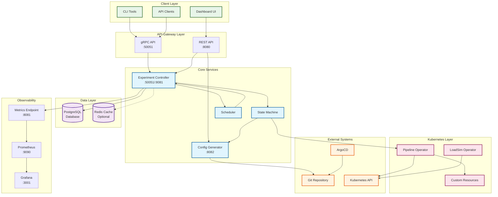
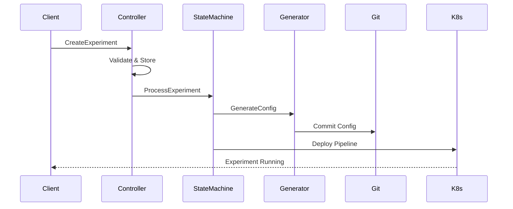
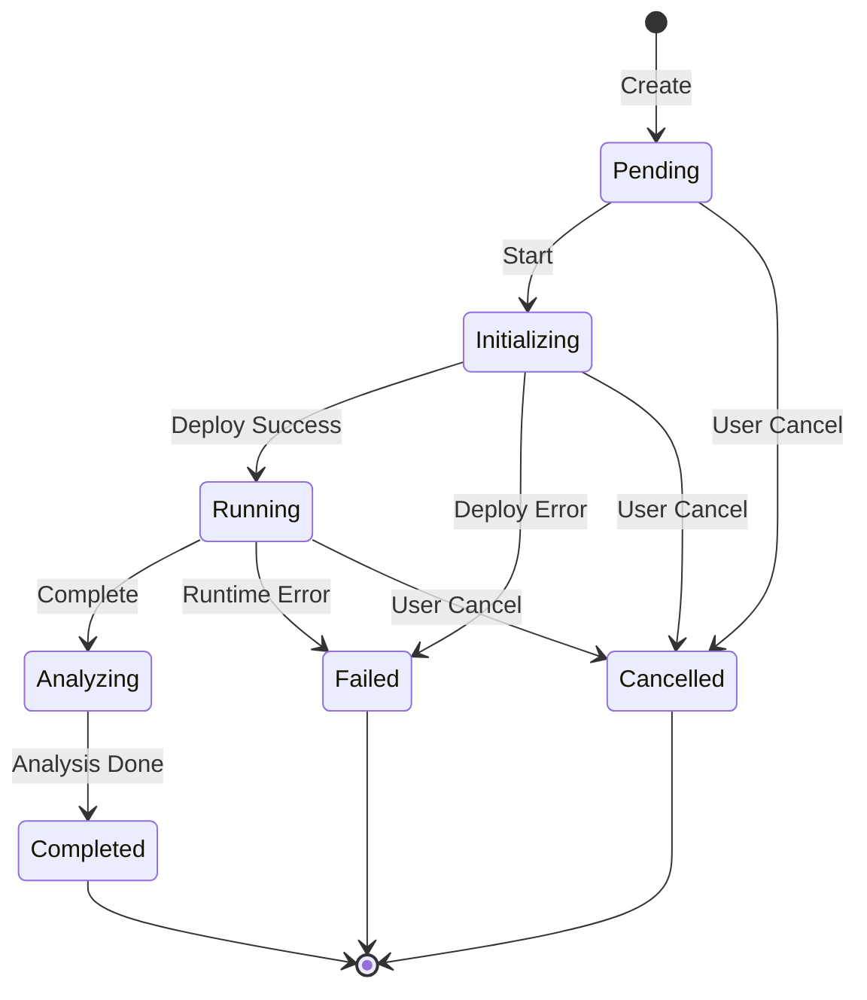

# Phoenix Platform Architecture

## Introduction

Phoenix is an automated observability platform that optimizes process metrics collection through intelligent OpenTelemetry pipelines. The platform reduces telemetry costs by 50-80% while maintaining 100% visibility for critical processes.

## System Architecture Overview



## Core Components

### 1. Control Plane

#### API Gateway
- **Technology**: Go with Chi router and gRPC-gateway
- **Purpose**: External REST/WebSocket interface for dashboard
- **Ports**: 
  - REST API: 8080
  - gRPC API: 50051
- **Key Features**:
  - JWT authentication
  - WebSocket support for real-time updates
  - Request validation and rate limiting
  - Protocol translation (REST to gRPC)

#### Experiment Controller
- **Technology**: Go with gRPC
- **Purpose**: Core business logic for experiment management
- **Ports**: 
  - gRPC: 50051
  - Metrics: 8081
- **Key Features**:
  - Experiment lifecycle management
  - State machine orchestration
  - Database integration (PostgreSQL)
  - Prometheus metrics exposure
  - Coordinates with Pipeline Operator
  - Handles experiment state transitions

#### Configuration Generator
- **Technology**: Go
- **Purpose**: Transforms visual pipeline designs into OTel configurations
- **Port**: 8082 (HTTP API)
- **Key Features**:
  - YAML generation for OTel collectors
  - Pipeline template management
  - Kubernetes manifest generation
  - Git integration for version control

#### State Machine
- **Purpose**: Manages experiment state transitions
- **Key Features**:
  - Orchestrates workflow steps
  - Ensures valid state changes
  - Triggers appropriate actions per state

#### Scheduler
- **Purpose**: Background task management
- **Key Features**:
  - Periodically processes experiments
  - Triggers state transitions
  - Manages timed operations

### 2. Data Plane

#### OTel Collectors
- **Technology**: OpenTelemetry Collector (contrib distribution)
- **Purpose**: Process metrics collection and optimization
- **Deployment**: Kubernetes DaemonSet
- **Key Features**:
  - Dual deployment for A/B testing (baseline & candidate)
  - Multiple processor chains
  - Dual export (Prometheus + New Relic)
  - Host metrics collection

#### Pipeline Templates
Pre-validated configurations:
- `process-baseline-v1`: No optimization (control)
- `process-priority-filter-v1`: Priority-based filtering
- `process-topk-v1`: Top CPU/memory consumers only
- `process-aggregated-v1`: Aggregate common applications
- `process-adaptive-v1`: Dynamic threshold adjustment
- `process-intelligent-v1`: ML-based optimization
- `process-minimal-v1`: Minimal essential metrics

### 3. User Interface

#### Dashboard UI
- **Technology**: React 18 with TypeScript
- **Purpose**: Visual pipeline builder and experiment management
- **Key Features**:
  - Drag-and-drop pipeline builder (React Flow)
  - Real-time experiment monitoring
  - Cost analysis dashboards
  - Pipeline template library
  - Metrics visualization

#### CLI Tools
- **Purpose**: Command-line interface for automation
- **Key Features**:
  - Experiment management
  - Pipeline deployment
  - Automation scripting

### 4. Kubernetes Integration

#### Pipeline Operator
- **Purpose**: Manages OTel collector deployments
- **CRD**: PhoenixProcessPipeline
- **Key Features**:
  - DaemonSet management
  - ConfigMap generation
  - Rolling updates
  - Health monitoring

#### LoadSim Operator
- **Purpose**: Manages process simulation jobs
- **CRD**: LoadSimulationJob
- **Key Features**:
  - Job scheduling
  - Load profile management
  - Cleanup automation
  - Performance metrics collection

### 5. Data Layer

#### PostgreSQL Database
- **Purpose**: Primary data store
- **Key Data**:
  - Experiment metadata and state
  - Pipeline configurations
  - User data and preferences
  - Audit logs
- **Features**:
  - Connection pooling
  - Concurrent access handling
  - Migration framework

#### Redis Cache (Optional)
- **Purpose**: Performance optimization
- **Key Uses**:
  - Frequently accessed data caching
  - Pub/sub for real-time updates
  - Session storage
  - Temporary data

### 6. Observability Stack

#### Prometheus
- **Purpose**: Metrics storage and querying
- **Port**: 9090
- **Key Metrics**:
  - Collector performance metrics
  - Pipeline cardinality metrics
  - Experiment comparison data
  - Service health metrics

#### Grafana
- **Purpose**: Visualization and dashboards
- **Port**: 3001
- **Key Dashboards**:
  - Pipeline Performance
  - A/B Experiment Comparison
  - Cost Analysis
  - System Health
  - Cardinality Tracking

## Data Flow

### Experiment Creation Flow



### State Transitions



### Metrics Collection Flow
1. Host processes generate metrics
2. OTel Collector scrapes via hostmetrics receiver
3. Processors optimize based on pipeline config
4. Metrics exported to:
   - Prometheus (local analysis)
   - New Relic (production monitoring)

### A/B Testing Flow
1. Two collectors deployed on same host
2. Both process identical input metrics
3. Different optimization strategies applied
4. Results compared in real-time
5. Winner promoted after analysis

## Module Interfaces and Communication

### Interface-Driven Architecture

Phoenix follows an interface-driven architecture where all module communication is defined through explicit contracts in the `pkg/interfaces` package. This ensures:

- **Loose Coupling**: Modules depend on interfaces, not implementations
- **Testability**: Easy mocking for unit tests
- **Parallel Development**: Teams can work independently
- **Clear Boundaries**: Well-defined service contracts

### Core Interfaces

#### Domain Interfaces
- **ExperimentService**: Experiment lifecycle management
- **PipelineService**: Pipeline CRUD and deployment
- **MonitoringService**: Metrics collection and analysis
- **SimulationService**: Load generation and testing

#### Infrastructure Interfaces
- **EventBus**: Asynchronous event-driven communication
- **ServiceRegistry**: Service discovery and health checking
- **LoadBalancer**: Request distribution strategies
- **CircuitBreaker**: Fault tolerance patterns

### Service Communication Patterns

#### Synchronous Communication
```
Dashboard → REST/WebSocket → API Gateway → gRPC → Services
```

#### Asynchronous Communication
```
Service A → Event → EventBus → Event → Service B
```

### Event-Driven Architecture

Phoenix uses events for decoupled communication between services:

- **Experiment Events**: Created, Started, Completed, Failed
- **Pipeline Events**: Deployed, StatusChanged
- **Metrics Events**: Collected, AnomalyDetected
- **System Events**: ServiceStarted, HealthCheckFailed

## Security Architecture

### Authentication & Authorization
- **JWT-based authentication** for API access
- **Role-based access control** (RBAC) in Kubernetes
- **Service account isolation** for internal services
- **API key management** for external integrations

### Network Security
- **TLS** for all external communication
- **mTLS** between internal services (optional)
- **Network policies** for pod isolation
- **Ingress controls** with rate limiting

### Secret Management
- **External Secrets Operator** integration
- **Kubernetes secrets** for sensitive data
- **No hardcoded credentials**
- **Secret rotation** support

### Audit Logging
- All operations logged for compliance
- Git history for configuration changes
- Database audit tables
- Centralized log aggregation

## Scalability Considerations

### Performance Targets
- 100+ concurrent experiments
- 1000+ nodes per experiment
- 500+ processes per node
- 3.5M+ unique time series
- Sub-second API response times

### Scaling Strategies

#### Horizontal Scaling
- All services are stateless and can scale
- Kubernetes HPA for automatic scaling
- Load balancing across replicas

#### Database Scaling
- PostgreSQL with connection pooling
- Read replicas for query distribution
- Partitioning for large tables

#### Caching Strategy
- Redis for frequently accessed data
- CDN for dashboard assets
- Local caching in services

#### Metrics Scaling
- Prometheus federation for large deployments
- Remote write for long-term storage
- Cardinality limits enforcement

## High Availability

### Service Redundancy
- **Multiple replicas** of each service
- **Pod disruption budgets** for maintenance
- **Anti-affinity rules** for distribution

### Database HA
- **PostgreSQL replication** for failover
- **Automated backups** with point-in-time recovery
- **Connection retry logic** in services

### Health Management
- **Liveness probes** for container health
- **Readiness probes** for traffic routing
- **Startup probes** for slow-starting containers

### Fault Tolerance
- **Circuit breakers** prevent cascade failures
- **Timeouts** on all external calls
- **Graceful degradation** for non-critical features
- **Retry logic** with exponential backoff

## Deployment Architecture

### Kubernetes Resources
- **Namespaces**: 
  - `phoenix-system`: Core platform components
  - `phoenix-experiments`: Experiment resources
- **Storage**: 
  - PVCs for Prometheus data
  - PVCs for PostgreSQL data
  - ConfigMaps for configurations
- **Networking**:
  - Services for internal communication
  - Ingress for external access
  - Network policies for security

### GitOps Workflow
1. All configurations stored in Git
2. ArgoCD monitors repository
3. Automated deployment on changes
4. Rollback capability via Git
5. Audit trail through commit history

### Deployment Patterns
- **Blue-green deployments** for zero-downtime updates
- **Canary releases** for gradual rollouts
- **Feature flags** for controlled activation

## Monitoring & Alerting

### Key Metrics
- **API Performance**:
  - Request latency (p50, p95, p99)
  - Error rates by endpoint
  - Request throughput
- **Collector Performance**:
  - CPU and memory usage
  - Processing latency
  - Export success rate
- **Pipeline Effectiveness**:
  - Cardinality reduction percentage
  - Data volume reduction
  - Cost savings metrics
- **System Health**:
  - Service availability
  - Database performance
  - Queue depths

### Alerting Rules
- **Critical Alerts**:
  - Service downtime
  - Database connection failures
  - Collector crashes
- **Warning Alerts**:
  - High latency
  - Resource exhaustion
  - Failed experiments
- **Info Alerts**:
  - Successful deployments
  - Experiment completions
  - Maintenance events

### Observability Best Practices
- Structured logging with correlation IDs
- Distributed tracing for request flow
- Custom metrics for business KPIs
- Error tracking and aggregation